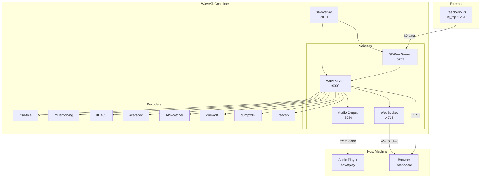
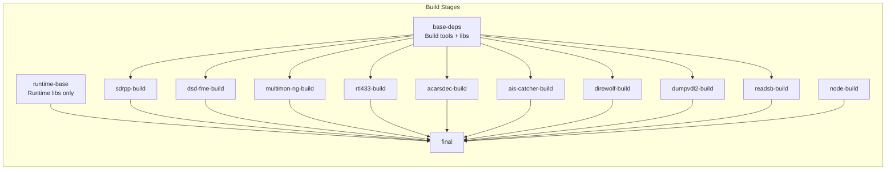
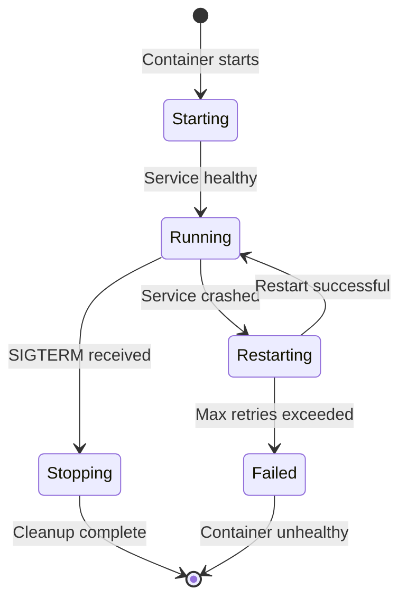
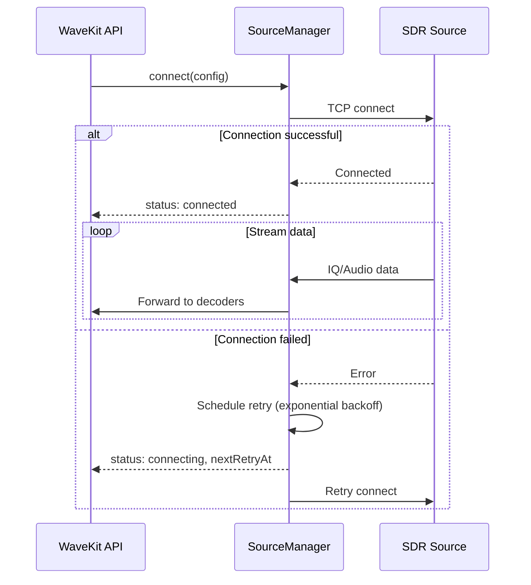
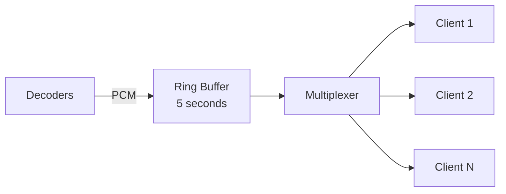

# Design Document: Docker Setup

## Overview

This design document describes the architecture and implementation details for WaveKit's production-ready Docker deployment. The system uses a multi-stage Dockerfile with three build targets (full, core, sdrpp-only), s6-overlay for process supervision, and comprehensive health checking and configuration management.

The design prioritizes:

- **Zero-configuration startup**: Sensible defaults that work out of the box
- **Resilience**: Automatic reconnection, service restart, and graceful degradation
- **Observability**: Structured logging, health endpoints, and Prometheus metrics
- **Developer experience**: Hot reload, debugging support, and easy local testing

## Architecture



### Deployment Modes

| Mode      | Components               | Use Case           | Image Size |
| --------- | ------------------------ | ------------------ | ---------- |
| **full**  | SDR++, API, All Decoders | Single-host (Pi)   | ~1.5GB     |
| **core**  | API, All Decoders        | Distributed setup  | ~800MB     |
| **sdrpp** | SDR++ only               | Dedicated SDR host | ~450MB     |

### Supported Decoders

The container includes all 8 decoder binaries that WaveKit supports:

| Decoder         | Binary        | Protocol/Signal                                       | Build Source                        |
| --------------- | ------------- | ----------------------------------------------------- | ----------------------------------- |
| **dsd-fme**     | `dsd-fme`     | Digital voice (DMR, P25, YSF, D-Star, NXDN, ProVoice) | github.com/lwvmobile/dsd-fme        |
| **multimon-ng** | `multimon-ng` | Pager protocols (POCSAG, FLEX, EAS, DTMF)             | github.com/EliasOeworsl/multimon-ng |
| **rtl_433**     | `rtl_433`     | ISM band sensors, weather stations                    | github.com/merbanan/rtl_433         |
| **acarsdec**    | `acarsdec`    | ACARS aircraft data link                              | github.com/TLeconte/acarsdec        |
| **AIS-catcher** | `AIS-catcher` | Maritime AIS transponders                             | github.com/jvde-github/AIS-catcher  |
| **direwolf**    | `direwolf`    | APRS amateur radio packets                            | github.com/wb2osz/direwolf          |
| **dumpvdl2**    | `dumpvdl2`    | VDL Mode 2 aviation data link                         | github.com/szpajder/dumpvdl2        |
| **readsb**      | `readsb`      | ADS-B aircraft transponders                           | github.com/wiedehopf/readsb         |

### Decoder Dependencies

Each decoder requires specific libraries at build and runtime:

| Decoder         | Build Dependencies                                                                               | Runtime Dependencies                                                     |
| --------------- | ------------------------------------------------------------------------------------------------ | ------------------------------------------------------------------------ |
| **dsd-fme**     | cmake, libsndfile-dev, libfftw3-dev, libpulse-dev, libitpp-dev                                   | libsndfile1, libfftw3-3, libpulse0, libitpp8                             |
| **multimon-ng** | cmake, libpulse-dev, libx11-dev                                                                  | libpulse0                                                                |
| **rtl_433**     | cmake, librtlsdr-dev, libsoapysdr-dev                                                            | librtlsdr0, libsoapysdr0.8                                               |
| **acarsdec**    | cmake, librtlsdr-dev, libsndfile-dev                                                             | librtlsdr0, libsndfile1                                                  |
| **AIS-catcher** | cmake, librtlsdr-dev, libairspy-dev, libairspyhf-dev, libhackrf-dev, libsoapysdr-dev, zlib1g-dev | librtlsdr0, libairspy0, libairspyhf0, libhackrf0, libsoapysdr0.8, zlib1g |
| **direwolf**    | cmake, libasound2-dev, libgps-dev, libhamlib-dev                                                 | libasound2, libgps28, libhamlib4                                         |
| **dumpvdl2**    | cmake, librtlsdr-dev, libglib2.0-dev, libsqlite3-dev, libzmq3-dev                                | librtlsdr0, libglib2.0-0, libsqlite3-0, libzmq5                          |
| **readsb**      | make, librtlsdr-dev, libncurses-dev, zlib1g-dev                                                  | librtlsdr0, libncurses6, zlib1g                                          |

## Components and Interfaces

### 1. Build System

The build system uses Docker multi-stage builds with BuildKit optimizations.



**Build Script Interface** (`docker/build.sh`):

```bash
./docker/build.sh [mode] [tag] [options]

# Arguments:
#   mode    - full (default), core, sdrpp
#   tag     - Image tag (default: latest)

# Environment Variables:
#   REGISTRY   - Registry prefix (e.g., docker.io/myuser/)
#   PLATFORMS  - Multi-platform targets (e.g., linux/amd64,linux/arm64)
#   BUILDKIT   - Enable BuildKit (default: 1)
```

### 2. s6-overlay Service Management

s6-overlay provides PID 1 init system with proper signal handling and service supervision.

**Service Directory Structure**:

```
/etc/s6-overlay/s6-rc.d/
├── base/                    # Oneshot: System initialization
│   ├── type                 # "oneshot"
│   └── up                   # Init script
├── sdrpp-server/            # Longrun: SDR++ server
│   ├── type                 # "longrun"
│   ├── run                  # Start script
│   ├── finish               # Cleanup script
│   └── dependencies.d/
│       └── base             # Depends on base
├── wavekit-api/             # Longrun: WaveKit API
│   ├── type                 # "longrun"
│   ├── run                  # Start script
│   ├── finish               # Cleanup script
│   └── dependencies.d/
│       ├── base
│       └── sdrpp-server     # Depends on SDR++ (full mode)
├── services/                # Bundle: All services
│   ├── type                 # "bundle"
│   └── contents.d/
│       ├── sdrpp-server
│       └── wavekit-api
└── user/                    # Bundle: User-facing services
    ├── type                 # "bundle"
    └── contents.d/
        └── services
```

**Service Lifecycle**:



### 3. Source Connection Manager

Handles connection to SDR sources with automatic retry and reconnection.

```typescript
interface SourceConnectionConfig {
	type: "rtl_tcp" | "sdrpp" | "network"
	host: string
	port: number
	reconnect: {
		enabled: boolean
		initialDelay: number // ms, default: 1000
		maxDelay: number // ms, default: 30000
		multiplier: number // default: 2
	}
}

interface ConnectionState {
	status: "connecting" | "connected" | "disconnected" | "failed"
	lastConnected?: Date
	lastError?: string
	retryCount: number
	nextRetryAt?: Date
}
```

**Connection Flow**:



### 4. Health Check System

Multi-level health checking for accurate container status.

```typescript
interface HealthStatus {
	status: "healthy" | "degraded" | "unhealthy"
	timestamp: string
	uptime: number
	components: {
		api: ComponentHealth
		sdrpp?: ComponentHealth
		decoders: Record<string, ComponentHealth>
		source: ComponentHealth
	}
}

interface ComponentHealth {
	status: "up" | "down" | "degraded"
	message?: string
	lastCheck: string
	metrics?: Record<string, number>
}
```

**Health Check Endpoints**:

| Endpoint            | Purpose              | Response                              |
| ------------------- | -------------------- | ------------------------------------- |
| `GET /health`       | Quick liveness check | `200 OK` or `503 Service Unavailable` |
| `GET /health/ready` | Readiness probe      | `200` when ready to accept traffic    |
| `GET /health/live`  | Liveness probe       | `200` when process is alive           |
| `GET /api/status`   | Detailed status      | Full `HealthStatus` JSON              |

### 5. Configuration System

Layered configuration with environment variable overrides.

```mermaid
graph TB
    subgraph "Configuration Sources"
        DEFAULT[default.yaml<br/>Built-in defaults]
        MOUNTED[/app/config/*.yaml<br/>Mounted configs]
        ENV[Environment Variables<br/>WAVEKIT_*]
    end

    subgraph "Config Loader"
        MERGE[Config Merger]
        VALIDATE[Zod Validator]
        RUNTIME[Runtime Config]
    end

    DEFAULT --> MERGE
    MOUNTED --> MERGE
    ENV --> MERGE
    MERGE --> VALIDATE
    VALIDATE --> RUNTIME
```

**Environment Variable Mapping**:

```bash
# Format: WAVEKIT_<SECTION>_<KEY>=value
# Nested keys use double underscore

WAVEKIT_API_PORT=9000
WAVEKIT_API_HOST=0.0.0.0
WAVEKIT_LOG_LEVEL=info
WAVEKIT_SOURCES__RTL_TCP__HOST=192.168.1.100
WAVEKIT_SOURCES__RTL_TCP__PORT=1234
WAVEKIT_DECODERS__DSD_FME__ENABLED=true
```

### 6. Audio Output Server

TCP server for streaming decoded audio to host applications.

```typescript
interface AudioOutputConfig {
	port: number // default: 8080
	format: "S16LE" // 16-bit signed little-endian
	sampleRate: number // default: 48000
	channels: number // default: 1 (mono)
	bufferSeconds: number // default: 5 (ring buffer for late joiners)
}

interface AudioClient {
	id: string
	connectedAt: Date
	bytesStreamed: number
	remoteAddress: string
}
```

**Audio Flow**:



### 7. Logging System

Structured JSON logging with Pino, supporting multiple outputs.

```typescript
interface LogConfig {
	level: "debug" | "info" | "warn" | "error"
	format: "json" | "pretty"
	outputs: {
		stdout: boolean
		file?: {
			path: string
			maxSize: string // e.g., '10M'
			maxFiles: number
			compress: boolean
		}
	}
	redact: string[] // Paths to redact (e.g., ['config.secrets.*'])
}

interface LogEntry {
	level: number
	time: number
	pid: number
	hostname: string
	component: string
	msg: string
	correlationId?: string
	[key: string]: unknown
}
```

### 8. Metrics System

Prometheus-compatible metrics for monitoring.

```typescript
// Exposed at GET /metrics
interface Metrics {
	// Counters
	wavekit_messages_decoded_total: Counter<"decoder" | "type">
	wavekit_connections_total: Counter<"source" | "status">
	wavekit_audio_bytes_streamed_total: Counter

	// Gauges
	wavekit_active_decoders: Gauge
	wavekit_audio_clients_connected: Gauge
	wavekit_source_connection_status: Gauge<"source">

	// Histograms
	wavekit_decode_duration_seconds: Histogram<"decoder">
	wavekit_api_request_duration_seconds: Histogram<"method" | "route">
}
```

## Data Models

### Container Configuration Schema

```typescript
// Zod schema for container configuration
const ContainerConfigSchema = z.object({
	api: z
		.object({
			port: z.number().default(9000),
			host: z.string().default("0.0.0.0"),
			cors: z
				.object({
					enabled: z.boolean().default(true),
					origins: z.array(z.string()).default(["*"]),
				})
				.default({}),
		})
		.default({}),

	sources: z
		.object({
			rtlTcp: z
				.object({
					host: z.string().optional(),
					port: z.number().default(1234),
					enabled: z.boolean().default(true),
				})
				.optional(),
			sdrpp: z
				.object({
					host: z.string().optional(),
					port: z.number().default(5259),
					enabled: z.boolean().default(false),
				})
				.optional(),
		})
		.default({}),

	decoders: z
		.object({
			dsdFme: z
				.object({
					enabled: z.boolean().default(true),
					mode: z
						.enum(["auto", "dmr", "p25", "ysf", "dstar", "nxdn"])
						.default("auto"),
				})
				.default({}),
			multimonNg: z
				.object({
					enabled: z.boolean().default(true),
					modes: z
						.array(z.string())
						.default(["POCSAG512", "POCSAG1200", "FLEX"]),
				})
				.default({}),
			rtl433: z
				.object({
					enabled: z.boolean().default(false),
				})
				.default({}),
		})
		.default({}),

	audio: z
		.object({
			port: z.number().default(8080),
			format: z.literal("S16LE").default("S16LE"),
			sampleRate: z.number().default(48000),
			channels: z.number().default(1),
			bufferSeconds: z.number().default(5),
		})
		.default({}),

	logging: z
		.object({
			level: z.enum(["debug", "info", "warn", "error"]).default("info"),
			format: z.enum(["json", "pretty"]).default("json"),
		})
		.default({}),
})

type ContainerConfig = z.infer<typeof ContainerConfigSchema>
```

### Service State Model

```typescript
interface ServiceState {
	name: string
	status: "starting" | "running" | "stopping" | "stopped" | "failed"
	pid?: number
	startedAt?: Date
	stoppedAt?: Date
	restartCount: number
	lastError?: string
	dependencies: string[]
	dependents: string[]
}

interface ContainerState {
	mode: "full" | "core" | "sdrpp"
	startedAt: Date
	services: Record<string, ServiceState>
	health: HealthStatus
	config: ContainerConfig
}
```

### Build Manifest

```typescript
interface BuildManifest {
	version: string
	mode: "full" | "core" | "sdrpp"
	buildDate: string
	gitCommit: string
	platform: string
	components: {
		name: string
		version: string
		path: string
	}[]
	layers: {
		stage: string
		size: number
		cached: boolean
	}[]
}
```

## Correctness Properties

_A property is a characteristic or behavior that should hold true across all valid executions of a system—essentially, a formal statement about what the system should do. Properties serve as the bridge between human-readable specifications and machine-verifiable correctness guarantees._

### Property 1: Source Connection Respects Configuration

_For any_ valid source configuration (RTL_TCP_HOST or SDR_SOURCE environment variable), the WaveKit container SHALL attempt to connect to the specified host and port.

**Validates: Requirements 2.1, 2.2**

### Property 2: Exponential Backoff on Connection Failure

_For any_ failed connection attempt, the retry delay SHALL follow exponential backoff starting at 1 second, doubling each attempt, and capping at 30 seconds.

**Validates: Requirements 2.3**

### Property 3: Automatic Reconnection on Connection Loss

_For any_ established connection that is subsequently lost, the system SHALL automatically initiate reconnection attempts without manual intervention.

**Validates: Requirements 2.4**

### Property 4: Connection Status Logging

_For any_ change in connection status (connecting, connected, disconnected, failed), the system SHALL emit a log entry with the appropriate severity level.

**Validates: Requirements 2.5**

### Property 5: Service Restart on Crash

_For any_ supervised service that crashes, s6-overlay SHALL restart it within 5 seconds of the crash being detected.

**Validates: Requirements 3.2**

### Property 6: Environment Variable Propagation

_For any_ environment variable set on the container, it SHALL be accessible to all child services managed by s6-overlay.

**Validates: Requirements 3.4**

### Property 7: Health Check Covers All Configured Decoders

_For any_ set of enabled decoders in the configuration, the health check SHALL verify the running status of each decoder.

**Validates: Requirements 4.2**

### Property 8: Health Check Exit Code Matches State

_For any_ health check execution, the exit code SHALL be 0 if and only if all component checks pass, and 1 otherwise.

**Validates: Requirements 4.4**

### Property 9: Health Check Completes Within Timeout

_For any_ health check execution, it SHALL complete within 10 seconds regardless of system state.

**Validates: Requirements 4.6**

### Property 10: Configuration via Environment Variables with Precedence

_For any_ configuration setting, if both an environment variable (WAVEKIT\_\* prefix) and a config file specify the same setting, the environment variable value SHALL take precedence.

**Validates: Requirements 5.1, 5.3**

### Property 11: Configuration via YAML Files

_For any_ valid YAML configuration file mounted at /app/config, the settings SHALL be loaded and applied to the system.

**Validates: Requirements 5.2**

### Property 12: Invalid Configuration Fails Fast

_For any_ invalid configuration (malformed YAML, invalid values, missing required fields), the container SHALL fail to start with a clear error message describing the validation failure.

**Validates: Requirements 5.4**

### Property 13: Structured JSON Logs with Correlation IDs

_For any_ log entry emitted by the system, it SHALL be valid JSON containing at minimum: level, time, component, msg, and for request-related logs, a correlationId.

**Validates: Requirements 6.1, 6.3**

### Property 14: Log Level Filtering

_For any_ configured log level, only messages at that level or higher severity SHALL be emitted (debug < info < warn < error).

**Validates: Requirements 6.2**

### Property 15: Decoder Output Logging

_For any_ decoder that produces output, the system SHALL log an event containing the decoder name and message type.

**Validates: Requirements 6.5**

### Property 16: Multi-Client Audio Streaming

_For any_ number of connected audio clients (1 to N), all clients SHALL receive the same audio stream simultaneously, and disconnection of any client SHALL not affect streaming to other clients.

**Validates: Requirements 7.2, 7.3, 7.4**

### Property 17: Audio Ring Buffer for Late Joiners

_For any_ client connecting to the audio port when audio is being produced, the client SHALL immediately receive buffered audio (up to 5 seconds) followed by live audio.

**Validates: Requirements 7.5**

### Property 18: Secret Masking in Logs

_For any_ environment variable containing sensitive data (matching patterns like _\_SECRET, _\_PASSWORD, _\_KEY, _\_TOKEN), its value SHALL be masked (e.g., "\*\*\*") in all log output.

**Validates: Requirements 9.6**

### Property 19: Decoder Failure Isolation

_For any_ decoder that fails or crashes, all other configured decoders SHALL continue operating without interruption.

**Validates: Requirements 10.1**

### Property 20: API Availability During Component Failures

_For any_ failure of SDR++ server or SDR source, the REST API SHALL remain responsive and return appropriate status information.

**Validates: Requirements 10.2, 10.3**

### Property 21: Health Status Reflects System State

_For any_ system state, the health check SHALL return the correct status: "healthy" when all components are operational, "degraded" when non-critical components have failed, and "unhealthy" when critical components have failed.

**Validates: Requirements 10.4**

### Property 22: Periodic Degraded Mode Warnings

_For any_ period where the system is in degraded mode, warning logs SHALL be emitted at 60-second intervals until the degraded condition is resolved.

**Validates: Requirements 10.5**

## Error Handling

### Container Startup Errors

| Error                    | Cause                   | Handling                                            |
| ------------------------ | ----------------------- | --------------------------------------------------- |
| Config validation failed | Invalid YAML or values  | Exit with code 1, log detailed error                |
| Port already in use      | Another process on port | Exit with code 1, log which port                    |
| Missing required env var | Required config not set | Exit with code 1, list missing vars                 |
| Permission denied        | File/directory access   | Exit with code 1, log path and required permissions |

### Runtime Errors

| Error                    | Cause                        | Handling                                     |
| ------------------------ | ---------------------------- | -------------------------------------------- |
| Source connection failed | Network/host unreachable     | Retry with exponential backoff, log attempts |
| Source connection lost   | Network interruption         | Automatic reconnection, emit degraded status |
| Decoder crash            | Process terminated           | s6-overlay auto-restart, log crash details   |
| Decoder spawn failed     | Binary not found/permissions | Mark decoder as failed, continue with others |
| Audio client disconnect  | Client closed connection     | Remove from client list, continue streaming  |
| Health check timeout     | Service unresponsive         | Return unhealthy status, log timeout         |

### Error Response Format

```typescript
interface ErrorResponse {
	error: {
		code: string // Machine-readable error code
		message: string // Human-readable message
		details?: unknown // Additional context
		timestamp: string // ISO 8601 timestamp
		correlationId?: string // Request correlation ID
	}
}

// Error codes
enum ErrorCode {
	CONFIG_INVALID = "CONFIG_INVALID",
	SOURCE_UNAVAILABLE = "SOURCE_UNAVAILABLE",
	DECODER_FAILED = "DECODER_FAILED",
	HEALTH_CHECK_FAILED = "HEALTH_CHECK_FAILED",
	INTERNAL_ERROR = "INTERNAL_ERROR",
}
```

## Testing Strategy

### Dual Testing Approach

This design requires both unit tests and property-based tests for comprehensive coverage:

- **Unit tests**: Verify specific examples, edge cases, and error conditions
- **Property tests**: Verify universal properties across all valid inputs

### Property-Based Testing Configuration

- **Library**: fast-check (already in dev dependencies)
- **Minimum iterations**: 100 per property test
- **Tag format**: `Feature: docker-setup, Property {number}: {property_text}`

### Test Categories

#### 1. Build System Tests (Unit)

- Verify each build mode produces correct binaries
- Verify multi-stage build produces minimal image
- Verify build script handles invalid modes

#### 2. Configuration Tests (Property + Unit)

- **Property 10**: Env var precedence over config files
- **Property 11**: YAML config loading
- **Property 12**: Invalid config rejection
- Unit tests for specific config scenarios

#### 3. Connection Management Tests (Property + Unit)

- **Property 1**: Source configuration parsing
- **Property 2**: Exponential backoff timing
- **Property 3**: Reconnection behavior
- **Property 4**: Status change logging
- Unit tests for connection edge cases

#### 4. Health Check Tests (Property + Unit)

- **Property 7**: Decoder coverage
- **Property 8**: Exit code correctness
- **Property 9**: Timeout compliance
- **Property 21**: Status accuracy
- Unit tests for specific health scenarios

#### 5. Logging Tests (Property + Unit)

- **Property 13**: JSON structure validation
- **Property 14**: Level filtering
- **Property 15**: Decoder output logging
- **Property 18**: Secret masking
- **Property 22**: Degraded mode warnings

#### 6. Audio Streaming Tests (Property + Unit)

- **Property 16**: Multi-client streaming
- **Property 17**: Ring buffer behavior
- Unit tests for client connect/disconnect

#### 7. Graceful Degradation Tests (Property + Unit)

- **Property 5**: Service restart timing
- **Property 6**: Env var propagation
- **Property 19**: Decoder isolation
- **Property 20**: API availability
- Unit tests for failure scenarios

### Integration Tests

- End-to-end container startup and health check
- Source connection with mock RTL-TCP
- Decoder output through WebSocket
- Audio streaming to multiple clients

### Test File Structure

```
tests/
├── unit/
│   ├── docker/
│   │   ├── config-loader.test.ts
│   │   ├── health-check.test.ts
│   │   └── source-connection.test.ts
│   └── ...
├── property/
│   ├── config-precedence.property.test.ts
│   ├── exponential-backoff.property.test.ts
│   ├── health-check.property.test.ts
│   ├── log-structure.property.test.ts
│   └── audio-streaming.property.test.ts
└── integration/
    ├── container-startup.test.ts
    └── end-to-end.test.ts
```
