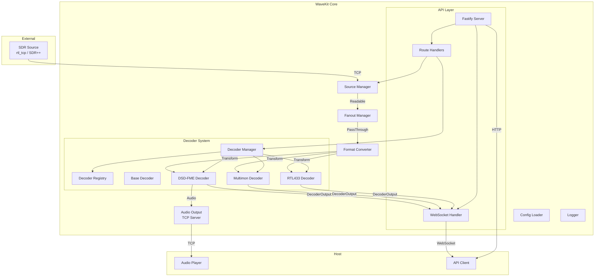

# Design Document: WaveKit Core

## Overview

WaveKit is a TypeScript-based SDR stream processing framework built on Node.js streams and Fastify. The system follows an event-driven architecture where components communicate through EventEmitters and Node.js streams, enabling efficient real-time audio processing with backpressure handling.

The design prioritizes:

- **Stream-first architecture**: All audio data flows through Node.js streams with proper backpressure
- **Plugin extensibility**: Decoders are registered via a factory pattern for easy extension
- **Resilience**: Auto-reconnect, process restart, and graceful degradation
- **Observability**: Structured logging, metrics emission, and real-time event broadcasting

## Architecture



## Components and Interfaces

### Source Manager

Manages TCP connections to SDR sources with automatic reconnection using exponential backoff. Supports multiple source types with capability declarations.

```typescript
// src/core/source-manager.ts

type SourceKind = "audio_pcm" | "iq" | "recording"

interface SourceCaps {
	kind: SourceKind
	sampleRate: number
	format: "S16LE" | "FLOAT32LE" | "U8_IQ" | "S16_IQ"
	channels?: number
	centerFreq?: number
	exclusive: boolean
}

interface SourceConfig {
	id: string
	type: "sdrpp-network" | "rtl_tcp" | "recording"
	host?: string
	port?: number
	filePath?: string // For recording sources
	loop?: boolean // For recording sources
	playbackSpeed?: number // For recording sources (1.0 = realtime)
	caps: SourceCaps
}

interface SourceStatus {
	id: string
	connected: boolean
	bytesReceived: number
	dataRate: number // KB/s
	lastError?: string
	reconnectAttempts: number
	caps: SourceCaps
}

interface SourceManagerEvents {
	connected: (sourceId: string) => void
	disconnected: (sourceId: string, error?: Error) => void
	error: (sourceId: string, error: Error) => void
	data: (sourceId: string, chunk: Buffer) => void
	metrics: (
		sourceId: string,
		metrics: { bytesReceived: number; dataRate: number },
	) => void
	ended: (sourceId: string) => void // For recording sources
}

class SourceManager extends EventEmitter {
	constructor(logger: Logger)

	connect(config: SourceConfig): Promise<Readable>
	disconnect(id: string): Promise<void>
	reconnect(id: string): Promise<void>

	getStatus(id: string): SourceStatus | undefined
	getAllStatus(): SourceStatus[]
	getStream(id: string): Readable | undefined
	getCaps(id: string): SourceCaps | undefined

	// Capability checking
	isCompatible(sourceId: string, decoderCaps: DecoderCaps): boolean
	getAvailableSources(decoderCaps: DecoderCaps): SourceStatus[]
}
```

**Implementation Details:**

- Uses `net.Socket` for TCP connections
- Exponential backoff: 2s → 4s → 8s → 16s → 30s (max)
- Emits metrics every 5 seconds via `setInterval`
- Wraps socket in a `Readable` stream for pipeline compatibility

### Fanout Manager

Multiplexes a single audio stream to multiple consumers with independent buffering.

```typescript
// src/core/fanout-manager.ts

interface BranchConfig {
	id: string
	highWaterMark?: number // Default: 256KB (262144 bytes)
}

interface BranchStatus {
	id: string
	bufferedBytes: number
	backpressure: boolean
}

interface FanoutManagerEvents {
	backpressure: (branchId: string, bufferedBytes: number) => void
	"branch-added": (branchId: string) => void
	"branch-removed": (branchId: string) => void
}

class FanoutManager extends EventEmitter {
	constructor(logger: Logger)

	attachSource(source: Readable): void
	detachSource(): void

	addBranch(config: BranchConfig): PassThrough
	removeBranch(id: string): void

	getBranchIds(): string[]
	getBranchStatus(id: string): BranchStatus | undefined
}
```

**Implementation Details:**

- Each branch is a `PassThrough` stream with configurable `highWaterMark`
- Source data is copied to all branches via `chunk.slice()` (no shared buffers)
- When `write()` returns false, emit 'backpressure' but continue (don't block source)
- Real-time priority: drop data rather than block the source stream

### Format Converter

Transform streams for audio format conversion.

```typescript
// src/core/format-converter.ts

// Convert 32-bit float [-1.0, 1.0] to 16-bit signed integer [-32768, 32767]
function createF32ToS16Transform(): Transform

// Convert 16-bit signed integer to 32-bit float
function createS16ToF32Transform(): Transform

// Resample audio using linear interpolation
// For production, consider libsamplerate bindings
function createResampleTransform(fromRate: number, toRate: number): Transform
```

**Implementation Details:**

- F32→S16: `Math.round(sample * 32767)` clamped to [-32768, 32767]
- S16→F32: `sample / 32768`
- Resampling: Linear interpolation for simplicity; can upgrade to libsamplerate later
- All transforms operate in `objectMode: false` for raw buffer processing

### Decoder Types

Core type definitions for the decoder system with capability declarations.

```typescript
// src/decoders/types.ts

type DecoderInputType = "audio_pcm" | "iq" | "external"
type DecoderOutputFormat = "jsonl" | "nmea" | "beast" | "text"
type DecoderIntegrationPattern =
	| "pure_consumer"
	| "network_producer"
	| "external_sdr"
type DecoderHealth = "running" | "degraded" | "faulted"

interface DecoderCaps {
	input: DecoderInputType
	wantsExclusiveSource?: boolean
	preferredSampleRates?: number[]
	output: DecoderOutputFormat
	integrationPattern: DecoderIntegrationPattern
}

interface DecoderConfig {
	id: string
	type: string
	enabled: boolean
	sourceId?: string // Which source to attach to (for non-external decoders)
	options: Record<string, unknown>
	// For external SDR decoders
	deviceSerial?: string
	frequencies?: number[]
	// For network producer decoders
	outputHost?: string
	outputPort?: number
	outputProtocol?: "tcp" | "udp"
	// Version pinning
	minVersion?: string
	maxVersion?: string
}

type DecoderOutputType =
	| "sync"
	| "decode"
	| "call"
	| "message"
	| "signal"
	| "error"
	| "stats"
	| "aircraft" // ADS-B
	| "acars" // ACARS messages
	| "vdl2" // VDL2 messages
	| "ship" // AIS
	| "aprs" // APRS packets

interface DecoderOutput {
	timestamp: Date
	decoder: string
	type: DecoderOutputType
	data: unknown
}

interface DecoderStats {
	bytesIn: number
	eventsOut: number
	errors: number
}

interface DecoderStatus {
	id: string
	type: string
	running: boolean
	health: DecoderHealth
	pid?: number
	uptime: number // seconds
	stats: DecoderStats
	lastOutputAt?: Date
	restartCount: number
	version?: string
}

interface DecoderEvents {
	output: (output: DecoderOutput) => void
	error: (error: Error) => void
	exit: (code: number | null, signal: string | null) => void
	started: () => void
	stopped: () => void
	health: (health: DecoderHealth) => void
}

interface Decoder extends EventEmitter {
	readonly id: string
	readonly type: string
	readonly caps: DecoderCaps

	start(): Promise<void>
	stop(): Promise<void>
	restart(): Promise<void>

	attachInput(stream: Readable): void
	detachInput(): void

	getOutput(): Readable // Object mode stream of DecoderOutput
	getAudioOutput(): Readable | null // Raw audio output if available
	getStatus(): DecoderStatus
	getHealth(): DecoderHealth
}
```

### Base Decoder

Abstract base class implementing common decoder functionality for the "pure consumer" pattern.

```typescript
// src/decoders/base-decoder.ts

abstract class BaseDecoder extends EventEmitter implements Decoder {
  readonly id: string;
  readonly type: string;
  readonly caps: DecoderCaps;

  protected process: ChildProcess | null = null;
  protected inputStream: Readable | null = null;
  protected outputStream: PassThrough; // Object mode
  protected audioOutputStream: PassThrough | null = null;
  protected stats: DecoderStats = { bytesIn: 0, eventsOut: 0, errors: 0 };
  protected startTime: number = 0;
  protected lastOutputAt: Date | null = null;
  protected health: DecoderHealth = 'running';

  constructor(config: DecoderConfig, protected logger: Logger);

  // Template method pattern
  protected abstract getCommand(): string;
  protected abstract getArgs(): string[];
  protected abstract parseOutput(line: string): DecoderOutput | null;
  protected abstract getCaps(): DecoderCaps;

  async start(): Promise<void>;
  async stop(): Promise<void>;
  async restart(): Promise<void>;

  attachInput(stream: Readable): void;
  detachInput(): void;

  getOutput(): Readable;
  getAudioOutput(): Readable | null;
  getStatus(): DecoderStatus;
  getHealth(): DecoderHealth;

  protected updateHealth(): void; // Called periodically to check degraded state
}
```

**Implementation Details:**

- Uses `child_process.spawn` with `stdio: ['pipe', 'pipe', 'pipe']`
- Stdout/stderr parsed line-by-line using `readline.createInterface`
- Graceful stop: SIGTERM → wait 5s → SIGKILL
- Auto-restart handled by DecoderManager, not BaseDecoder
- Health transitions: running → degraded (no output for timeout) → faulted (crash loop)

### Network Producer Decoder Base

Abstract base class for decoders that run as network services (Pattern 2).

```typescript
// src/decoders/network-producer-decoder.ts

interface NetworkProducerConfig extends DecoderConfig {
	outputHost: string
	outputPort: number
	outputProtocol: 'tcp' | 'udp'
}

abstract class NetworkProducerDecoder extends EventEmitter implements Decoder {
  readonly id: string;
  readonly type: string;
  readonly caps: DecoderCaps;

  protected process: ChildProcess | null = null;
  protected networkClient: Socket | dgram.Socket | null = null;
  protected outputStream: PassThrough; // Object mode
  protected stats: DecoderStats = { bytesIn: 0, eventsOut: 0, errors: 0 };
  protected health: DecoderHealth = 'running';

  constructor(config: NetworkProducerConfig, protected logger: Logger);

  // Template method pattern
  protected abstract getCommand(): string;
  protected abstract getArgs(): string[];
  protected abstract parseNetworkData(data: Buffer): DecoderOutput[];
  protected abstract getCaps(): DecoderCaps;

  async start(): Promise<void>;
  async stop(): Promise<void>;
  async restart(): Promise<void>;

  // Network producers don't use stdin input
  attachInput(stream: Readable): void { /* no-op */ }
  detachInput(): void { /* no-op */ }

  getOutput(): Readable;
  getAudioOutput(): Readable | null { return null; }
  getStatus(): DecoderStatus;
  getHealth(): DecoderHealth;

  protected connectToOutput(): Promise<void>;
  protected reconnectToOutput(): Promise<void>;
}
```

**Implementation Details:**

- Spawns decoder process, then connects to its output port
- Supports both TCP and UDP output protocols
- Reconnects to output port with exponential backoff if connection lost
- Process and network connection managed independently

### External SDR Decoder Base

Abstract base class for decoders that manage their own SDR hardware (Pattern 3).

```typescript
// src/decoders/external-sdr-decoder.ts

interface ExternalSdrConfig extends DecoderConfig {
	deviceSerial: string
	frequencies: number[]
	gain?: number
	ppm?: number
}

abstract class ExternalSdrDecoder extends EventEmitter implements Decoder {
  readonly id: string;
  readonly type: string;
  readonly caps: DecoderCaps;

  protected process: ChildProcess | null = null;
  protected outputStream: PassThrough; // Object mode
  protected stats: DecoderStats = { bytesIn: 0, eventsOut: 0, errors: 0 };
  protected health: DecoderHealth = 'running';

  constructor(config: ExternalSdrConfig, protected logger: Logger);

  // Template method pattern
  protected abstract getCommand(): string;
  protected abstract getArgs(): string[];
  protected abstract parseOutput(line: string): DecoderOutput | null;
  protected abstract getCaps(): DecoderCaps;

  async start(): Promise<void>;
  async stop(): Promise<void>;
  async restart(): Promise<void>;

  // External SDR decoders don't use stdin input
  attachInput(stream: Readable): void { /* no-op */ }
  detachInput(): void { /* no-op */ }

  getOutput(): Readable;
  getAudioOutput(): Readable | null { return null; }
  getStatus(): DecoderStatus;
  getHealth(): DecoderHealth;
}
```

**Implementation Details:**

- Passes device serial, frequencies, and gain to decoder command line
- Does not receive audio input from WaveKit (decoder controls its own SDR)
- Parses stdout/stderr for structured output (typically JSON)
- Validates device availability before starting

### Decoder Manager

Orchestrates decoder lifecycle and coordinates with other components. Supports all three integration patterns.

```typescript
// src/decoders/manager.ts

interface DecoderManagerConfig {
	restartDelay: number // Initial restart delay in ms
	maxRestartDelay: number // Maximum restart delay in ms
	maxRestarts: number // Max restarts before giving up (0 = unlimited)
	healthCheckInterval: number // ms between health checks
	degradedTimeout: number // ms without output before degraded
}

interface DecoderManagerEvents {
	"decoder:started": (id: string) => void
	"decoder:stopped": (id: string) => void
	"decoder:output": (id: string, output: DecoderOutput) => void
	"decoder:error": (id: string, error: Error) => void
	"decoder:health": (id: string, health: DecoderHealth) => void
}

class DecoderManager extends EventEmitter {
	constructor(
		registry: DecoderRegistry,
		sourceManager: SourceManager,
		fanout: FanoutManager,
		logger: Logger,
		config?: Partial<DecoderManagerConfig>,
	)

	// Lifecycle
	createDecoder(config: DecoderConfig): Decoder
	startDecoder(id: string): Promise<void>
	stopDecoder(id: string): Promise<void>
	restartDecoder(id: string): Promise<void>

	// Bulk operations
	startAll(): Promise<void>
	stopAll(): Promise<void>

	// Status
	getDecoder(id: string): Decoder | undefined
	getAllDecoders(): Decoder[]
	getStatus(id: string): DecoderStatus | undefined
	getAllStatus(): DecoderStatus[]

	// Health monitoring
	getHealth(id: string): DecoderHealth | undefined
	getAllHealth(): Map<string, DecoderHealth>

	// Source assignment
	assignSource(decoderId: string, sourceId: string): void
	getAssignedSource(decoderId: string): string | undefined
}
```

**Implementation Details:**

- Validates decoder-source compatibility using `DecoderCaps` and `SourceCaps`
- For pure consumer decoders: creates fanout branch and pipes to decoder stdin
- For network producer decoders: spawns process and connects to output port
- For external SDR decoders: spawns process with device config, no input piping
- Runs periodic health checks to detect degraded state
- Emits health events when decoder health changes

````

### Decoder Registry

Plugin system for registering decoder factories with capability declarations.

```typescript
// src/decoders/registry.ts

interface DecoderFactoryMeta {
	factory: DecoderFactory
	caps: DecoderCaps
	minVersion?: string
	maxVersion?: string
}

type DecoderFactory = (config: DecoderConfig, logger: Logger) => Decoder

class DecoderRegistry {
	private factories: Map<string, DecoderFactoryMeta> = new Map()

	register(type: string, factory: DecoderFactory, caps: DecoderCaps, versionConstraints?: { min?: string, max?: string }): void
	unregister(type: string): boolean

	create(config: DecoderConfig, logger: Logger): Decoder
	has(type: string): boolean
	getRegisteredTypes(): string[]
	getCaps(type: string): DecoderCaps | undefined

	// Capability queries
	getDecodersByInput(input: DecoderInputType): string[]
	getDecodersByOutput(output: DecoderOutputFormat): string[]
	getCompatibleDecoders(sourceCaps: SourceCaps): string[]
}
````

### Built-in Decoders

#### DSD-FME Decoder

```typescript
// src/decoders/builtin/dsd-fme.ts

interface DsdFmeOptions {
	mode: "auto" | "dmr" | "p25" | "ysf" | "dstar" | "nxdn" | "provoice"
	output: "null" | "wav" | "udp"
	wavDir?: string
	udpHost?: string
	udpPort?: number
	extraArgs?: string[]
}

class DsdFmeDecoder extends BaseDecoder {
	constructor(config: DecoderConfig, logger: Logger)

	protected getCommand(): string // 'dsd-fme'
	protected getArgs(): string[]
	protected parseOutput(line: string): DecoderOutput | null
}
```

**Output Parsing:**

- Sync: `/Sync: (DMR|P25|YSF|DSTAR|NXDN)/` → `{ type: 'sync', data: { mode, slot? } }`
- Call: `/TG: (\d+) SRC: (\d+)/` → `{ type: 'call', data: { talkgroup, source } }`
- Error: `/FEC ERR|CRC ERR/` → `{ type: 'error', data: { message } }`

#### Multimon-ng Decoder

```typescript
// src/decoders/builtin/multimon-ng.ts

type MultimonMode =
	| "POCSAG512"
	| "POCSAG1200"
	| "POCSAG2400"
	| "FLEX"
	| "EAS"
	| "AFSK1200"
	| "FSK9600"
	| "DTMF"

interface MultimonOptions {
	modes: MultimonMode[]
	verbosity?: number
	charset?: string
}

class MultimonDecoder extends BaseDecoder {
	constructor(config: DecoderConfig, logger: Logger)

	protected getCommand(): string // 'multimon-ng'
	protected getArgs(): string[]
	protected parseOutput(line: string): DecoderOutput | null
}
```

**Output Parsing:**

- POCSAG: `/POCSAG(\d+): Address: (\d+)/` → `{ type: 'message', data: { protocol, address, message } }`
- FLEX: `/FLEX:/` → `{ type: 'message', data: { ... } }`
- DTMF: `/DTMF: (\d+)/` → `{ type: 'decode', data: { protocol: 'DTMF', digits } }`

#### RTL_433 Decoder

```typescript
// src/decoders/builtin/rtl433.ts

interface Rtl433Options {
	analyze?: boolean
	protocols?: number[]
	outputFormat?: "json" | "csv"
}

class Rtl433Decoder extends BaseDecoder {
	constructor(config: DecoderConfig, logger: Logger)

	protected getCommand(): string // 'rtl_433'
	protected getArgs(): string[]
	protected parseOutput(line: string): DecoderOutput | null
}
```

**Output Parsing:**

- Uses `-F json` flag for structured output
- Parses JSON lines directly into `{ type: 'signal', data: parsedJson }`

### Aviation Decoders

#### Readsb ADS-B Decoder (Network Producer Pattern)

```typescript
// src/decoders/builtin/readsb.ts

interface ReadsbOptions {
	device?: string // RTL-SDR device index or serial
	deviceSerial?: string
	gain?: number
	ppm?: number
	outputFormat: "sbs" | "beast" | "json"
	outputPort?: number // Default: 30003 for SBS, 30005 for Beast
	enableMlat?: boolean
	lat?: number
	lon?: number
}

interface AircraftData {
	icao: string // 24-bit ICAO address
	callsign?: string
	altitude?: number // feet
	groundSpeed?: number // knots
	track?: number // degrees
	lat?: number
	lon?: number
	verticalRate?: number // ft/min
	squawk?: string
	onGround?: boolean
	lastSeen: Date
	messageCount: number
}

class ReadsbDecoder extends NetworkProducerDecoder {
	constructor(config: DecoderConfig, logger: Logger)

	protected getCommand(): string // 'readsb'
	protected getArgs(): string[]
	protected parseNetworkData(data: Buffer): DecoderOutput[]
	protected getCaps(): DecoderCaps // { input: 'external', output: 'beast' | 'jsonl' }
}
```

**Output Parsing:**

- SBS format: Parse CSV lines into AircraftData
- Beast format: Parse binary Beast protocol
- JSON format: Parse JSON lines directly

#### ACARS Decoder (External SDR Pattern)

```typescript
// src/decoders/builtin/acarsdec.ts

interface AcarsdecOptions {
	deviceSerial: string
	frequencies: number[] // e.g., [131550000, 131725000]
	gain?: number
	ppm?: number
	outputFormat?: "json" | "native"
}

interface ACARSMessage {
	timestamp: Date
	frequency: number
	channel: number
	level: number // signal level dB
	error: number // bit errors
	mode: string
	label: string
	blockId?: string
	ack?: string
	tail?: string // aircraft registration
	flight?: string
	msgno?: string
	text?: string
}

class AcarsdecDecoder extends ExternalSdrDecoder {
	constructor(config: DecoderConfig, logger: Logger)

	protected getCommand(): string // 'acarsdec'
	protected getArgs(): string[]
	protected parseOutput(line: string): DecoderOutput | null
	protected getCaps(): DecoderCaps // { input: 'external', output: 'jsonl' }
}
```

**Output Parsing:**

- Uses `-j` flag for JSON output
- Parses JSON lines into ACARSMessage objects

#### VDL2 Decoder (External SDR Pattern)

```typescript
// src/decoders/builtin/dumpvdl2.ts

interface Dumpvdl2Options {
	deviceSerial: string
	frequencies: number[] // e.g., [136650000, 136700000, 136975000]
	gain?: number
	ppm?: number
	outputFormat?: "json" | "text"
}

interface VDL2Message {
	timestamp: Date
	frequency: number
	station?: string
	icao?: string
	toaddr?: string
	fromaddr?: string
	msgType: string
	acars?: ACARSMessage // Embedded ACARS if present
	text?: string
}

class Dumpvdl2Decoder extends ExternalSdrDecoder {
	constructor(config: DecoderConfig, logger: Logger)

	protected getCommand(): string // 'dumpvdl2'
	protected getArgs(): string[]
	protected parseOutput(line: string): DecoderOutput | null
	protected getCaps(): DecoderCaps // { input: 'external', output: 'jsonl' }
}
```

**Output Parsing:**

- Uses `--output decoded:json:file:-` for JSON to stdout
- Parses JSON lines into VDL2Message objects

### Maritime Decoders

#### AIS-catcher Decoder (Network Producer Pattern)

```typescript
// src/decoders/builtin/ais-catcher.ts

interface AisCatcherOptions {
	device?: string // RTL-SDR device index
	deviceSerial?: string
	rtlTcpHost?: string // Alternative: connect to rtl_tcp
	rtlTcpPort?: number
	gain?: number
	ppm?: number
	outputFormat: "nmea" | "json"
	outputPort?: number // UDP port for output
}

interface ShipData {
	mmsi: string // Maritime Mobile Service Identity
	name?: string
	callsign?: string
	imo?: number
	shipType?: number
	lat?: number
	lon?: number
	cog?: number // Course over ground
	sog?: number // Speed over ground (knots)
	heading?: number
	navStatus?: number
	destination?: string
	eta?: Date
	draught?: number
	lastSeen: Date
	messageType: number
}

class AisCatcherDecoder extends NetworkProducerDecoder {
	constructor(config: DecoderConfig, logger: Logger)

	protected getCommand(): string // 'AIS-catcher'
	protected getArgs(): string[]
	protected parseNetworkData(data: Buffer): DecoderOutput[]
	protected getCaps(): DecoderCaps // { input: 'external', output: 'nmea' | 'jsonl' }
}
```

**Output Parsing:**

- NMEA format: Parse !AIVDM/!AIVDO sentences
- JSON format: Parse JSON lines directly into ShipData

### Amateur Radio Decoders

#### Direwolf APRS Decoder (Network Producer Pattern)

```typescript
// src/decoders/builtin/direwolf.ts

interface DirewolfOptions {
	audioDevice?: string // ALSA device or 'stdin'
	sampleRate?: number // Default: 48000
	kissPort?: number // Default: 8001
	agwPort?: number // Default: 8000
	callsign?: string
}

interface APRSData {
	timestamp: Date
	source: string // Callsign-SSID
	destination: string
	path: string[]
	dataType: string // Position, Message, Weather, etc.
	lat?: number
	lon?: number
	altitude?: number
	course?: number
	speed?: number
	symbol?: string
	comment?: string
	weather?: {
		temperature?: number
		humidity?: number
		pressure?: number
		windSpeed?: number
		windDirection?: number
		rainfall?: number
	}
	message?: {
		addressee: string
		text: string
		messageNo?: string
	}
}

class DirewolfDecoder extends NetworkProducerDecoder {
	constructor(config: DecoderConfig, logger: Logger)

	protected getCommand(): string // 'direwolf'
	protected getArgs(): string[]
	protected parseNetworkData(data: Buffer): DecoderOutput[]
	protected getCaps(): DecoderCaps // { input: 'audio_pcm', output: 'text' }
}
```

**Output Parsing:**

- Connects to KISS TCP port (8001)
- Parses KISS frames into APRS packets
- Decodes APRS packet types (position, message, weather, etc.)

### API Server

Fastify-based REST and WebSocket server.

```typescript
// src/api/server.ts

interface ApiServerConfig {
	host: string
	port: number
}

class ApiServer {
	private app: FastifyInstance

	constructor(
		sourceManager: SourceManager,
		decoderManager: DecoderManager,
		audioOutput: AudioOutput,
		logger: Logger,
		config: ApiServerConfig,
	)

	async start(): Promise<void>
	async stop(): Promise<void>

	getApp(): FastifyInstance
}
```

**Route Structure:**

- `GET /health` - Health check
- `GET /api/status` - Full system status
- `GET /api/sources` - List sources
- `POST /api/sources` - Add source
- `DELETE /api/sources/:id` - Remove source
- `GET /api/decoders` - List decoders
- `GET /api/decoders/:id` - Get decoder status
- `POST /api/decoders/:id/start` - Start decoder
- `POST /api/decoders/:id/stop` - Stop decoder
- `POST /api/decoders/:id/restart` - Restart decoder
- `PATCH /api/decoders/:id` - Update decoder config

### WebSocket Events

```typescript
// src/api/websocket/events.ts

type WebSocketChannel = "decoders" | "metrics" | "sources"

interface ClientMessage {
	type: "subscribe" | "unsubscribe"
	channels: WebSocketChannel[]
}

interface ServerMessage {
	type:
		| "decoder:output"
		| "decoder:status"
		| "source:connected"
		| "source:disconnected"
		| "metrics"
	data: unknown
}

class WebSocketEventBroadcaster {
	constructor(fastify: FastifyInstance, logger: Logger)

	broadcast(channel: WebSocketChannel, message: ServerMessage): void
	getConnectedClients(): number
}
```

### Audio Output

TCP server for streaming decoded audio to host players.

```typescript
// src/core/audio-output.ts

interface AudioOutputConfig {
	port: number
	format: "S16LE" | "FLOAT32LE"
	sampleRate: number
}

class AudioOutput extends EventEmitter {
	constructor(logger: Logger, config: AudioOutputConfig)

	start(): Promise<void>
	stop(): Promise<void>

	attachSource(stream: Readable): void
	detachSource(): void

	getConnectedClients(): number
	getPort(): number
}
```

**Implementation Details:**

- Uses `net.createServer()` for TCP server
- Maintains array of connected client sockets
- Pipes source stream to all clients via fanout pattern
- Handles client disconnection gracefully

### Configuration

```typescript
// src/config.ts

import { z } from "zod"

const SourceCapsSchema = z.object({
	kind: z.enum(["audio_pcm", "iq", "recording"]),
	sampleRate: z.number().int().positive(),
	format: z.enum(["S16LE", "FLOAT32LE", "U8_IQ", "S16_IQ"]),
	channels: z.number().int().positive().optional(),
	centerFreq: z.number().positive().optional(),
	exclusive: z.boolean().default(false),
})

const SourceConfigSchema = z.object({
	id: z.string(),
	type: z.enum(["sdrpp-network", "rtl_tcp", "recording"]),
	host: z.string().optional(), // Required for network sources
	port: z.number().int().positive().optional(), // Required for network sources
	filePath: z.string().optional(), // Required for recording sources
	loop: z.boolean().default(false), // For recording sources
	playbackSpeed: z.number().positive().default(1.0), // For recording sources
	caps: SourceCapsSchema,
})

const DecoderCapsSchema = z.object({
	input: z.enum(["audio_pcm", "iq", "external"]),
	wantsExclusiveSource: z.boolean().optional(),
	preferredSampleRates: z.array(z.number().int().positive()).optional(),
	output: z.enum(["jsonl", "nmea", "beast", "text"]),
	integrationPattern: z.enum([
		"pure_consumer",
		"network_producer",
		"external_sdr",
	]),
})

const DecoderConfigSchema = z.object({
	id: z.string(),
	type: z.string(),
	enabled: z.boolean(),
	sourceId: z.string().optional(), // Which source to attach to
	options: z.record(z.unknown()),
	// For external SDR decoders
	deviceSerial: z.string().optional(),
	frequencies: z.array(z.number().positive()).optional(),
	gain: z.number().optional(),
	ppm: z.number().optional(),
	// For network producer decoders
	outputHost: z.string().optional(),
	outputPort: z.number().int().positive().optional(),
	outputProtocol: z.enum(["tcp", "udp"]).optional(),
	// Version pinning
	minVersion: z.string().optional(),
	maxVersion: z.string().optional(),
})

const ConfigSchema = z.object({
	sources: z.array(SourceConfigSchema),
	decoders: z.array(DecoderConfigSchema),
	audio: z.object({
		tcpPort: z.number().int().positive().default(8080),
		format: z.enum(["S16LE", "FLOAT32LE"]).default("S16LE"),
		sampleRate: z.number().int().positive().default(48000),
	}),
	api: z.object({
		host: z.string().default("0.0.0.0"),
		port: z.number().int().positive().default(3000),
	}),
	logging: z.object({
		level: z.enum(["trace", "debug", "info", "warn", "error"]).default("info"),
		dir: z.string().optional(),
	}),
	health: z
		.object({
			checkInterval: z.number().int().positive().default(5000), // ms
			degradedTimeout: z.number().int().positive().default(30000), // ms without output
		})
		.optional(),
})

type Config = z.infer<typeof ConfigSchema>

function loadConfig(configPath?: string): Config
```

### Logger

```typescript
// src/utils/logger.ts

import pino from "pino"

function createLogger(config: { level: string; dir?: string }): pino.Logger

// Child loggers for components
function createComponentLogger(
	parent: pino.Logger,
	component: string,
): pino.Logger
```

### Graceful Shutdown

```typescript
// src/utils/graceful-shutdown.ts

interface ShutdownHandler {
	name: string
	handler: () => Promise<void>
	timeout?: number // ms, default 5000
}

class GracefulShutdown {
	private handlers: ShutdownHandler[] = []
	private shuttingDown: boolean = false

	register(handler: ShutdownHandler): void
	unregister(name: string): void

	async shutdown(): Promise<void>

	// Call this once at startup
	installSignalHandlers(): void
}
```

## Data Models

### Source Status

```typescript
interface SourceStatus {
	id: string
	type: "sdrpp-network" | "rtl_tcp"
	host: string
	port: number
	connected: boolean
	bytesReceived: number
	dataRate: number // KB/s, rolling average
	lastError?: string
	reconnectAttempts: number
	connectedAt?: Date
}
```

### Decoder Status

```typescript
interface DecoderStatus {
	id: string
	type: string
	running: boolean
	enabled: boolean
	pid?: number
	uptime: number // seconds
	stats: {
		bytesIn: number
		eventsOut: number
		errors: number
	}
	lastOutput?: DecoderOutput
	restartCount: number
}
```

### System Status

```typescript
interface SystemStatus {
	uptime: number // seconds
	version: string
	sources: SourceStatus[]
	decoders: DecoderStatus[]
	audio: {
		outputPort: number
		clientsConnected: number
		format: string
		sampleRate: number
	}
}
```

## Correctness Properties

_A property is a characteristic or behavior that should hold true across all valid executions of a system—essentially, a formal statement about what the system should do. Properties serve as the bridge between human-readable specifications and machine-verifiable correctness guarantees._

### Property 1: Exponential Backoff Correctness

_For any_ sequence of N consecutive failures (connection or process restart), the delay before attempt N should be `min(2^N * baseDelay, maxDelay)` where baseDelay=2000ms and maxDelay=30000ms.

**Validates: Requirements 1.2, 4.2**

### Property 2: Source Status Completeness

_For any_ source managed by Source_Manager, calling `getStatus(id)` should return an object containing all required fields: `id`, `connected`, `bytesReceived`, `dataRate`, and `reconnectAttempts`.

**Validates: Requirements 1.7**

### Property 3: Connection Error Resilience

_For any_ TCP connection error of type ECONNREFUSED, ETIMEDOUT, or ECONNRESET, the Source_Manager should emit an 'error' event and not throw an unhandled exception.

**Validates: Requirements 1.6**

### Property 4: Fanout Data Distribution

_For any_ data chunk received by Fanout_Manager with N active branches, all N branches should receive an identical copy of the chunk (same bytes, same length).

**Validates: Requirements 2.3**

### Property 5: Branch Independence

_For any_ two branches A and B in Fanout_Manager, writing to branch A's buffer should not affect branch B's buffer state, and removing branch A should not affect data flow to branch B.

**Validates: Requirements 2.2, 2.5**

### Property 6: Backpressure Non-Blocking

_For any_ branch that reaches its highWaterMark, the source stream should continue to flow (not block), and a 'backpressure' event should be emitted for that branch.

**Validates: Requirements 2.4**

### Property 7: Format Conversion Round-Trip

_For any_ 16-bit signed integer value V in range [-32768, 32767], converting V to float and back to S16 should produce a value within ±1 of V (accounting for floating-point precision).

**Validates: Requirements 3.1, 3.2**

### Property 8: Resample Length Ratio

_For any_ audio buffer of length L samples at rate R1, resampling to rate R2 should produce a buffer of length approximately `L * (R2 / R1)` samples (within ±1 sample for rounding).

**Validates: Requirements 3.3**

### Property 9: Decoder Registry Consistency

_For any_ decoder type T registered with factory F, the registry should: (a) return true for `has(T)`, (b) include T in `getRegisteredTypes()`, (c) successfully create a decoder when `create({type: T, ...})` is called, and (d) return an error for any unregistered type U.

**Validates: Requirements 5.1, 5.2, 5.3, 5.4**

### Property 10: Decoder Status Completeness

_For any_ decoder managed by Decoder_Manager, calling `getStatus(id)` should return an object containing all required fields: `id`, `type`, `running`, `uptime`, and `stats` (with `bytesIn`, `eventsOut`, `errors`).

**Validates: Requirements 4.5**

### Property 11: DSD Output Parsing

_For any_ valid dsd-fme output line matching sync, call, or error patterns, the parser should produce a DecoderOutput object with the correct `type` field and extracted data fields.

**Validates: Requirements 6.2, 6.3, 6.4**

### Property 12: DSD Mode Support

_For any_ mode in the set {auto, dmr, p25, ysf, dstar, nxdn, provoice}, creating a DSD decoder with that mode should succeed without error.

**Validates: Requirements 6.5**

### Property 13: Multimon Output Parsing

_For any_ valid multimon-ng output line matching POCSAG, FLEX, or DTMF patterns, the parser should produce a DecoderOutput object with the correct `type` field and extracted data fields.

**Validates: Requirements 7.2**

### Property 14: Multimon Mode Support

_For any_ mode in the set {POCSAG512, POCSAG1200, POCSAG2400, FLEX, EAS, AFSK1200, FSK9600, DTMF}, creating a Multimon decoder with that mode should succeed without error.

**Validates: Requirements 7.3**

### Property 15: RTL433 JSON Parsing

_For any_ valid JSON line output by rtl_433, the parser should produce a DecoderOutput object with `type: 'signal'` and the parsed JSON as the data field.

**Validates: Requirements 8.2**

### Property 16: API Status Response Completeness

_For any_ call to GET /api/status, the response should contain `uptime`, `sources` (array), `decoders` (array), and `audio` (object with `outputPort`, `clientsConnected`).

**Validates: Requirements 9.2**

### Property 17: Source CRUD Consistency

_For any_ valid source configuration S, after POST /api/sources with S, GET /api/sources should include S, and after DELETE /api/sources/:id, GET /api/sources should not include S.

**Validates: Requirements 9.3, 9.4, 9.5**

### Property 18: Decoder API State Consistency

_For any_ decoder D, after POST /api/decoders/:id/start, GET /api/decoders/:id should show `running: true`, and after POST /api/decoders/:id/stop, it should show `running: false`.

**Validates: Requirements 9.6, 9.7, 9.8**

### Property 19: WebSocket Channel Filtering

_For any_ client subscribed to channel C, the client should receive all events for channel C and no events for channels not in their subscription list.

**Validates: Requirements 10.2, 10.3, 10.4**

### Property 20: Audio Output Multi-Client Distribution

_For any_ N connected TCP clients to Audio_Output, when audio data is written to the source, all N clients should receive identical data.

**Validates: Requirements 11.2, 11.3**

### Property 21: Config Environment Override

_For any_ configuration key K with YAML value Y and environment variable value E, the loaded config should have value E (environment overrides file).

**Validates: Requirements 12.2**

### Property 22: Config Validation Errors

_For any_ invalid configuration (missing required fields, wrong types), the Config_Loader should return a Zod validation error with a descriptive message indicating the invalid field.

**Validates: Requirements 12.3, 12.4**

### Property 23: Log Entry Structure

_For any_ log entry produced by the Logger, it should contain `time` (timestamp), `level` (log level), and `component` (component name) fields.

**Validates: Requirements 13.3**

### Property 24: Graceful Shutdown Completeness

_For any_ shutdown initiated by SIGTERM, after shutdown completes: (a) all decoders should be stopped, (b) all source connections should be closed, (c) all streams should be destroyed, and (d) no new connections should be accepted.

**Validates: Requirements 14.2, 14.3, 14.4, 14.5**

---

## Decoder Expansion Properties

### Property 25: Source Capability Compatibility

_For any_ decoder D with capabilities C_d and source S with capabilities C_s, the Source_Manager should return `isCompatible(S, C_d) = true` if and only if C_d.input matches C_s.kind (audio_pcm↔audio_pcm, iq↔iq) or C_d.input is 'external'.

**Validates: Requirements 16.2, 17.2**

### Property 26: Multi-Source Independence

_For any_ two sources S1 and S2 managed by Source_Manager, connecting/disconnecting S1 should not affect the connection state or data flow of S2.

**Validates: Requirements 15.1**

### Property 27: Decoder-Source Assignment Consistency

_For any_ decoder D assigned to source S, after assignment: (a) `getAssignedSource(D.id)` should return S.id, and (b) if D is a pure consumer decoder, D should receive data from S's stream.

**Validates: Requirements 15.2**

### Property 28: Exclusive Source Enforcement

_For any_ source S with `caps.exclusive = true`, the Source_Manager should prevent more than one decoder from being assigned to S, returning an error for subsequent assignment attempts.

**Validates: Requirements 15.3**

### Property 29: Recording Source Determinism

_For any_ recording source R with file F, replaying F twice should produce identical byte sequences in the same order.

**Validates: Requirements 21.1, 21.3**

### Property 30: Health State Transitions

_For any_ decoder D, health transitions should follow: running → degraded (after timeout without output), degraded → running (on output received), running/degraded → faulted (on crash loop), and health events should be emitted for each transition.

**Validates: Requirements 20.1, 20.2, 20.3, 20.4**

### Property 31: Network Producer Reconnection

_For any_ network producer decoder D, if the output connection is lost while the process is running, D should attempt reconnection with exponential backoff and emit appropriate events.

**Validates: Requirements 18.3**

### Property 32: External SDR Decoder Device Isolation

_For any_ external SDR decoder D configured with device serial S, the spawned process should receive S as a command-line argument, and D should not attempt to pipe audio input.

**Validates: Requirements 19.1, 19.2, 19.4**

### Property 33: ADS-B Output Parsing

_For any_ valid readsb output line (SBS, Beast, or JSON format), the parser should produce a DecoderOutput object with `type: 'aircraft'` and an AircraftData object containing at minimum the ICAO address.

**Validates: Requirements 22.2**

### Property 34: ACARS Output Parsing

_For any_ valid acarsdec JSON output line, the parser should produce a DecoderOutput object with `type: 'acars'` and an ACARSMessage object containing timestamp, frequency, and message content.

**Validates: Requirements 23.2**

### Property 35: VDL2 Output Parsing

_For any_ valid dumpvdl2 JSON output line, the parser should produce a DecoderOutput object with `type: 'vdl2'` and a VDL2Message object containing timestamp, frequency, and message type.

**Validates: Requirements 24.2**

### Property 36: AIS Output Parsing

_For any_ valid AIS-catcher output (NMEA or JSON), the parser should produce a DecoderOutput object with `type: 'ship'` and a ShipData object containing at minimum the MMSI.

**Validates: Requirements 25.2**

### Property 37: APRS Output Parsing

_For any_ valid direwolf KISS frame containing an APRS packet, the parser should produce a DecoderOutput object with `type: 'aprs'` and an APRSData object containing source callsign and data type.

**Validates: Requirements 26.2**

## Error Handling

### Custom Error Classes

```typescript
// src/utils/errors.ts

class WaveKitError extends Error {
	constructor(
		message: string,
		public readonly code: string,
		public readonly cause?: Error,
	) {
		super(message)
		this.name = "WaveKitError"
	}
}

class SourceConnectionError extends WaveKitError {
	constructor(host: string, port: number, cause?: Error) {
		super(
			`Failed to connect to ${host}:${port}`,
			"SOURCE_CONNECTION_ERROR",
			cause,
		)
	}
}

class DecoderSpawnError extends WaveKitError {
	constructor(decoderId: string, command: string, cause?: Error) {
		super(
			`Failed to spawn decoder ${decoderId}: ${command}`,
			"DECODER_SPAWN_ERROR",
			cause,
		)
	}
}

class DecoderParseError extends WaveKitError {
	constructor(decoderId: string, line: string) {
		super(
			`Failed to parse decoder output: ${line.substring(0, 100)}`,
			"DECODER_PARSE_ERROR",
		)
	}
}

class ConfigValidationError extends WaveKitError {
	constructor(errors: z.ZodError) {
		super(
			`Configuration validation failed: ${errors.message}`,
			"CONFIG_VALIDATION_ERROR",
		)
	}
}

class RegistryError extends WaveKitError {
	constructor(type: string) {
		super(`Unknown decoder type: ${type}`, "REGISTRY_ERROR")
	}
}
```

### Error Handling Strategy

| Error Type            | Handling Strategy                     |
| --------------------- | ------------------------------------- |
| TCP Connection Errors | Log, emit event, retry with backoff   |
| Decoder Process Exit  | Log, emit event, restart with backoff |
| Decoder Parse Errors  | Log warning, skip line, continue      |
| Config Validation     | Log error, exit with code 1           |
| API Request Errors    | Return appropriate HTTP status code   |
| WebSocket Errors      | Log, close connection gracefully      |
| Shutdown Timeout      | Log warning, force exit               |

### Stream Error Handling

All streams must have error handlers attached:

```typescript
stream.on("error", err => {
	logger.error({ err, streamId }, "Stream error")
	// Don't re-throw - handle gracefully
})
```

## Testing Strategy

### Testing Framework

- **Unit Tests**: Vitest (fast, ESM-native, TypeScript support)
- **Property-Based Tests**: fast-check (JavaScript PBT library)
- **Integration Tests**: Vitest with real processes
- **Mocking**: Vitest built-in mocking for child processes and network

### Test Configuration

```typescript
// vitest.config.ts
export default defineConfig({
	test: {
		globals: true,
		environment: "node",
		coverage: {
			provider: "v8",
			reporter: ["text", "json", "html"],
		},
	},
})
```

### Property-Based Testing Configuration

Each property test must:

- Run minimum 100 iterations
- Reference the design document property number
- Use descriptive test names

```typescript
// Example property test structure
import { fc } from "fast-check"

describe("Format Converter", () => {
	// Feature: wavekit-core, Property 7: Format Conversion Round-Trip
	// Validates: Requirements 3.1, 3.2
	it("should round-trip S16 values within ±1", () => {
		fc.assert(
			fc.property(fc.integer({ min: -32768, max: 32767 }), s16Value => {
				const f32 = s16ToF32(s16Value)
				const roundTrip = f32ToS16(f32)
				return Math.abs(roundTrip - s16Value) <= 1
			}),
			{ numRuns: 100 },
		)
	})
})
```

### Unit Test Focus Areas

- Specific examples demonstrating correct behavior
- Edge cases (empty inputs, boundary values)
- Error conditions and exception handling
- Integration points between components

### Test File Organization

```
tests/
├── unit/
│   ├── core/
│   │   ├── source-manager.test.ts
│   │   ├── fanout-manager.test.ts
│   │   └── format-converter.test.ts
│   ├── decoders/
│   │   ├── registry.test.ts
│   │   ├── dsd-fme.test.ts
│   │   ├── multimon-ng.test.ts
│   │   └── rtl433.test.ts
│   ├── api/
│   │   └── routes.test.ts
│   └── utils/
│       ├── config.test.ts
│       └── logger.test.ts
├── integration/
│   ├── decoder-lifecycle.test.ts
│   ├── audio-pipeline.test.ts
│   └── api-websocket.test.ts
└── mocks/
    ├── tcp-server.ts
    ├── decoder-process.ts
    └── fixtures/
        ├── dsd-output.txt
        ├── multimon-output.txt
        └── rtl433-output.json
```

### Mock Strategies

| Component       | Mock Strategy                                       |
| --------------- | --------------------------------------------------- |
| TCP Connections | In-memory mock server using `net.createServer()`    |
| Child Processes | Mock `spawn()` returning fake stdout/stderr streams |
| Decoder Output  | Fixture files with real decoder output samples      |
| Timers          | Vitest fake timers for backoff testing              |
