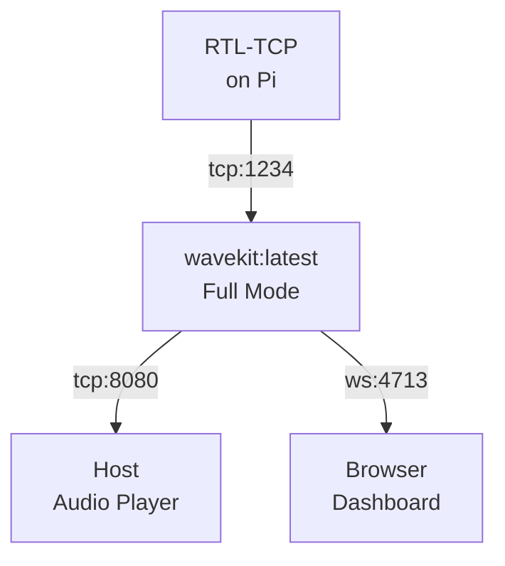
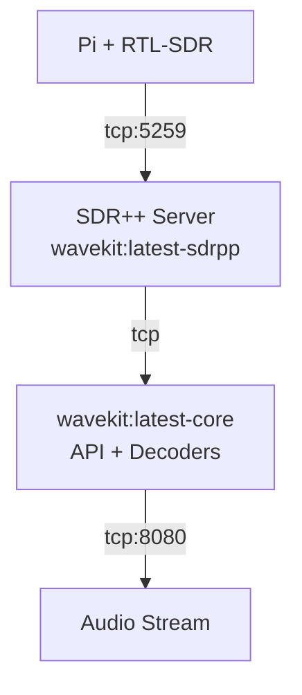

# WaveKit Docker Setup Guide

> **Status**: Production-ready, multi-platform (amd64/arm64/arm/v7)
> **Architecture**: s6-overlay service supervision, BuildKit optimization
> **Deployment Modes**: Full | Core | SDR++-only

## Quick Start

### Development (Full Mode)

```bash
# Build development images
./docker/build.sh full dev

# Run development environment
docker-compose -f docker-compose.dev.yml up

# Access services
curl http://localhost:9000/health        # API health
nc localhost 8080 | sox -t s16le ...    # Audio stream
wscat -c ws://localhost:4713            # WebSocket events
```

### Production (Optimized)

```bash
# Build production image
./docker/build.sh full latest

# Run with docker-compose
docker-compose -f docker-compose.prod.yml up -d

# Or with docker directly
docker run -d \
  -p 9000:9000 \
  -p 8080:8080 \
  -p 4713:4713 \
  -v wavekit-config:/app/config \
  -v recordings:/recordings \
  --restart unless-stopped \
  wavekit:latest
```

---

## Deployment Modes

### 🎯 Full Mode (Recommended for Pi)

Everything in one container. Simple, efficient, no networking overhead.



**When to use:**

- Raspberry Pi with integrated setup
- Single-host deployments
- Simplest operational model

**Start:**

```bash
docker run -d \
  --name wavekit \
  -e RTL_TCP_HOST=192.168.1.100 \
  -p 9000:9000 -p 8080:8080 -p 4713:4713 \
  -v wavekit-logs:/var/log/wavekit \
  wavekit:latest
```

**Environment:**
| Variable | Default | Purpose |
|----------|---------|---------|
| WAVEKIT_LOG_LEVEL | info | Logging level (debug/info/warn/error) |
| WAVEKIT_CONFIG_PATH | /app/config | Configuration directory |
| RTL_TCP_HOST | 127.0.0.1 | RTL-TCP server hostname |
| RTL_TCP_PORT | 1234 | RTL-TCP server port |
| NODE_ENV | production | Node.js environment |

---

### 🔌 Core Mode (Distributed Setup)

API + decoders only. Connect to external SDR++ server.

**Advantages:**

- SDR++ on Pi or dedicated host
- Decoders on more powerful machine
- Independent scaling



**Start SDR++ on Pi:**

```bash
docker run -d \
  --name wavekit-sdrpp \
  -p 5259:5259 \
  wavekit:latest-sdrpp
```

**Start WaveKit Core on main machine:**

```bash
docker run -d \
  --name wavekit \
  -e SDR_SOURCE=tcp://pi.local:5259 \
  -p 9000:9000 -p 8080:8080 -p 4713:4713 \
  wavekit:latest-core
```

---

### 🛰️ SDR++-Only Mode

Just SDR++ server. Useful for:

- Dedicated SDR hardware host
- Headless Pi setup
- Separating concerns

```bash
docker run -d \
  --name wavekit-sdrpp \
  -p 5259:5259 \
  wavekit:latest-sdrpp
```

---

## Process Management (s6-overlay)

WaveKit uses **s6-overlay** as PID 1, providing:

- ✅ Proper signal handling (SIGTERM → graceful shutdown)
- ✅ Auto-restart of failed services
- ✅ Dependency management (SDR++ before API)
- ✅ Process supervision with accurate status
- ✅ Logging aggregation

### Service Architecture

```
/run/service/
├── base           (oneshot: init system)
├── sdrpp-server   (depends: base)
└── wavekit-api    (depends: sdrpp-server)
```

### Checking Service Status

```bash
# Inside container
docker exec wavekit s6-svstat /run/service/wavekit-api

# From host (via healthcheck)
docker inspect wavekit --format='{{.State.Health.Status}}'
```

### Manual Service Control

```bash
# Stop API (s6-overlay auto-restarts it)
docker exec wavekit s6-svc -d /run/service/wavekit-api

# Stop & keep stopped
docker exec wavekit s6-svc -D /run/service/wavekit-api

# Restart
docker exec wavekit s6-svc -r /run/service/wavekit-api
```

---

## Multi-Platform Builds

### BuildKit Setup

Enable BuildKit for faster, more efficient builds:

```bash
export DOCKER_BUILDKIT=1
export BUILDKIT_PROGRESS=plain

# Or set in Docker daemon config
cat > ~/.docker/config.json <<EOF
{
  "buildkitVersion": "v0.11.0"
}
EOF
```

### Build for Multiple Platforms

```bash
# Build for amd64, arm64, arm/v7
./docker/build.sh full latest

# Or manually
docker buildx create --name wavekit-builder
docker buildx use wavekit-builder

docker buildx build \
  --platform linux/amd64,linux/arm64,linux/arm/v7 \
  --tag wavekit:latest \
  --push .
```

### Push to Multiple Registries

```bash
./docker/push.sh latest docker.io ghcr.io

# Pushes to:
# - docker.io/wavekit:latest
# - ghcr.io/wavekit:latest
```

---

## Configuration

### Mount Configuration

```bash
docker run -v my-config.yaml:/app/config/custom.yaml wavekit:latest
```

### Configuration Hierarchy

1. `/app/config/default.yaml` (built-in defaults)
2. Environment variables (override)
3. `/app/config/custom.yaml` (mounted config)

### Example Custom Config

```yaml
# /app/config/custom.yaml
api:
  port: 9000
  host: 0.0.0.0

decoders:
  dsd-fme:
    enabled: true
    mode: auto
  multimon-ng:
    enabled: true
    modes: [POCSAG512, FLEX]
  rtl_433:
    enabled: true

sources:
  rtl-tcp:
    host: 192.168.1.100
    port: 1234
```

---

## Logging

### View Logs

```bash
# From host
docker logs -f wavekit

# Inside container
docker exec -it wavekit tail -f /var/log/wavekit/system.log

# All services
docker exec -it wavekit s6-rc-log list
```

### Log Locations

| Service  | Path                            |
| -------- | ------------------------------- |
| System   | `/var/log/wavekit/system.log`   |
| API      | `/var/log/wavekit/wavekit.log`  |
| Decoders | `/var/log/wavekit/decoders.log` |
| SDR++    | `/var/log/wavekit/sdrpp.log`    |

### Configure Logging

```bash
docker run -e WAVEKIT_LOG_LEVEL=debug wavekit:latest
```

---

## Health Checks

### Container Health

```bash
# Check status
docker ps --format "table {{.Names}}\t{{.Status}}"

# Inspect detailed health
docker inspect wavekit --format='{{json .State.Health}}' | jq .
```

### Service Health Endpoints

```bash
# API health
curl http://localhost:9000/health

# Full status
curl http://localhost:9000/api/status

# Decoder status
curl http://localhost:9000/api/decoders
```

---

## Troubleshooting

### Container Won't Start

```bash
# Check logs
docker logs wavekit

# Check s6-overlay errors
docker exec wavekit cat /var/log/s6-rc.log

# Interactive shell
docker run -it --rm wavekit:latest /bin/bash
```

### Services Not Starting

```bash
# Check service status
docker exec wavekit s6-rc-status

# View service logs
docker exec wavekit s6-rc-log list
docker exec wavekit s6-rc-log show wavekit-api
```

### SDR++ Connection Issues

```bash
# Test connectivity from container
docker exec wavekit bash -c \
  'timeout 2 nc -zv sdrpp-server 5259'

# Or verify in API logs
docker logs -f wavekit | grep -i "sdr\|connect"
```

### Performance Issues

```bash
# Check resource usage
docker stats wavekit

# Increase limits in docker-compose
cpu: "2"
memory: 1G

# or via docker run
--cpus 2 --memory 1g
```

---

## Volume Management

### Essential Volumes

| Path               | Purpose          | Persistence |
| ------------------ | ---------------- | ----------- |
| `/app/config`      | Configuration    | Recommended |
| `/var/log/wavekit` | Logs             | Optional    |
| `/recordings`      | Audio recordings | Required    |

### Create Named Volume

```bash
docker volume create wavekit-config
docker run -v wavekit-config:/app/config wavekit:latest
```

### Backup Configuration

```bash
docker run --rm \
  -v wavekit-config:/app/config \
  -v $(pwd):/backup \
  alpine tar czf /backup/wavekit-config.tar.gz -C / app/config
```

### Restore Configuration

```bash
docker run --rm \
  -v wavekit-config:/app/config \
  -v $(pwd):/backup \
  alpine tar xzf /backup/wavekit-config.tar.gz -C /
```

---

## Audio Streaming

### Connect to Audio Stream

```bash
# On host machine
nc localhost 8080 | sox -t s16le -r 48000 -c 1 -b 16 -e signed-integer - -d

# Or with ffplay
nc localhost 8080 | ffplay -f s16le -ar 48000 -ac 1 -nodisp -
```

### Audio Format

- **Format**: S16LE (16-bit signed, little-endian)
- **Sample Rate**: 48000 Hz
- **Channels**: 1 (mono)
- **Bitrate**: 1.5 Mbps

---

## Security

### Network Security

```bash
# Don't expose all ports
docker run -p 9000:9000 wavekit:latest  # API only

# Use internal Docker network
docker network create wavekit-net
docker run --network wavekit-net wavekit:latest
```

### User Privileges

```bash
# Run as non-root (if decoder supports it)
docker run --user 1000:1000 wavekit:latest

# Or keep root (required for process management)
docker run --user 0:0 wavekit:latest
```

### Secrets

```bash
# Use Docker secrets (Swarm mode)
docker secret create wavekit-config my-config.yaml

# Or environment variables
docker run -e DATABASE_URL=... wavekit:latest
```

---

## Performance Tuning

### CPU & Memory

```yaml
# docker-compose.yml
services:
  wavekit:
    deploy:
      resources:
        limits:
          cpus: "2" # 2 CPU cores
          memory: 1G # 1 GB RAM
        reservations:
          cpus: "1" # Reserve 1 core
          memory: 512M # Reserve 512 MB
```

### Decoder Optimization

```bash
docker run -e DECODER_THREADS=4 wavekit:latest
```

### Storage

```bash
# Use local driver for performance
docker run -v wavekit-data:/recordings --volume-driver local wavekit:latest

# Or bind mount (even faster, but less portable)
docker run -v /fast/ssd/recordings:/recordings wavekit:latest
```

---

## Docker Compose Examples

### Minimal Setup (Pi with rtl_tcp)

```yaml
version: "3.9"
services:
  wavekit:
    image: wavekit:latest
    environment:
      RTL_TCP_HOST: 192.168.1.100
      RTL_TCP_PORT: 1234
    ports:
      - "9000:9000"
      - "8080:8080"
      - "4713:4713"
    restart: unless-stopped
```

### Full Stack (with monitoring)

```bash
docker-compose -f docker-compose.prod.yml up -d

# Monitoring available at:
# - Grafana: http://localhost:3000
# - Prometheus: http://localhost:9090
```

---

## Maintenance

### Update Image

```bash
# Pull latest
docker pull wavekit:latest

# Rebuild locally
./docker/build.sh full latest

# Stop old container & start new
docker-compose -f docker-compose.prod.yml down
docker-compose -f docker-compose.prod.yml up -d
```

### Clean Up

```bash
# Remove unused images
docker image prune -a

# Remove stopped containers
docker container prune

# Remove unused volumes
docker volume prune
```

### Backup & Restore

```bash
# Backup
docker run --rm \
  -v wavekit-config:/data \
  -v $(pwd):/backup \
  alpine tar czf /backup/wavekit-backup.tar.gz -C / data

# Restore
docker volume create wavekit-config
docker run --rm \
  -v wavekit-config:/data \
  -v $(pwd):/backup \
  alpine tar xzf /backup/wavekit-backup.tar.gz -C /
```

---

## Advanced: Custom Decoder Integration

### Building with Additional Decoders

Extend `Dockerfile` with new decoder builds:

```dockerfile
# Stage: readsb-build
FROM base-deps AS readsb-build
RUN git clone https://github.com/wiedehopf/readsb.git && \
    cd readsb && make -j$(nproc)

# Final stage
FROM runtime-base AS final
COPY --from=readsb-build /build/readsb/readsb /usr/local/bin/
```

---

## Architecture Decision Records

### Why s6-overlay?

| Aspect             | s6-overlay           | supervisord   | Docker multi-process |
| ------------------ | -------------------- | ------------- | -------------------- |
| PID 1 handling     | ✅ Native            | ❌ Delegate   | ⚠️ Manual            |
| Signal propagation | ✅ Proper SIGTERM    | ⚠️ Unreliable | ❌ Missed signals    |
| Dependency mgmt    | ✅ Built-in          | ⚠️ Complex    | ❌ None              |
| Container size     | ✅ 5MB               | ❌ 50MB       | ✅ Smallest          |
| Industry adoption  | ✅ Alpine, Baseimage | ❌ Legacy     | ⚠️ Discouraged       |

### Why Multi-Stage Builds?

- 🏗️ Separate build and runtime environments
- 📦 Only final dependencies in image
- 🚀 Faster builds with better caching
- 🔐 Reduced attack surface

### Why BuildKit?

- ⚡ Parallel stage building
- 💾 Persistent caching (`--mount=type=cache`)
- 📐 Better layer management
- 🔄 Improved incremental builds

---

## References

- [s6-overlay Documentation](https://skarnet.org/software/s6-overlay/)
- [Docker BuildKit](https://docs.docker.com/build/buildkit/)
- [Docker Compose](https://docs.docker.com/compose/)
- [WaveKit GitHub](https://github.com/your-org/wavekit)
