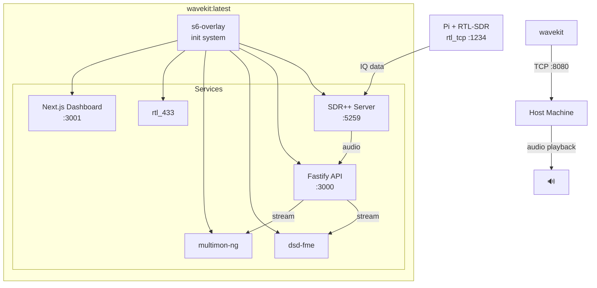
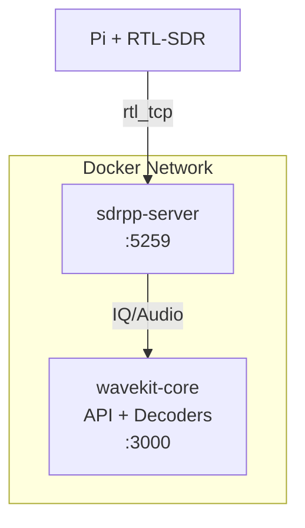
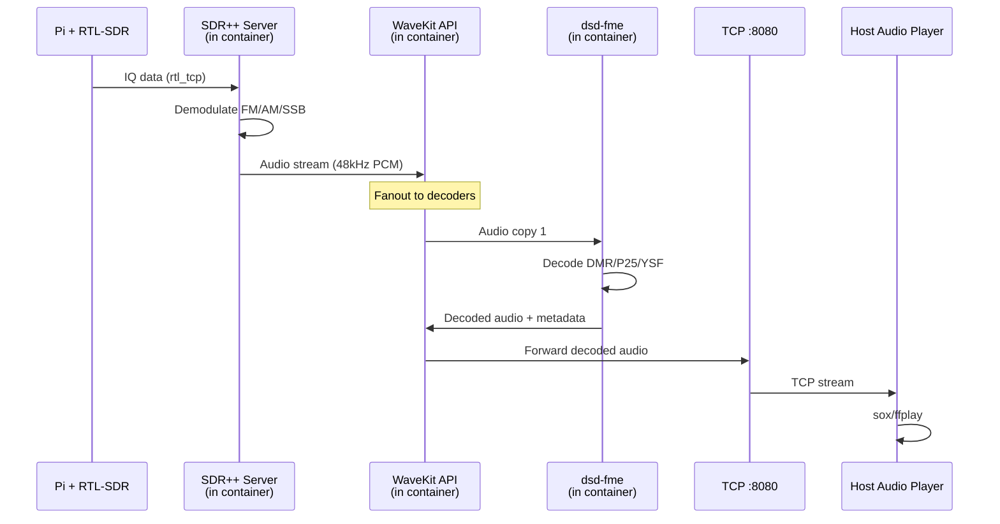

# WaveKit Docker Architecture Deep Dive

> Let's think through every aspect of containerizing this SDR signal processing stack.

---

## The Core Question: Monolith vs Microservices

You suggested putting **everything in one container**. Let's deeply analyze both approaches:

### Option A: Single "Mega-Container" 🐳

Everything runs inside one container: SDR++ Server, decoders, API, dashboard.



**Pros:**
| Benefit | Why it matters |
|---------|----------------|
| **Single deployment** | `docker run wavekit` - done |
| **Shared filesystem** | Logs, recordings all in one place |
| **No network complexity** | Inter-process communication is fast (shared memory) |
| **Easier debugging** | `docker exec -it wavekit bash` gives you everything |
| **Resource efficiency** | Shared base image layers, no container overhead |

**Cons:**
| Challenge | Mitigation |
|-----------|------------|
| **Process management** | Use s6-overlay as init system (designed for this) |
| **One crash affects all** | s6-overlay auto-restarts individual services |
| **Large image size** | Multi-stage builds, shared base layers (~1-2GB total) |
| **Can't scale decoders** | For hobby use, not needed |

---

### Option B: Sidecar Pattern 🚗🏍️

Separate containers communicating over Docker network:



**Pros:**

- SDR++ Server can be updated independently
- Cleaner separation of concerns

**Cons:**

- More complex networking
- Need docker-compose or orchestration
- Audio streaming between containers adds latency

---

## My Recommendation: **Hybrid Approach** 🎯

After deep analysis, I recommend a **single container with SDR++ Server as an optional sidecar**:

```mermaid
graph TB
    subgraph "Deployment Options"
        subgraph "Option 1: All-in-One"
            A1[wavekit:full]
            A1 --> |contains| SDRPP1[SDR++ Server]
            A1 --> |contains| CORE1[API + Decoders]
        end

        subgraph "Option 2: Sidecar"
            B1[wavekit:core]
            B2[wavekit:sdrpp]
            B1 -.->|network| B2
        end
    end

    style A1 fill:#2d5a27
    style B1 fill:#1a3a5c
    style B2 fill:#1a3a5c
```



**Why?**

- Build **one Dockerfile** with multi-stage targets
- `wavekit:full` = everything (for single-node deployment)
- `wavekit:core` = just API + decoders (if you want SDR++ elsewhere)
- `wavekit:sdrpp` = just SDR++ server (for dedicated SDR host)

---

## Process Management: s6-overlay

Since we're running multiple processes in one container, we need a proper init system. **s6-overlay** is the gold standard:

### Why s6-overlay over supervisord?

| Feature                     | s6-overlay                    | supervisord                   |
| --------------------------- | ----------------------------- | ----------------------------- |
| **Designed for containers** | ✅ Yes, runs as PID 1         | ❌ No, not designed for PID 1 |
| **Signal handling**         | ✅ Proper SIGTERM propagation | ⚠️ Can miss signals           |
| **Zombie reaping**          | ✅ Handles orphaned processes | ⚠️ Limited                    |
| **Dependencies**            | C only, ~5MB                  | Python, ~50MB                 |
| **Auto-restart**            | ✅ Built-in                   | ✅ Built-in                   |
| **Health checks**           | ✅ Accurate container status  | ⚠️ Can report false healthy   |

### s6-overlay Service Structure

```
/etc/s6-overlay/
├── s6-rc.d/
│   ├── sdrpp-server/
│   │   ├── type           # "longrun"
│   │   ├── run            # Start script
│   │   ├── finish         # Cleanup script
│   │   └── dependencies.d/
│   │       └── base       # Wait for base setup
│   │
│   ├── wavekit-api/
│   │   ├── type
│   │   ├── run
│   │   └── dependencies.d/
│   │       └── sdrpp-server  # Start after SDR++
│   │
│   ├── decoder-dsd/
│   │   ├── type
│   │   ├── run
│   │   └── dependencies.d/
│   │       └── wavekit-api
│   │
│   ├── decoder-multimon/
│   │   └── ...
│   │
│   └── user/
│       └── contents.d/
│           ├── sdrpp-server
│           ├── wavekit-api
│           ├── decoder-dsd
│           └── decoder-multimon
```

### Example Service Script

```bash
# /etc/s6-overlay/s6-rc.d/sdrpp-server/run
#!/command/execlineb -P
with-contenv
cd /app

# Wait for rtl_tcp to be available (on the Pi)
if { s6-svwait -U /run/service/network-ready }

# Start SDR++ in server mode
fdmove -c 2 1
sdrpp --server --port 5259 --addr 0.0.0.0
```

---

## SDR++ Server Analysis

SDR++ has a built-in server mode that's perfect for headless Docker operation:

### Server Mode Features

```bash
sdrpp --server [options]

Options:
  --port, -p    Server port (default: 5259)
  --addr, -a    Bind address (default: 0.0.0.0)
```

### What SDR++ Server Provides

| Feature                  | Benefit                                |
| ------------------------ | -------------------------------------- |
| **Remote IQ streaming**  | Clients get raw IQ data from the SDR   |
| **Full device control**  | Frequency, gain, bandwidth via network |
| **Multiple SDR support** | RTL-SDR, HackRF, SDRplay, AirSpy, etc  |
| **Better than rtl_tcp**  | More features, better stability        |

### SDR++ Server in Docker

```dockerfile
# Can connect to rtl_tcp on Pi - no USB passthrough needed!
ENV RTL_TCP_HOST=192.168.1.100
ENV RTL_TCP_PORT=1234

# SDR++ connects to rtl_tcp as a "network source"
CMD ["sdrpp", "--server", "--port", "5259"]
```

> [!IMPORTANT]
> SDR++ Server can connect to your Pi's rtl_tcp over the network. No USB device passthrough needed in the Docker container!

---

## Audio Flow Architecture

This is where it gets interesting. Let's trace the complete audio path:



### Audio Routing Options Inside Container

**Option 1: Internal Network Sink (Preferred)**

SDR++ has a "Network Sink" that outputs audio to a TCP port. Inside the container:

```
SDR++ → tcp://127.0.0.1:7355 → WaveKit API → decoders
```

**Option 2: Named Pipes**

```
SDR++ → /tmp/sdr-audio.pipe → WaveKit API → decoders
```

**Option 3: Virtual Audio Device (ALSA loopback)**

```bash
# Load ALSA loopback module
modprobe snd-aloop

# SDR++ outputs to hw:Loopback,0,0
# WaveKit reads from hw:Loopback,1,0
```

**Recommendation:** Option 1 (Network Sink) is cleanest and matches your current setup.

---

## Host-Side Audio Player

For decoded audio playback, we'll have a tiny process on the host:

### Simple Host Player Script

```bash
#!/bin/bash
# wavekit-audio-player.sh
# Run on host: ./wavekit-audio-player.sh

CONTAINER_HOST="${1:-localhost}"
AUDIO_PORT="${2:-8080}"

echo "▶ Connecting to WaveKit audio stream at ${CONTAINER_HOST}:${AUDIO_PORT}"

# Using nc + sox for playback
nc "$CONTAINER_HOST" "$AUDIO_PORT" \
  | sox -t raw -r 48000 -c 1 -b 16 -e signed-integer - -d

# Alternative: ffplay
# nc "$CONTAINER_HOST" "$AUDIO_PORT" | ffplay -f s16le -ar 48000 -ac 1 -nodisp -
```

### Or as a tiny Node.js script

```typescript
// wavekit-audio-player.ts
import { spawn } from "child_process"
import { createConnection } from "net"

const socket = createConnection({ host: "localhost", port: 8080 })
const player = spawn("sox", [
	"-t",
	"raw",
	"-r",
	"48000",
	"-c",
	"1",
	"-b",
	"16",
	"-e",
	"signed-integer",
	"-",
	"-d",
])

socket.pipe(player.stdin)

socket.on("connect", () => console.log("🔊 Audio connected"))
socket.on("error", e => console.error("Audio error:", e.message))
```

---

## Complete Dockerfile Design

Here's the full multi-stage Dockerfile for the "mega-container":

```dockerfile
# =============================================================================
# Stage 1: Base with SDR dependencies
# =============================================================================
FROM debian:bookworm-slim AS sdr-base

RUN apt-get update && apt-get install -y --no-install-recommends \
    # Build tools
    build-essential cmake git pkg-config \
    # SDR libraries
    librtlsdr-dev libhackrf-dev libairspy-dev \
    libsoapysdr-dev soapysdr-module-rtlsdr \
    # Audio libraries
    libsndfile1-dev libsamplerate0-dev \
    libpulse-dev libasound2-dev \
    sox libsox-fmt-all \
    # SDR++ dependencies
    libfftw3-dev libglfw3-dev libglew-dev \
    libvolk2-dev libzstd-dev \
    # Networking
    netcat-openbsd curl \
    && rm -rf /var/lib/apt/lists/*

# =============================================================================
# Stage 2: Build SDR++ Server
# =============================================================================
FROM sdr-base AS sdrpp-build

WORKDIR /build

# Clone and build SDR++
RUN git clone --depth 1 https://github.com/AlexandreRouworx/SDRPlusPlus.git && \
    cd SDRPlusPlus && \
    mkdir build && cd build && \
    cmake .. \
        -DOPT_BUILD_RTL_TCP_SOURCE=ON \
        -DOPT_BUILD_SOAPY_SOURCE=ON \
        -DOPT_BUILD_NETWORK_SINK=ON \
        -DOPT_BUILD_NEW_PORTAUDIO_SINK=OFF \
        -DOPT_BUILD_AUDIO_SINK=OFF \
        && \
    make -j$(nproc) && \
    make install

# =============================================================================
# Stage 3: Build dsd-fme
# =============================================================================
FROM sdr-base AS dsd-build

WORKDIR /build

RUN git clone --depth 1 https://github.com/lwvmobile/dsd-fme.git && \
    cd dsd-fme && \
    mkdir build && cd build && \
    cmake .. && \
    make -j$(nproc) && \
    make install

# =============================================================================
# Stage 4: Build multimon-ng
# =============================================================================
FROM sdr-base AS multimon-build

WORKDIR /build

RUN git clone --depth 1 https://github.com/EliasOeworsl/multimon-ng.git && \
    cd multimon-ng && \
    mkdir build && cd build && \
    cmake .. && \
    make -j$(nproc) && \
    make install

# =============================================================================
# Stage 5: Build rtl_433
# =============================================================================
FROM sdr-base AS rtl433-build

WORKDIR /build

RUN git clone --depth 1 https://github.com/merbanan/rtl_433.git && \
    cd rtl_433 && \
    mkdir build && cd build && \
    cmake .. && \
    make -j$(nproc) && \
    make install

# =============================================================================
# Stage 6: Node.js for WaveKit API
# =============================================================================
FROM node:22-bookworm-slim AS node-build

WORKDIR /app

COPY package*.json ./
RUN npm ci --only=production

COPY . .
RUN npm run build

# =============================================================================
# Stage 7: Final Runtime Image
# =============================================================================
FROM debian:bookworm-slim AS runtime

# Install s6-overlay
ARG S6_OVERLAY_VERSION=3.1.6.2
ADD https://github.com/just-containers/s6-overlay/releases/download/v${S6_OVERLAY_VERSION}/s6-overlay-noarch.tar.xz /tmp
ADD https://github.com/just-containers/s6-overlay/releases/download/v${S6_OVERLAY_VERSION}/s6-overlay-x86_64.tar.xz /tmp
RUN tar -C / -Jxpf /tmp/s6-overlay-noarch.tar.xz && \
    tar -C / -Jxpf /tmp/s6-overlay-x86_64.tar.xz && \
    rm /tmp/s6-overlay-*.tar.xz

# Install runtime dependencies only
RUN apt-get update && apt-get install -y --no-install-recommends \
    librtlsdr0 libhackrf0 libairspy0 \
    libsoapysdr0.8 soapysdr-module-rtlsdr \
    libsndfile1 libsamplerate0 \
    libpulse0 libasound2 \
    sox libsox-fmt-all \
    libfftw3-3 libglfw3 libglew2.2 \
    libvolk2.5 libzstd1 \
    netcat-openbsd curl \
    && rm -rf /var/lib/apt/lists/*

# Install Node.js runtime
RUN curl -fsSL https://deb.nodesource.com/setup_22.x | bash - && \
    apt-get install -y nodejs && \
    rm -rf /var/lib/apt/lists/*

# Copy built applications
COPY --from=sdrpp-build /usr/local/bin/sdrpp* /usr/local/bin/
COPY --from=sdrpp-build /usr/local/lib/sdrpp /usr/local/lib/sdrpp
COPY --from=dsd-build /usr/local/bin/dsd-fme /usr/local/bin/
COPY --from=multimon-build /usr/local/bin/multimon-ng /usr/local/bin/
COPY --from=rtl433-build /usr/local/bin/rtl_433 /usr/local/bin/
COPY --from=node-build /app /app

# Copy s6 service definitions
COPY docker/s6-overlay/ /etc/s6-overlay/

# Create directories
RUN mkdir -p /data/logs /data/recordings /data/config

# Environment
ENV S6_KEEP_ENV=1
ENV S6_BEHAVIOUR_IF_STAGE2_FAILS=2
ENV RTL_TCP_HOST=host.docker.internal
ENV RTL_TCP_PORT=1234
ENV SDRPP_PORT=5259
ENV API_PORT=3000
ENV AUDIO_OUT_PORT=8080

# Expose ports
EXPOSE 5259 3000 8080

# Volumes
VOLUME ["/data"]

# s6-overlay as init
ENTRYPOINT ["/init"]
```

---

## Image Size Analysis

| Component                  | Estimated Size |
| -------------------------- | -------------- |
| Base Debian + runtime libs | ~200 MB        |
| SDR++ Server               | ~50 MB         |
| dsd-fme                    | ~10 MB         |
| multimon-ng                | ~5 MB          |
| rtl_433                    | ~5 MB          |
| Node.js + WaveKit          | ~100 MB        |
| s6-overlay                 | ~5 MB          |
| **Total**                  | **~375 MB**    |

With multi-stage builds, we avoid including build tools in the final image.

---

## Deployment Scenarios

### Scenario 1: All-in-One on Mac

```bash
# Start WaveKit container
docker run -d --name wavekit \
  -p 3000:3000 \    # API
  -p 8080:8080 \    # Audio out
  -v wavekit-data:/data \
  -e RTL_TCP_HOST=192.168.1.100 \
  -e RTL_TCP_PORT=1234 \
  wavekit:full

# Start host audio player
./wavekit-audio-player.sh localhost 8080
```

### Scenario 2: SDR++ on Pi, Rest in Docker

```bash
# On Pi: just rtl_tcp
rtl_tcp -a 0.0.0.0 -p 1234

# On Mac: WaveKit with SDR++ inside
docker run -d --name wavekit \
  -e RTL_TCP_HOST=pi.local \
  wavekit:full
```

### Scenario 3: SDR++ on Pi via Docker

```bash
# On Pi: SDR++ Server in Docker
docker run -d --name sdrpp \
  --device /dev/bus/usb \
  -p 5259:5259 \
  wavekit:sdrpp

# On Mac: WaveKit core
docker run -d --name wavekit \
  -e SDRPP_HOST=pi.local \
  -e SDRPP_PORT=5259 \
  wavekit:core
```

---

## Configuration File

The container will use a YAML config for runtime settings:

```yaml
# /data/config/wavekit.yaml

source:
  # Connect to SDR++ server (can be internal or external)
  type: sdrpp-network
  host: 127.0.0.1 # localhost = internal SDR++
  port: 5259

  # Or connect directly to rtl_tcp
  # type: rtl_tcp
  # host: 192.168.1.100
  # port: 1234

sdrpp:
  # Only used if source.type = sdrpp-network and host = 127.0.0.1
  enabled: true
  rtl_tcp_host: ${RTL_TCP_HOST} # Env variable
  rtl_tcp_port: ${RTL_TCP_PORT}

decoders:
  dsd-fme:
    enabled: true
    mode: auto
    output: wav
    wav_dir: /data/recordings

  multimon-ng:
    enabled: true
    modes:
      - POCSAG512
      - POCSAG1200
      - POCSAG2400
      - FLEX

  rtl_433:
    enabled: false # Only for ISM band signals

audio:
  # Output decoded audio over TCP
  tcp_port: 8080
  format: S16LE
  sample_rate: 48000

api:
  port: 3000

logging:
  level: info
  dir: /data/logs
```

---

## Summary: Recommended Architecture

```mermaid
graph TB
    subgraph "Your Setup"
        PI[🍓 Raspberry Pi<br/>RTL-SDR + rtl_tcp :1234]
    end

    subgraph "Docker on Mac"
        subgraph "wavekit:full container"
            S6[s6-overlay]
            SDRPP[SDR++ Server<br/>connects to rtl_tcp]
            API[WaveKit API<br/>Fastify :3000]
            DSD[dsd-fme]
            MM[multimon-ng]
            RTL[rtl_433]

            S6 --> SDRPP
            S6 --> API
            S6 --> DSD
            S6 --> MM
            S6 --> RTL

            SDRPP -->|audio| API
            API -->|fanout| DSD
            API -->|fanout| MM
        end
    end

    subgraph "Mac Host"
        PLAYER[wavekit-audio-player<br/>sox/ffplay]
        BROWSER[Browser<br/>Dashboard :3000]
    end

    PI -->|IQ data| SDRPP
    API -->|TCP :8080| PLAYER
    PLAYER --> SPEAKER[🔊]
    API --> BROWSER

    style wavekit:full fill:#1a3a5c
```



---

## Next Steps

1. **Approve this architecture?**
2. **Start with the Dockerfile** - Build the multi-stage image
3. **Add s6-overlay services** - Service definitions for each process
4. **Implement WaveKit TypeScript core** - Stream handling, API
5. **Create host audio player** - Simple script for audio output
6. **Test end-to-end** - Pi → Docker → Audio on Mac

What aspects would you like to explore further?
