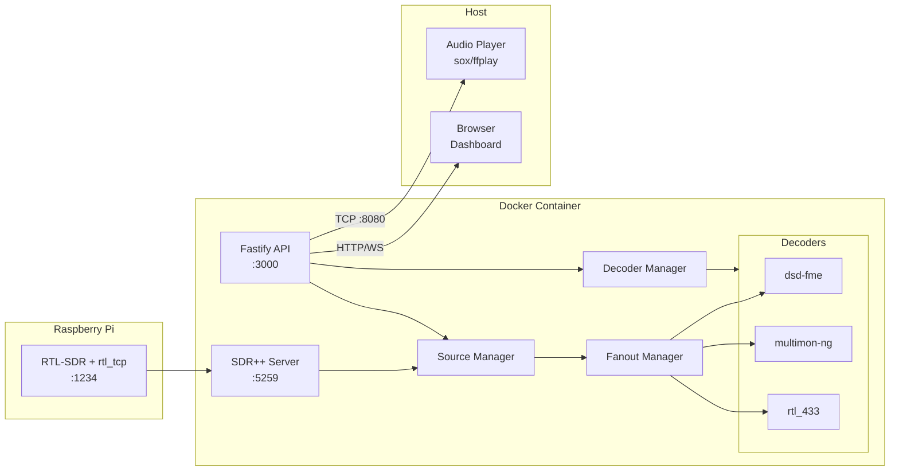

# WaveKit: SDR Stream Processing Framework

> **AI Agent Implementation Specification v1.0**
>
> A production-ready TypeScript framework for SDR signal processing with Docker containerization, Fastify API, and extensible decoder architecture.

---

## Executive Summary

**WaveKit** is a TypeScript-based SDR (Software Defined Radio) stream processing framework that:

1. Connects to SDR sources (rtl_tcp, SDR++ network sink)
2. Fans out audio streams to multiple signal decoders in parallel
3. Provides a Fastify REST/WebSocket API for control and monitoring
4. Runs in Docker with optional SDR++ Server integration
5. Outputs decoded audio over TCP for host-side playback

### Current Hardware Setup

```
┌─────────────────┐      ┌─────────────────┐      ┌─────────────────┐
│  Raspberry Pi 3 │      │   Mac (Docker)  │      │   Mac (Host)    │
│                 │      │                 │      │                 │
│  RTL-SDR dongle │      │  WaveKit        │      │  Audio Player   │
│  + Antenna      │ ───► │  Container      │ ───► │  (sox/ffplay)   │
│                 │ IQ   │                 │ TCP  │                 │
│  rtl_tcp :1234  │      │  SDR++ Server   │      │  Browser UI     │
│                 │      │  + Decoders     │      │  (future)       │
└─────────────────┘      └─────────────────┘      └─────────────────┘
```

---

## Table of Contents

1. [Architecture Overview](#architecture-overview)
2. [Docker Strategy](#docker-strategy)
3. [Project Structure](#project-structure)
4. [Core Components](#core-components)
5. [Decoder Plugin System](#decoder-plugin-system)
6. [API Specification](#api-specification)
7. [Configuration](#configuration)
8. [Implementation Phases](#implementation-phases)
9. [Future Roadmap](#future-roadmap)
10. [Development Guidelines](#development-guidelines)

---

## Architecture Overview

### System Flow



### Component Responsibilities

| Component           | Responsibility                                           |
| ------------------- | -------------------------------------------------------- |
| **Source Manager**  | TCP connections to SDR sources with auto-reconnect       |
| **Fanout Manager**  | Multiplexes audio stream to N decoders with backpressure |
| **Decoder Manager** | Lifecycle management for decoder processes               |
| **Process Manager** | Spawn, monitor, restart subprocesses                     |
| **API Server**      | REST endpoints + WebSocket for real-time events          |

---

## Docker Strategy

### Multi-Target Build

The Dockerfile supports three build targets:

| Target          | Contents                          | Use Case              |
| --------------- | --------------------------------- | --------------------- |
| `wavekit:full`  | SDR++ Server + API + All Decoders | All-in-one deployment |
| `wavekit:core`  | API + All Decoders (no SDR++)     | SDR++ runs elsewhere  |
| `wavekit:sdrpp` | SDR++ Server only                 | Dedicated SDR server  |

### Build Commands

```bash
# Full image (recommended)
docker build --target runtime-full -t wavekit:full .

# Core only (connect to external SDR++)
docker build --target runtime-core -t wavekit:core .

# SDR++ server only
docker build --target runtime-sdrpp -t wavekit:sdrpp .
```

### Process Management: s6-overlay

Use [s6-overlay](https://github.com/just-containers/s6-overlay) v3.x as the container init system:

- Runs as PID 1 with proper signal handling
- Auto-restarts crashed services
- Supports service dependencies
- Lightweight (~5MB)

#### Service Dependency Graph

```
base-setup (oneshot)
    │
    ├── sdrpp-server (longrun) ─────┐
    │                               │
    └── wavekit-api (longrun) ──────┤
            │                       │
            ├── decoder-dsd         │
            ├── decoder-multimon    │
            └── decoder-rtl433      │
                                    │
            [all depend on api] ────┘
```

### Audio Output

Decoded audio streams out over TCP (not PulseAudio):

```
Container :8080 → TCP → Host sox/ffplay
```

Host-side player script:

```bash
#!/bin/bash
nc localhost 8080 | sox -t raw -r 48000 -c 1 -b 16 -e signed-integer - -d
```

---

## Project Structure

```
wavekit/
├── src/
│   ├── index.ts                    # Entry point
│   ├── config.ts                   # Zod schemas + config loading
│   │
│   ├── core/
│   │   ├── source-manager.ts       # TCP client for SDR sources
│   │   ├── fanout-manager.ts       # Stream multiplexer
│   │   ├── format-converter.ts     # F32↔S16 transform streams
│   │   ├── audio-output.ts         # TCP server for audio out
│   │   └── types.ts                # Core type definitions
│   │
│   ├── decoders/
│   │   ├── types.ts                # Decoder interface + status types
│   │   ├── manager.ts              # Decoder lifecycle orchestration
│   │   ├── base-decoder.ts         # Abstract base class
│   │   ├── output-parser.ts        # Parse decoder stdout
│   │   │
│   │   ├── builtin/
│   │   │   ├── dsd-fme.ts          # DSD-FME adapter
│   │   │   ├── multimon-ng.ts      # Multimon-ng adapter
│   │   │   ├── rtl433.ts           # rtl_433 adapter
│   │   │   └── audio-passthrough.ts # Raw audio output
│   │   │
│   │   └── registry.ts             # Decoder plugin registry
│   │
│   ├── api/
│   │   ├── server.ts               # Fastify setup
│   │   ├── plugins/
│   │   │   ├── websocket.ts        # @fastify/websocket setup
│   │   │   └── swagger.ts          # OpenAPI docs
│   │   │
│   │   ├── routes/
│   │   │   ├── health.ts           # GET /health
│   │   │   ├── status.ts           # GET /api/status
│   │   │   ├── sources.ts          # /api/sources CRUD
│   │   │   ├── decoders.ts         # /api/decoders CRUD
│   │   │   └── audio.ts            # /api/audio/stream
│   │   │
│   │   └── websocket/
│   │       └── events.ts           # Real-time event broadcasting
│   │
│   └── utils/
│       ├── logger.ts               # Pino structured logging
│       ├── process.ts              # Child process helpers
│       └── graceful-shutdown.ts    # SIGTERM handling
│
├── docker/
│   ├── Dockerfile                  # Multi-stage, multi-target
│   ├── s6-overlay/
│   │   └── s6-rc.d/
│   │       ├── sdrpp-server/
│   │       │   ├── type            # "longrun"
│   │       │   ├── run             # Start script
│   │       │   └── dependencies.d/
│   │       │
│   │       ├── wavekit-api/
│   │       │   ├── type
│   │       │   ├── run
│   │       │   └── dependencies.d/
│   │       │
│   │       └── user/
│   │           └── contents.d/     # Services to start
│   │
│   └── scripts/
│       └── audio-player.sh         # Host-side audio player
│
├── config/
│   └── default.yaml                # Default configuration
│
├── tests/
│   ├── unit/
│   ├── integration/
│   └── mocks/
│
├── package.json
├── tsconfig.json
├── docker-compose.yml
└── README.md
```

---

## Core Components

### Source Manager

Manages TCP connections to SDR sources with automatic reconnection.

```typescript
// src/core/source-manager.ts

interface SourceConfig {
	id: string
	type: "sdrpp-network" | "rtl_tcp"
	host: string
	port: number
	format: "S16LE" | "FLOAT32LE"
	sampleRate: number
}

interface SourceStatus {
	id: string
	connected: boolean
	bytesReceived: number
	dataRate: number // KB/s
	lastError?: string
}

class SourceManager extends EventEmitter {
	// Events: 'connected', 'disconnected', 'error', 'data'

	connect(config: SourceConfig): Promise<Readable>
	disconnect(id: string): void
	getStatus(id: string): SourceStatus
	getAllStatus(): SourceStatus[]
}
```

**Key behaviors:**

- Auto-reconnect with exponential backoff (2s, 4s, 8s, max 30s)
- Emit data rate metrics every 5 seconds
- Handle `ECONNREFUSED`, `ETIMEDOUT`, `ECONNRESET` gracefully

### Fanout Manager

Multiplexes a single audio stream to multiple consumers.

```typescript
// src/core/fanout-manager.ts

interface BranchConfig {
	id: string
	highWaterMark?: number // Default: 256KB
}

class FanoutManager extends EventEmitter {
	// Events: 'backpressure', 'branch-added', 'branch-removed'

	attachSource(source: Readable): void
	addBranch(config: BranchConfig): PassThrough
	removeBranch(id: string): void
	getBranchIds(): string[]
}
```

**Key behaviors:**

- Each branch has independent buffering
- If a branch buffer fills, emit 'backpressure' event (don't block source)
- Real-time audio priority: prefer dropping data over blocking

### Format Converter

Transform streams for audio format conversion.

```typescript
// src/core/format-converter.ts

// Convert 32-bit float to 16-bit signed integer
function createF32ToS16Transform(): Transform

// Convert 16-bit signed integer to 32-bit float
function createS16ToF32Transform(): Transform

// Resample audio (48kHz → 22050Hz for multimon-ng)
function createResampleTransform(fromRate: number, toRate: number): Transform
```

---

## Decoder Plugin System

### Decoder Interface

All decoders implement this interface for consistent lifecycle management.

```typescript
// src/decoders/types.ts

interface DecoderConfig {
	id: string
	type: string
	enabled: boolean
	options: Record<string, unknown>
}

interface DecoderOutput {
	timestamp: Date
	decoder: string
	type: "sync" | "decode" | "call" | "message" | "signal" | "error" | "stats"
	data: unknown
}

interface DecoderStatus {
	id: string
	type: string
	running: boolean
	pid?: number
	uptime: number
	stats: {
		bytesIn: number
		eventsOut: number
		errors: number
	}
}

interface Decoder {
	readonly id: string
	readonly type: string

	start(): Promise<void>
	stop(): Promise<void>
	restart(): Promise<void>

	attachInput(stream: Readable): void
	getOutput(): Readable // Object mode stream of DecoderOutput
	getStatus(): DecoderStatus

	on(event: "output", listener: (output: DecoderOutput) => void): this
	on(event: "error", listener: (error: Error) => void): this
	on(event: "exit", listener: (code: number) => void): this
}
```

### Built-in Decoders

#### DSD-FME

Digital voice decoder (DMR, P25, YSF, D-Star, NXDN, ProVoice).

```typescript
// src/decoders/builtin/dsd-fme.ts

interface DsdFmeOptions {
	mode: "auto" | "dmr" | "p25" | "ysf" | "dstar" | "nxdn" | "provoice"
	output: "null" | "wav" | "udp"
	wavDir?: string
	extraArgs?: string[]
}

// Output types:
// - { type: 'sync', data: { mode: 'DMR', slot: 1 } }
// - { type: 'call', data: { talkgroup: 1234, source: 5678, duration: 12.5 } }
// - { type: 'error', data: { message: 'FEC ERR' } }
```

#### Multimon-ng

Pager and data protocol decoder.

```typescript
// src/decoders/builtin/multimon-ng.ts

interface MultimonOptions {
	modes: Array<
		| "POCSAG512"
		| "POCSAG1200"
		| "POCSAG2400"
		| "FLEX"
		| "EAS"
		| "AFSK1200"
		| "FSK9600"
		| "DTMF"
	>
	verbosity?: number
	filters?: {
		highpass?: number
		lowpass?: number
		gain?: number
	}
}

// Output types:
// - { type: 'message', data: { protocol: 'POCSAG1200', address: 1234567, message: '...' } }
// - { type: 'decode', data: { protocol: 'DTMF', digits: '123#' } }
```

#### RTL_433

ISM band signal classifier and decoder.

```typescript
// src/decoders/builtin/rtl433.ts

interface Rtl433Options {
	analyze?: boolean // -A flag for pulse analysis
	protocols?: number[] // Specific protocols to decode
}

// Output types:
// - { type: 'signal', data: { model: 'Acurite-Tower', id: 1234, temp_C: 22.5 } }
```

### Decoder Registry

Plugin system for adding new decoders.

```typescript
// src/decoders/registry.ts

type DecoderFactory = (config: DecoderConfig) => Decoder

class DecoderRegistry {
	register(type: string, factory: DecoderFactory): void
	create(config: DecoderConfig): Decoder
	getRegisteredTypes(): string[]
}

// Usage:
registry.register("dsd-fme", config => new DsdFmeDecoder(config))
registry.register("multimon-ng", config => new MultimonDecoder(config))
registry.register("rtl_433", config => new Rtl433Decoder(config))
```

---

## API Specification

### REST Endpoints

| Method   | Path                        | Description             |
| -------- | --------------------------- | ----------------------- |
| `GET`    | `/health`                   | Health check            |
| `GET`    | `/api/status`               | Full system status      |
| `GET`    | `/api/sources`              | List configured sources |
| `POST`   | `/api/sources`              | Add a source            |
| `DELETE` | `/api/sources/:id`          | Remove a source         |
| `GET`    | `/api/decoders`             | List all decoders       |
| `GET`    | `/api/decoders/:id`         | Get decoder status      |
| `POST`   | `/api/decoders/:id/start`   | Start a decoder         |
| `POST`   | `/api/decoders/:id/stop`    | Stop a decoder          |
| `POST`   | `/api/decoders/:id/restart` | Restart a decoder       |
| `PATCH`  | `/api/decoders/:id`         | Update decoder config   |

### WebSocket Events

Connect to `ws://host:3000/ws` for real-time events:

```typescript
// Client → Server
{ type: 'subscribe', channels: ['decoders', 'metrics'] }
{ type: 'unsubscribe', channels: ['metrics'] }

// Server → Client
{ type: 'decoder:output', data: DecoderOutput }
{ type: 'decoder:status', data: DecoderStatus }
{ type: 'source:connected', data: { id: string } }
{ type: 'source:disconnected', data: { id: string, error?: string } }
{ type: 'metrics', data: { dataRate: number, bufferLevel: number } }
```

### Response Schemas

```typescript
// GET /api/status
interface SystemStatus {
	uptime: number
	sources: SourceStatus[]
	decoders: DecoderStatus[]
	audio: {
		outputPort: number
		clientsConnected: number
	}
}
```

---

## Configuration

### Config File Format

```yaml
# config/default.yaml

# SDR Source Configuration
sources:
  - id: sdrpp
    type: sdrpp-network
    host: ${SDRPP_HOST:-127.0.0.1}
    port: ${SDRPP_PORT:-7355}
    format: S16LE
    sampleRate: 48000

# SDR++ Server (only for wavekit:full)
sdrpp:
  enabled: true
  rtlTcpHost: ${RTL_TCP_HOST:-192.168.1.100}
  rtlTcpPort: ${RTL_TCP_PORT:-1234}
  serverPort: 5259

# Decoder Configuration
decoders:
  - id: dsd
    type: dsd-fme
    enabled: true
    options:
      mode: auto
      output: wav
      wavDir: /data/recordings

  - id: multimon
    type: multimon-ng
    enabled: true
    options:
      modes:
        - POCSAG512
        - POCSAG1200
        - POCSAG2400
        - FLEX
      filters:
        highpass: 200
        lowpass: 5000

  - id: rtl433
    type: rtl_433
    enabled: false
    options:
      analyze: true

# Audio Output
audio:
  tcpPort: ${AUDIO_PORT:-8080}
  format: S16LE
  sampleRate: 48000

# API Server
api:
  host: 0.0.0.0
  port: ${API_PORT:-3000}

# Logging
logging:
  level: ${LOG_LEVEL:-info}
  dir: /data/logs

# Paths
paths:
  recordings: /data/recordings
  config: /data/config
```

### Environment Variables

| Variable       | Default         | Description                             |
| -------------- | --------------- | --------------------------------------- |
| `RTL_TCP_HOST` | `192.168.1.100` | Pi rtl_tcp host                         |
| `RTL_TCP_PORT` | `1234`          | Pi rtl_tcp port                         |
| `SDRPP_HOST`   | `127.0.0.1`     | SDR++ network sink host                 |
| `SDRPP_PORT`   | `7355`          | SDR++ network sink port                 |
| `API_PORT`     | `3000`          | Fastify API port                        |
| `AUDIO_PORT`   | `8080`          | Audio output TCP port                   |
| `LOG_LEVEL`    | `info`          | Log level (trace/debug/info/warn/error) |

---

## Implementation Phases

### Phase 1: Core Infrastructure ⏱️ 2-3 days

- [ ] Update `package.json` with dependencies
- [ ] Set up TypeScript config + ESLint
- [ ] Implement `src/utils/logger.ts` (Pino)
- [ ] Implement `src/config.ts` (Zod validation)
- [ ] Implement `src/core/source-manager.ts`
- [ ] Implement `src/core/fanout-manager.ts`
- [ ] Implement `src/core/format-converter.ts`
- [ ] Unit tests for core components

**Dependencies:**

```json
{
	"dependencies": {
		"fastify": "^5.0.0",
		"@fastify/websocket": "^11.0.0",
		"@fastify/swagger": "^9.0.0",
		"@fastify/swagger-ui": "^5.0.0",
		"pino": "^9.0.0",
		"pino-pretty": "^11.0.0",
		"zod": "^3.23.0",
		"yaml": "^2.4.0"
	}
}
```

### Phase 2: Decoder System ⏱️ 2 days

- [ ] Implement `src/decoders/types.ts`
- [ ] Implement `src/decoders/base-decoder.ts`
- [ ] Implement `src/decoders/manager.ts`
- [ ] Implement `src/decoders/output-parser.ts`
- [ ] Implement `src/decoders/builtin/dsd-fme.ts`
- [ ] Implement `src/decoders/builtin/multimon-ng.ts`
- [ ] Implement `src/decoders/builtin/rtl433.ts`
- [ ] Integration tests with mock decoders

### Phase 3: API Layer ⏱️ 1-2 days

- [ ] Implement `src/api/server.ts`
- [ ] Implement route handlers
- [ ] Implement WebSocket events
- [ ] Add OpenAPI documentation
- [ ] Implement `src/core/audio-output.ts` (TCP server)
- [ ] End-to-end API tests

### Phase 4: Docker Container ⏱️ 2 days

- [ ] Create `docker/Dockerfile` (multi-stage, multi-target)
- [ ] Create s6-overlay service scripts
- [ ] Create `docker-compose.yml`
- [ ] Create host audio player script
- [ ] Test all three image variants
- [ ] Document deployment options

### Phase 5: Integration Testing ⏱️ 1 day

- [ ] Test with real Pi + rtl_tcp
- [ ] Test full audio pipeline
- [ ] Test decoder output parsing
- [ ] Performance profiling
- [ ] Memory leak testing

---

## Future Roadmap

### Near-term (v1.1)

- [ ] **Recording Management** - API to browse/play/delete recordings
- [ ] **Decoder Metrics** - Detailed stats (sync %, error rates)
- [ ] **Log Streaming** - WebSocket endpoint for live logs

### Medium-term (v1.5)

- [ ] **Next.js Dashboard** - Real-time web UI
  - Decoder status cards with live stats
  - Log viewer with filtering
  - Audio player (WebRTC or Icecast)
  - Signal spectrogram visualization
  - SDR++ control integration (frequency, gain, mode)
- [ ] **More Decoders**
  - `op25` - P25 trunking support
  - `tetra-rx` - TETRA decoder
  - `dump1090` - ADS-B aircraft tracking
  - `rtl_ais` - AIS ship tracking
  - `m17-cxx-demod` - M17 decoder

### Long-term (v2.0)

- [ ] **SDR++ API Integration** - Control frequency/gain from dashboard
- [ ] **Trunking Support** - Automatic channel following
- [ ] **Signal Classification ML** - Auto-detect signal types
- [ ] **Multi-SDR Support** - Multiple dongles, parallel decoding
- [ ] **Remote Deployment** - Deploy decoder containers to edge devices

---

## Development Guidelines

### Code Style

- TypeScript strict mode (`"strict": true`)
- ESM modules (`"type": "module"`)
- Prefer `async/await` over callbacks
- Use Zod for all external data validation
- Structured logging with Pino (no console.log)

### Stream Handling Rules

1. Always use `pipeline()` from `stream/promises` for piping
2. Handle `'error'` events on all streams
3. Clean up streams on shutdown (call `.destroy()`)
4. Use `highWaterMark` to control memory usage
5. Emit backpressure warnings, don't block

### Process Spawning Rules

1. Use `spawn` with `stdio: ['pipe', 'pipe', 'pipe']`
2. Always handle `'error'` and `'exit'` events
3. Implement graceful shutdown with `SIGTERM` → `SIGKILL` timeout
4. Parse stdout/stderr line-by-line for structured output
5. Auto-restart with exponential backoff

### Testing Strategy

- **Unit tests**: Mock child processes and network sockets
- **Integration tests**: Real processes, mock network
- **E2E tests**: Full Docker container, real or simulated SDR

### Error Handling

```typescript
// Use custom error classes
class WaveKitError extends Error {
	constructor(
		message: string,
		public readonly code: string,
	) {
		super(message)
		this.name = "WaveKitError"
	}
}

class SourceConnectionError extends WaveKitError {
	constructor(host: string, port: number, cause?: Error) {
		super(`Failed to connect to ${host}:${port}`, "SOURCE_CONNECTION_ERROR")
		this.cause = cause
	}
}
```

### Extensibility Points

When adding new features, use these extension points:

1. **New decoder**: Implement `Decoder` interface, register in `DecoderRegistry`
2. **New source type**: Add to `SourceConfig.type` union, implement in `SourceManager`
3. **New API route**: Add file in `src/api/routes/`, register in `server.ts`
4. **New metric**: Add to `DecoderOutput.type` union, update WebSocket events

---

## Quick Start Commands

```bash
# Development
npm run dev          # Start with hot reload
npm run typecheck    # Type checking
npm run test         # Run tests

# Docker
docker build --target runtime-full -t wavekit:full .
docker run -d -p 3000:3000 -p 8080:8080 \
  -e RTL_TCP_HOST=pi.local \
  -v wavekit-data:/data \
  wavekit:full

# Host audio player
./docker/scripts/audio-player.sh localhost 8080
```

---

## References

- [SDR++ GitHub](https://github.com/AlexandreRouworx/SDRPlusPlus)
- [dsd-fme GitHub](https://github.com/lwvmobile/dsd-fme)
- [multimon-ng GitHub](https://github.com/EliasOeworsl/multimon-ng)
- [rtl_433 GitHub](https://github.com/merbanan/rtl_433)
- [s6-overlay GitHub](https://github.com/just-containers/s6-overlay)
- [Fastify Documentation](https://fastify.dev/)
- [Node.js Streams Backpressure Guide](https://nodejs.org/en/docs/guides/backpressuring-in-streams)
