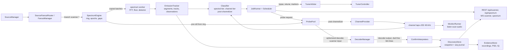

# Signal discovery and scanning: design

Date: 2026-10-09. Status: design, revised after two adversarial reviews (§ 18). Roadmap:
[ROADMAP.md § 5](../../ROADMAP.md), plus the § 5b mixed analog/digital item. Implementation plan:
[2026-10-09-signal-discovery-scanner.md](../plans/2026-10-09-signal-discovery-scanner.md).
Research notes: `output/scanner-research/feasibility.md` (measurements on real IQ; numbers below
come from it unless another source is named) and `output/scanner-research/review-spec-*.md`.

## 0. Summary

The scanner is a core service that finds and characterises RF activity on a source, confirms it
with a real decode where a decoder exists, records it, and reports each distinct emitter once as a
**discovery** with an evidence trail of **observations** (one per transmission).

It sits on a **core spectrum and activity service** (`src/core/spectrum/`): a continuous FFT of
each source's full IQ stream with a calibrated floor, artefact masks (DC, IQ images, spurs), an
emission tracker and a persistent occupancy history. The same service publishes the `spectrum` WS
feed that CLI and web waterfalls use; the scanner is its main consumer, not its owner.

**Primary use case (user-confirmed): identify.** The operator sees a signal on the waterfall and
every plausible decoder tries to identify and decode it; the answer is `identified`, `candidate` or
`unidentified`, always with measurements, or an explanation that the target is a receiver artefact
(§ 10.8). Discovery jobs below run the same tiers unattended.

Two modes share one pipeline:

- **In-window**: watch everything inside the source's current capture window (≈ 1.6 MHz at
  2.048 Msps). Never retunes, so it coexists with every other consumer. PMR446 (200 kHz) fits in
  one window. A passive in-window job runs on every eligible source by default.
- **Sweep**: own the tuner and hop a planned set of windows across a wider range (400–470 MHz is
  44 hops), dwelling, holding on activity and revisiting where activity was seen. Needs a tuner
  lease and, when other consumers would be disturbed, operator takeover consent.

Detection has three tiers; each tier runs only on what the cheaper tier before it selected:

1. **Activity**: wideband FFT energy detection against a calibrated noise floor (all bins, always).
2. **Classification**: features of each emission. Spectral features come free from the same FFT;
   narrowband discriminator features need a channel tap (cheap after the channelizer lands).
3. **Confirmation**: a scanner-owned *probe decoder* (dsd-fme, multimon-ng, direwolf; rtl_433
   after the channelizer) pointed at the emission, fed with **pre-roll** IQ from a ring buffer so
   the transmission that triggered it is decoded, not only its tail. Only a valid, repeated decode
   makes a discovery `decoded`.

The channelizer (opt-in Rust `wavekit-chan`, in implementation) makes many concurrent probes and
narrowband classification cheap. Before it lands, everything works with **one** probe at a time on
the existing per-decoder csdr chain (`offsetHz`), with spectral classification only (§ 14).

## 1. Goals, non-goals, honesty rules

Goals (each maps to a ROADMAP § 5 bullet):

- G1 Scan an operator range (or the receiver's tuning range) with explicit steps, bandwidth, dwell
  and exclusions; or watch the current window.
- G2 Protocol-specific searches ("find DMR") and generic discovery ("find anything"), separating a
  candidate from a confirmed decode.
- G3 Each discovery reports frequency, bandwidth, protocol, confidence, timestamps, signal
  measurements and decoded metadata, with evidence retained and duplicates avoided.
- G4 Coarse sweeps plus focused revisits, with bounded CPU, memory, disk and retune overhead;
  measured detection and false-positive rates on recorded fixtures.
- G5 Explicit tuner ownership: leases, priorities, pause/resume, takeover, in-window coexistence,
  dedicated receivers.
- G6 Jobs, progress, cancellation, discoveries, recordings, runtime settings and an opt-in spectrum
  feed on the shared REST/WS API, so the CLI and a future web UI have the same capabilities.
- G7 Listen-scan (post-channelizer): audio follows the active channel in a set, with priority
  channels and per-transmission analog/digital routing (the § 5b mixed-mode item).
- G8 "Any settings just work": every parameter is settable; every default is derived from
  measurements; a pure **plan preview** rejects invalid combinations and warns about self-defeating
  ones before anything touches the radio; runtime settings are editable without a restart.

Non-goals:

- No decryption, no key handling, and no key-related options passed to any decoder, ever.
  Encrypted activity is reported as `encrypted: true` with whatever clear metadata the protocol
  exposes.
- No transmit. No gain or rate change outside a lease, and only fields the job itself set are
  restored afterwards.
- No claim of whole-band coverage. Every job reports **coverage** (fraction of wall time each
  frequency was actually observed), so "nothing found" is always qualified.
- No hunting for ADS-B/AIS/ACARS/VDL2: those decoders already sit on fixed frequencies. The scanner
  still reports their energy as activity, with protocol `unknown` unless a bandplan prior names it.
- No Pi-side placement. The scanner runs in the core, for a local dongle and a Pi SDR host alike
  (memory `wavekit-not-pi-centric`).
- No probes on S16/F32 sources (every probe transport assumes CU8; the channelizer rejects non-CU8
  too). Those sources get the activity and spectral tiers only.

Honesty rules (enforced by properties in § 13):

- H1 Confidence only rises on evidence of the matching tier. Energy never makes a discovery
  `decoded`, and a later quiet period never lowers it.
- H2 Decoded identity values (DMR colour code, talkgroup, source; P25 NAC; NXDN RAN; POCSAG
  capcode) are accepted only after **two CRC-clean decoder lines** carrying the same value, and
  `encrypted` is accepted the same way. The run8 latency study saw garbage first lines:
  `Color Code=XX`, then `05`/`00`, and a fake `TGT=11 … Encrypted (CRC ERR)` before the real header.
- H3 A decode that fails within budget leaves the discovery at its classification tier with an
  explicit `undecodedReason`; it never claims the protocol is absent.
- H4 Frequencies carry their provenance (`tuningTrust`): a retune that bypasses the relay leaves
  `caps.centerFreq` stale (ROADMAP immediate priority 6).
- H5 Evidence is attributed only within its tuning epoch. Nothing captured before a retune counts
  for the new window, and no probe output after an epoch change counts for the old target.

## 2. Hardware and measured facts this design rests on

| Fact | Value | Source |
|---|---|---|
| Capture | 2.048 Msps CU8 typical; usable span `fs × 0.8` = 1.6384 MHz (noise flat to ±0.9 MHz, −0.87 dB droop there) | feasibility § 2; channelizer `usableFraction` 0.8 |
| DC spike | +9.8 dB, 1.5 kHz wide (3 bins over +3 dB at 500 Hz RBW) | feasibility § 2 |
| Baseband spur | one at −423 kHz, +4.7 dB (8192-pt), fixed in baseband | feasibility § 2 |
| Best detector | 2048-pt Hann FFT (1 kHz RBW, 1 ms frames), 50 ms integration, k = 4.0 dB, 3 dB hysteresis: FA < 1 /MHz/min, Pd ≥ 0.95 from 0 dB SNR (12.5 kHz). 100 ms, k = 3.5 dB: Pd ≥ 0.95 from −2 dB | feasibility § 3 |
| Integration | 5–20 ms needs k = 5.5–11.5 dB and +2 to +12 dB SNR; use ≥ 50 ms | feasibility § 3a/3b |
| DC not excluded | FA rises to 19–33 /MHz/min at 50–100 ms | feasibility § 3 |
| Real noise tail | FA 10–100× above chi-square theory at high k; calibrate on real noise | feasibility § 3a |
| FFT cost (Node, pure JS) | 6.4–7.7 % of one Mac core at 2048-pt, 2.048 Msps, loaded host; Pi 4 estimate 20–45 % [INFERENCE] | feasibility § 6 |
| DMR MS (handheld) | 8.75–9.0 kHz OBW (−20 dB); bursts 27.5 ms per 60 ms frame; envelope ACF −0.95 at 30 ms, +0.99 at 60 ms | feasibility § 2, § 4 |
| 4FSK vs 2FSK | discriminator std ≈ 1.2–1.5 kHz with 4 peaks (DMR, YSF) vs ≈ 4.4 kHz with 2 peaks (POCSAG, FLEX) | feasibility § 4 |
| DMR vs YSF | not separable by OBW or histogram; dsd-fme `-fa` decides at no extra latency | feasibility § 4, § 5 |
| dsd-fme confirm | key-up: sync 54 ms, CC and TG/SRC 183 ms. Late entry: CC ≈ 950 ms median (≤ 1033), TG/SRC ≈ 1250 ms (≤ 1337). No false sync on 4 s of quiet | feasibility § 5 |
| dsd-fme `call_start` delay | 100 ms after the first line (`CALL_START_DELAY_MS`) | `src/decoders/builtin/dsd-fme.ts` |
| dsd-fme cost | 3.8–4.3 % of a core, ≈ 18 MiB RSS | DIGITAL-VOICE.md |
| Full-rate csdr chain per decoder | the reason for the channelizer: 9 decoders ≈ 7.5 of 8 cores live; `sox rate -h` ×4 ≈ 1.5 cores | ROADMAP item 5 |
| Retune settle | **unmeasured**. rtl_tcp has no first-sample marker; USB buffers up to ≈ 1 s in flight; rtlmux tolerates 4 MiB (≈ 1 s) lag; core IQ queue bounded at 2 s / 8 MiB | feasibility § 7 |
| Tuner writes | fire-and-forget 5-byte rtl_tcp frames, no ack; `caps.centerFreq` is updated right after the write, before new-frequency samples arrive | `TunerController.setFrequency`, `sendCommand` |
| Test mode | rtl_tcp command 0x07 (`SET_TEST_MODE`, `TunerController.setTestMode`); RTL2832 test mode replaces samples with an 8-bit counter (as `rtl_test` uses) [INFERENCE until A0] | tuner-controller.ts |
| Fanout drops | whole chunks dropped silently while a branch is in backpressure; counters only | `FanoutManager` (fanout-manager.ts:259-272) |

Lessons carried in (from `output/acceptance/voice-decode-2026-10-09.json`):

- Co-channel users are normal on PMR446 (an analog user shared ch8 with the DMR test). Discovery
  identity separates co-channel emitters by protocol family and network identity (§ 7).
- Tune so that no channel of interest sits on DC; run8 used a +6 kHz offset. The hop planner
  enforces this by construction (§ 5.3).
- Never put a DC blocker or AGC in front of a TDMA decoder (csdr `dcblock` muted every DMR burst
  start). Probes reuse the merged dsd-fme input chain (`skipDcBlock`) unchanged.
- Never capture raw IQ over the Wi-Fi bridge in parallel with the core (it doubled Wi-Fi load and
  invalidated run2). Pre-roll and IQ evidence are cut from the core's own stream, never a second
  upstream connection.
- Detector hysteresis must be short and symmetric: `signalFlat` stayed set through strong bursts
  because its clear rule needed 30 s.

## 3. Architecture



Units. The spectrum and activity layer is a **core service** under `src/core/spectrum/` (no file
there imports from `src/core/scanner/`); the scanner under `src/core/scanner/` consumes it. Paths
below are relative to those two roots; each unit is testable alone:

| Unit | Responsibility | Depends on |
|---|---|---|
| `spectrum/types.ts` | Pipeline types (formats, epochs, tracks, blocks, frames, engine state) | nothing |
| `spectrum/fft.ts` | Radix-2 complex FFT (Float32Array, in place, precomputed twiddles), sizes 512–16384 | nothing |
| `spectrum/frame-source.ts` | IQ bytes → windowed complex frames for U8_IQ, S16_IQ, FLOAT32LE; optional 50 % overlap; sample counter; test-mode counter-run detector | pure |
| `spectrum/spectrum-worker.ts` | `worker_threads` entry hosting `SpectrumPipeline` | pipeline |
| `spectrum/noise-floor.ts` | Low-quantile floor with chi-square correction, absolute floor per (source, gain, fs), per-bin baseline | pure |
| `spectrum/spur-map.ts` | Baseband-keyed spur learning across retunes; baseband vs RF-fixed classification | pure |
| `spectrum/detector.ts` | Per-bin hysteresis against floor; DC/edge/spur/exclusion masks; per-range adaptive CFAR; long (50 ms) and short (5 ms) timescales | noise-floor |
| `spectrum/iq-ring.ts` | Per-source raw IQ ring (3 s) indexed by sample number; pre-roll, evidence and capture reads | pure |
| `spectrum/pipeline.ts` | `SpectrumPipeline`: composition, epoch resolution, stale check, block summaries | the above |
| `spectrum/spectrum-engine.ts` | One fanout branch + `PipelineHost` + ring per source; epochs, settle markers, gap accounting, centre-trust checks | SourceFanoutRouter, TunerController |
| `spectrum/spectrum-service.ts` | Engine registry ref-counted by consumers (scanner jobs, passive jobs, `spectrum` WS subscribers); frame profiles for the feed | engine |
| `spectrum/occupancy.ts` | Persistent per-frequency hourly duty history (7 days) | pure |
| `spectrum/emissions/segmenter.ts` | On-bins → segments (gap tolerance, raster-aware splits with local-peak test, truncation, skirt merge) | pure |
| `spectrum/emissions/tracker.ts` | Segments over time → tracks (open/hold/close, hang) → emissions; 1 ms envelope per track | segmenter |
| `spectrum/emissions/iq-image.ts` | IQ mirror-image flags | pure |
| `spectrum/emissions/spectral-features.ts` | OBW, shape, envelope ACF (30/60 ms), duty, burst stats | pure |
| `classify/channel-features.ts` | Post-channelizer: discriminator histogram, deviation, CTCSS, AFSK tones, symbol-rate line | pure |
| `classify/classifier.ts` | Features + bandplan priors → ranked hypotheses; intermod/adjacent-leak flags | pure |
| `bandplan/` | Built-in region-aware bandplans (rasters, OBW classes, priors) | api-types `BandRegion` |
| `plan/hop-planner.ts` | Ranges, exclusions, fs, usable fraction, raster union, DC guard → hop centres | pure |
| `plan/plan-preview.ts` | Validation, derived defaults, sweep period, POI, CPU/disk estimates, impact, issues | hop-planner, budgets |
| `tuner-arbiter.ts` | Leases, preemption detection, retune with markers, restore of changed fields, persisted snapshot, impact | TunerController, DecoderManager, LiveDemodulator, DigitalVoiceService, TunerRelay |
| `scheduler.ts` | Hop order, dwell, hold, revisit queue, per-hop gain memory, coverage (pure, clocked) | none |
| `job-runner.ts` | Transition table (§ 10.1); drives engine, arbiter, scheduler, probes; progress | above |
| `probes/probe-pool.ts` | Admission (budget, max probes, CPU guard), ephemeral decoders, transport, pre-roll input, epoch binding | DecoderManager, DigitalVoiceService, ChannelProvider? |
| `probes/confirm/*.ts` | Per-decoder interpreters → `DecodeEvidence`; double-match acceptance | decoder output types |
| `probes/ambient.ts` | Evidence from configured, always-on decoders matched by frequency and time | DecoderManager outputs |
| `store/discovery-store.ts` | Identity, sticky association, merge, confidence ladder, re-key migration | pure |
| `store/persistence.ts` | Snapshot + seq journal + replay; jobs and lease persistence | fs |
| `store/evidence-store.ts` | Recordings, PSD, IQ files; linking; size/age/free-disk retention | fs |
| `monitor/monitor-runner.ts` | Post-channelizer listen-scan: channel set, priorities, squelch, mode routing, audio | ChannelProvider, DigitalVoiceService |
| `cpu-meter.ts` | Normalised host CPU from `os.cpus()` deltas (or cgroup quota) | os |
| `scanner-service.ts` | Composition root: config, runtime settings, passive jobs, boot restore, shutdown | everything |
| `src/api/routes/scanner*.ts`, `src/api/websocket/*` | REST and WS | ScannerService |
| `packages/api-types/src/scanner.ts` | DTOs | none |

**Worker build.** The esbuild step gains a second entry, `src/core/spectrum/spectrum-worker.ts`
→ `dist/spectrum-worker.js`, located at runtime with `new URL("./spectrum-worker.js", import.meta.url)`
(dist) and through a `.ts` loader path under vitest. A test starts the worker from built output and
the Docker image is checked for the file. The worker keeps FFT work off the event loop that the
API, fanout and WS share.

**Engine behind an interface.** The engine talks to the pipeline only through `PipelineHost`
(`inline` for tests, `thread` for production). `wavekit-chan` already reads every source's full
CU8 stream, so a later `chan` host could run the FFT in Rust behind the same `PipelineInput` /
`PipelineEvent` protocol; nothing above the host changes.

**Detection sees the full stream; only display is decimated.** The pipeline processes every
sample (1 ms frames at 2048-pt, optional 50 % overlap); floors, thresholds and tracks run on that.
Only the `spectrum` WS feed is decimated (max-hold per display interval).

**Worker input is copied once.** Fanout hands every branch the same Buffer reference, and socket
Buffers are slices of pooled ArrayBuffers, so transferring `chunk.buffer` would detach memory other
branches still use. The engine copies each batch into an engine-owned pooled ArrayBuffer (≈ 4 MB/s
at 2.048 Msps CU8) and transfers that. Output is one `SpectrumBlock` per integration block
(≈ 2048 Float32 plus metadata, 20 per second at 50 ms).

## 4. Spectrum engine and activity detection (tier 1)

### 4.1 Input, gaps and alignment

- One fanout branch per source that has at least one scanner consumer: `scanner-${sourceId}`,
  `highWaterMark` 262144. The branch feeds the worker (copied batches) and the IQ ring.
- Eligible formats: `U8_IQ` (`u/127.5 − 1`, the channelizer mapping), `S16_IQ` (`s/32768`) and
  `FLOAT32LE` IQ. Not eligible: `audio_pcm`, `auto` (status reason `source-not-iq`). Probes need
  `U8_IQ` (status reason `probe-unsupported-format` otherwise).
- **Alignment.** SourceManager aligns chunks to whole IQ pairs only for U8_IQ today. A dropped
  S16_IQ chunk that is not a multiple of 4 bytes swaps I and Q for everyone downstream and mirrors
  the spectrum. S1 extends SourceManager's alignment to 4 bytes (S16_IQ) and 8 bytes (FLOAT32 IQ);
  until that task lands, only U8_IQ sources are eligible.
- **Sample index.** Every sample has an absolute index per source stream: received samples plus
  dropped samples. On the branch's `backpressure` event the engine records
  `atInputByte = totalBytesWritten − droppedBytesTotal` from `getBranchTelemetry()` (the channelizer
  plan's A2 mechanism); on `drain` it advances the index by the dropped byte count ÷ bytes per
  sample and marks `[seam, seam + dropped)` as a **gap**. Blocks containing a gap carry
  `gap: true`, are excluded from floor learning, FA accounting and coverage, and may still extend
  open tracks. Frame assembly restarts at the seam.
- SourceManager `disconnected` or `payload-started` starts a new **stream** (index resets) and a
  new epoch with `tuningTrust: unverified` until the tuner state is confirmed (§ 4.6).

### 4.2 FFT and integration

- Defaults: `fftSize` derived so that RBW = fs/N lies in 0.8–1.6 kHz
  (`N = 2^round(log2(fs / 1000))`, clamped to 512–16384): 2048 at 2.048 and 2.4 Msps. Hann window,
  no overlap. `integrationMs` 50, or 100 for `sensitivity: "high"`.
- Integration block = `L = round(integrationMs × fs / (N × 1000))` frames, at least 1. Blocks are
  aligned to the epoch's first settled sample, so their boundaries are a pure function of sample
  indices.
- The plan preview warns when RBW > typical OBW / 4 (emissions stop resolving) or < 250 Hz
  (8192-pt was measured worst at equal T).
- The tracker reduces frames to a **1 ms envelope per track** (sum of the track's bins per frame),
  the input to the TDMA features, at O(track bins) per frame.

### 4.3 Noise floor

- **Block floor** `F_b` = the 20th percentile of power over usable, unmasked bins, divided by the
  chi-square quantile ratio for `2L` degrees of freedom (so it estimates the mean noise power). A
  low quantile stays on noise when up to ≈ 75 % of the window is occupied (a DVB-T edge past
  470 MHz, a busy ISM window); the median, which the feasibility script used on a quiet capture,
  would sit on the signal.
- **Absolute floor** `A(source, gain, fs)` in dBFS: a slow minimum tracker over quiet blocks
  (no tracks, no gap), persisted with the engine state and valid across hops and retunes. The
  effective block floor is `max(F_b, A − 1 dB)`. When `F_b > A + k`, the block is marked
  `floorOccupied: true` and the excess is reported as a `wideband` observation spanning the window
  (the emitter that *is* the median is still found).
- **Per-bin baseline** `B_i`: exponential minimum tracker in **baseband** bin offsets (time
  constant `floorTauS` 30 s), clamped to `F_b ± 6 dB`, keyed by (source, fs, gain, fftSize) so it
  survives retunes. It absorbs passband ripple at other rates and dongles. The per-bin floor is
  `max(F_b, B_i)`.

### 4.4 Spurs

The spur map is keyed by (source, fs, gain, fftSize) in **baseband** bin offsets, so it survives
retunes and accumulates across every hop of a sweep. A candidate spur is a bin range ≤ 3 bins wide
that is on ≥ 95 % of settled time over ≥ 10 min of observation. It is classified by whether it moves
with the centre:

- Seen at the same baseband offset in ≥ 3 different epochs with different centres → **baseband
  spur**: masked, never reported as an RF discovery (the −423 kHz spur in run8 is this kind).
- Seen at the same RF frequency across epochs → **RF-fixed carrier** (crystal harmonics, local
  interference): reported once as a `carrier` discovery at its RF frequency, then excluded from
  probe allocation (not from detection).

### 4.5 Detector and false-alarm control

- A bin turns on when `P_i > floor_i + k` and off when `P_i < floor_i + k − hysteresisDb`
  (3 dB).
- Masks: DC ± `g` with `g = max(dcGuardHz, 2 × RBW)` (dcGuardHz default 1500 Hz); bins outside the
  usable span; exclusions; baseband spurs; overload blocks.
- `k` defaults from the measured table (NFFT × T), interpolated in T:

  | RBW | 20 ms | 50 ms | 100 ms |
  |---|---|---|---|
  | 1 kHz | 5.5 | 4.0 | 3.5 |
  | 500 Hz | 7.0 | 5.0 | 4.0 |
  | 250 Hz | 9.0 | 7.5 | 5.5 |

- **Adaptive CFAR, per range.** One dongle's table is a starting point. The detector keeps a noise
  false-alarm estimate per (source, bandplan range or 2 MHz bucket): rising edges that are at most
  2 bins wide (narrower than any expected emission; Hann noise crossings are 1–2 bins) and never
  join a track lasting ≥ 2 blocks, per MHz of unmasked span, per minute of settled time. Bins inside
  ranges whose bandplan priors include burst protocols (`ism`, `pocsag`, `aprs`) are not counted.
  If the estimate exceeds `faTargetPerMhzMin` (1.0) over 5 minutes, that range's `k` rises 0.5 dB
  (cap +4 dB over the table); if it stays below a quarter of the target for 30 minutes, `k` falls
  0.5 dB (never below the table). The `k` in force is reported in status and on every observation.
  Operators may pin `thresholdDb` instead.
- Sensitivity presets: `low` (FA target 0.25, T 50 ms), `normal` (1.0, 50 ms), `high` (2.0,
  100 ms).
- **Overload.** A block whose clipped-sample fraction exceeds `clipFraction` (1e-3; U8 0/255, S16
  ±32767, float |x| ≥ 1) is flagged; its observations carry `overload: true`, floors don't learn
  from it, and the job shows `overload` on the hop. Policy `overload: "flag"` (default) or
  `"reduce-gain"` (sweep jobs inside the lease only; § 10.2 per-hop gain memory).

### 4.6 Tuning epochs, settle markers and stale data

Every change of what the samples mean starts a **tuning epoch**: a frequency, rate, gain or AGC
command from any origin, a relay-mirrored change (`TunerController` `state-changed`; relay commands
emit neither `command-sent` nor `caps-changed`), SourceManager `caps-changed`, or a new stream.
Each epoch has `{epoch, startSample, centreHz, sampleRateHz, gainKey, tuningTrust, settleMode}`.

How the epoch's first trustworthy sample is found:

1. **Marker mode (scanner's own retunes, preferred).** The arbiter sends `SET_TEST_MODE 1`, the
   frequency (and gain, if this hop changes it), then `SET_TEST_MODE 0`. The RTL2832 replaces
   samples with an incrementing 8-bit counter while test mode is on, so the stream shows
   *old-frequency samples → counter run → new-frequency samples*, whatever the depth of the USB,
   rtlmux, Wi-Fi and core queues. `frame-source` detects a counter run (≥ 256 consecutive bytes
   with `b[n+1] = b[n] + 1 mod 256`; random IQ produces this with negligible probability). The epoch
   starts at the first sample after the run plus `pllSettleMs` (5 ms). The counter bytes are a gap.
   Test-mode commands are **never accepted state**: they bypass `markAccepted`, so reconnect replay
   can never re-send `TEST_MODE 1`. The arbiter sends `TEST_MODE 0` again after any error in the
   sequence, on lease release and at shutdown, and the engine raises `stuckTestMode` if counter
   bytes continue for more than 500 ms.
2. **Timer mode (fallback).** When no counter run arrives within `markerTimeoutMs` (2000) after the
   command, or the source is known not to pass test mode, the epoch start is
   `commandSample + bufferedSamples + settleSamples`: `bufferedSamples` is what the core already
   held when the command was written (the source stream's readable buffer plus the branch's
   `bufferedBytes`), and `settleSamples = settleMs × fs` covers upstream buffers (default local
   rtl_tcp 300 ms, network 1000 ms, both replaced by A0 measurements). Status shows
   `settleMode: "timer"` and the preview warns.
3. **External changes** (operator, relay, replay) get timer mode with the network default, and
   in-window jobs simply resume detection after it.

**Stale check (both modes).** In the first settled block of a centre-changing epoch, any bin range
that was part of an open track in the last pre-epoch block at the **same baseband offset**, and is
not explained by a known emitter at that RF in the new window, marks the block stale. The engine
discards it and re-tests the next one, up to 1 s; each discard increments `staleAfterSettle`
(reported, and it raises the timer-mode default). The check is skipped for epochs without a centre
change. It must not fire on the deliberate marker run (counter bytes are already a gap).

Test mode makes every consumer of the source see the counter run for the length of the retune
(tens of ms [INFERENCE]). During a sweep the other consumers are held (§ 10.4), and live-audio
listeners consented to disturbance. In-window engines on the same source treat the run as a gap.
A0 verifies that the Pi's rtlmux forwards command 0x07 and that the counter run arrives intact over
Wi-Fi; if it does not, that transport is marked `markerUnsupported` and uses timer mode.

### 4.7 Window changes the scanner did not make, and centre trust

- In-window jobs follow the window: tracks close with `endReason: "retune"`, the floor re-learns
  within 2 blocks, and the baseband-keyed spur map and per-bin baseline carry over.
- `tuningTrust` on every epoch, frame, block and observation: `commanded` (the core sent the
  command), `relay` (mirrored from a relay client command), `unverified` (caps known, but the last
  change was not observed; after a source reconnect with `reconnectPolicy: reset`, at boot before
  the tuner state is confirmed, or after an undetected-retune alarm below). A sweep never counts
  `unverified` data; in-window jobs run and mark observations; `spectrum:frame` carries it so a
  waterfall can grey out its frequency axis.
- **Retunes that bypass the relay** (SDR++ straight to the Pi) leave `caps.centerFreq` wrong, so
  the frequency axis and every emission centre would land on the wrong RF (ROADMAP immediate
  priority 6). The engine cannot see the command, so it detects the effect:
  - *discontinuity alarm*: within one block and with no epoch, ≥ 60 % of the persistent features
    (RF-fixed carriers, long-lived tracks) vanish, or reappear shifted by one common Δ. The engine
    starts an epoch with `tuningTrust: unverified` and reason `untracked-retune` (and the estimated
    Δ when shifted), closes tracks, and raises a status warning;
  - *host-reported centre*: when the source exposes the frequency the receiver is actually on (the
    sdr-host status, once the ROADMAP item 6 fix lands), the engine compares it every 5 s and marks a
    mismatch `unverified` and uses the reported value.
  Until that fix lands, the alarm is the only defence: discoveries made while `unverified` are kept
  but never upgraded past `candidate` by spectral evidence alone. A sweep's own first retune
  re-establishes `commanded`.

### 4.8 IQ ring (pre-roll and evidence)

Each engine keeps a ring of the last `ringSeconds` (3 s) of raw IQ, indexed by absolute sample
number (CU8 at 2.048 Msps: 12.3 MiB per source). Reads by sample range serve probe pre-roll
(§ 6.5), IQ evidence snippets and burst captures (§ 8). A read that reaches past the ring's tail or
across a gap returns only the contiguous part after it. A job with `capture` enabled raises the ring
to at least `preMs/1000 + 1` s while it runs.

### 4.9 Artefact masks (summary)

- **DC spike**: always masked at the tuned centre ± `g`, whatever `offsetHz` any decoder uses
  (§ 4.5).
- **IQ mirror images**: a track at baseband offset −x is flagged `iqImage` (never surfaces, never
  probed) when a track at +x exists with similar OBW (± 30 %) and the candidate is 20–65 dB below it
  (RTL dongles typically reject images by 25–45 dB; 20 dB is the threshold). An independent emitter
  within 20 dB of its mirror partner is not flagged.
- **Spurs**: baseband spurs masked, RF-fixed carriers reported once (§ 4.4). A **fast path** masks
  a narrow line (≤ 3 bins) that is on in ≥ 95 % of settled blocks over 30 s as a provisional spur
  (excluded from candidates, not yet reported); ≥ 3 provisional lines with equal spacing (± 1 bin)
  form a **comb** and are promoted to baseband spurs at once. The Pi setup shows such a comb about
  ±0.9 MHz from centre, inside the usable span at 2.4 Msps. Spur state persists per (source, fs,
  gain, fftSize), so a restart starts masked.
- **Broadband impulses** (periodic RFI from switching supplies and the like): a frame whose power
  rises ≥ 6 dB over the per-bin floor on ≥ 50 % of usable bins is blanked (left out of integration,
  counted as `blankedFrames`). ≥ 3 blanked frames at a stable interval (± 10 %) are reported as
  broadband RFI with the period (engine status `broadbandRfi {periodMs}`, § 12.1). A block with
  more than half its frames blanked is excluded from
  floor learning and FA accounting, so periodic RFI neither opens tracks nor lifts the floor.
- A pure `artefactOf(centreHz, epoch, masks)` answers `dc` / `spur` / `image` / `rfi` / none for any
  frequency, so identify mode (§ 10.8) can say why a cursor target is not an emission.

### 4.10 Short-burst path

A 50 ms block dilutes a 5 ms ISM or pager burst by ≈ 10 dB. The pipeline therefore runs a second
detector on the same frame powers (no extra FFT) at `T_short` = 5 ms with the table's k (8.5 dB at
1 kHz RBW). Short-path on-bins that are not part of a long-path track open tracks flagged
`burst: true`. They surface on a single block only at per-bin SNR ≥ k_short + 3 dB, otherwise by
repetition (§ 7.2 rule (d)).

### 4.11 Occupancy history

Per source, a persistent history of per-frequency duty (buckets of 12.5 kHz aligned to 0 Hz, one
slot per hour, 7 days, observed/active seconds as Uint16; ≤ 20 000 buckets ≈ 13 MB, i.e. 250 MHz of
history per source) records observed and active time from every settled
block, including activity that never surfaced as a discovery. Intermittent emitters are therefore
remembered: the scheduler seeds each hop's `activityScore` from the last 24 h, and clients read it
with `GET /api/spectrum/occupancy`. Persisted every 5 min as `engine/occupancy/<sourceId>.json`.

## 5. Bandplans, ranges and the hop plan

### 5.1 Ranges and bandplans

A job's frequency scope is a list of **ranges** `{startHz, endHz, spacingHz?, firstChannelHz?,
obwHz?, protocols?}` plus **exclusions** (`{startHz, endHz}`, or a frequency with a width). Ranges
may come from a built-in **bandplan** by id, region-aware through the existing `BandRegion` /
`DecoderBandRegion` resolution:

| Id | Region | Range | Rasters (spacing @ first channel) | OBW classes | Priors |
|---|---|---|---|---|---|
| `pmr446` | EU | 446.0–446.2 MHz | 12.5 k @ 446.00625 | 9 k digital, 11 k analog | analog-fm, dmr, dpmr |
| `dpmr446` | EU | 446.1–446.2 MHz | 6.25 k @ 446.103125 | 4.5 k | dpmr, nxdn48 |
| `uhf-land-mobile` | all | 400–470 MHz | 12.5 k @ 400.00625 and 6.25 k sub-raster @ 400.003125 | 9 k, 11 k, 4.5 k | dmr, analog-fm, p25p1, nxdn, tetra (energy only) |
| `vhf-land-mobile` | all | 136–174 MHz | 12.5 k @ 136.00625, 6.25 k sub-raster | 9 k, 11 k, 4.5 k | dmr, analog-fm, p25p1, nxdn, pocsag |
| `amateur-2m` | EU / US | 144–146 / 144–148 MHz | 12.5 k (EU), 15 k / 20 k (US) | 11 k, 16 k | analog-fm, aprs, dstar, dmr, ysf |
| `amateur-70cm` | EU / US | 430–440 / 420–450 MHz | 12.5 k, 25 k | 9 k, 11 k, 16 k | analog-fm, dstar, dmr, ysf, p25p1 |
| `aprs` | EU / US | 144.800 / 144.390 MHz | single | 16 k | aprs |
| `ism-433` | EU | 433.05–434.79 MHz | none | burst | ism |
| `ism-868` | EU | 863–870 MHz | none | burst | ism |
| `pager-vhf` | all | 137–174 MHz | 12.5 k | 12 k | pocsag, flex |
| `marine-vhf` | all | 156–162.025 MHz | 25 k | 16 k | analog-fm (AIS channels excluded) |

Bandplans are data (`src/core/scanner/bandplan/builtin.ts`), served by
`GET /api/scanner/bandplans` and offered as presets by the CLI. Operators can supply their own
ranges with any raster, or none.

### 5.2 Frequency keys and snapping

- With a raster, an observation's centre snaps to the nearest channel of the range's raster union
  if within `max(1 kHz, spacing/4)` (after the source's frequency-error correction, § 7.4);
  otherwise it keeps its measured centre and flags `offRaster: true`.
- Without a raster, the **frequency key** is a fixed grid: `round(centre / tol) × tol` with
  `tol = max(2 kHz, obw/4)` rounded to 500 Hz. Keys are a pure function of the centre (no
  order-dependent clustering).
- Association with an existing discovery is **sticky** and comes before keying (§ 7.2), so centroid
  jitter across a snap threshold or a grid boundary does not split one emitter into two.

### 5.3 Hop planner

Inputs: merged ranges minus exclusions, fs, usable fraction `u` (0.8; the channelizer's value when
enabled), the raster union with OBW classes, the DC guard `g = max(1500 Hz, 2 × RBW)` plus a ppm
margin `m = 2 ppm × f` (0.9 kHz at 446 MHz).

- Usable half-span `H = fs·u/2`. A channel `c` with planning width `w` (its raster spacing) is
  **covered** by hop centre `h` if `|c − h| + w/2 ≤ H`.
- **Greedy covering** from the low edge: the first hop is placed so the first channel is covered;
  each next hop advances by `2H − w_max` (adjacent hops overlap by the widest channel, so an
  emission straddling a seam is whole in one hop). Hops whose covered channels are all excluded are
  dropped. A range narrower than one window becomes one hop near its midpoint.
- **DC placement**, per hop: among candidate centres on a 100 Hz grid within ±`spacing_min` of the
  greedy position, choose the one that maximises the minimum distance from DC to any expected
  emission edge `|c − h| − o/2` over **every** channel of **every** raster and OBW class the hop
  covers, preferring half-raster points of the main raster on ties. If the best minimum is ≥
  `g + m`, the hop is DC-clean. Otherwise the preview lists the channels whose edge falls inside
  `g + m` as `dc-adjacent-channels` (they stay detectable from their unmasked bins, and their OBW is
  flagged `obwBiased`). For 12.5 kHz with 9 kHz digital this gives 1.75 kHz, which clears `g` but
  not `g + m` at 446 MHz: PMR446 analog (11 kHz) and dense 6.25 kHz sub-rasters are reported, as are
  coarse-RBW cases (2.4 Msps: `g` = 2.34 kHz).
- Free ranges place DC at least `g + m + 5 kHz` from any detected emission in the previous visit
  (first visit: the greedy point).
- 400–470 MHz at 2.048 Msps with a 12.5 kHz main raster: `2H − w_max` ≈ 1.626 MHz → 44 hops
  (feasibility § 8 agrees).
- The plan lists each hop's centre, covered span, covered channel count, DC-adjacent channels and
  excluded sub-spans; the job detail includes it (`plan.hops[]`).

### 5.4 Plan preview, validation and derived defaults

`POST /api/scanner/plan` is pure (no side effects, like `rate-preview`). Given a job spec it returns
the normalised spec (every derived default filled in, with `provenance` per field: `operator`,
`bandplan`, `measured`, `default`), the hop plan, estimates and `issues[]` with severity `error`
(create would fail) or `warning` (create succeeds; the operator should know).

Errors:

- empty or inverted range; any range outside the tuner's range (`TunerController` validation
  range; 24 MHz–1.766 GHz for R820T when known);
- exclusions covering every range;
- `in-window` mode whose ranges are not inside the current usable span;
- a sweep on a source without tuner control (not rtl_tcp), or while `controlMode: external`
  (409 `SCANNER_SOURCE_BUSY` on create);
- `dwellMs` below `settle + (minSurfaceBlocks + 1) × integrationMs`;
- `maxHoldMs < confirmHoldMs`; channel width wider than the usable span;
- a non-IQ source; a protocol-only job (`protocols` set) on a source where no protocol in the list
  has a probe transport (S16/F32 source, or `ism` before the channelizer).

Warnings:

- POI below 50 % for `txDurationHintMs` (default 5 s; § 10.5);
- RBW too coarse or fine (§ 4.2);
- timer settle mode in force, or settle not yet measured;
- CPU or disk estimate above budget (the job runs with fewer probes);
- `dc-adjacent-channels` (§ 5.3); a dedicated receiver is available for this sweep;
- tuner fields the job changes whose pre-job value is unknown (`unrestorable: [field]`, § 10.3);
- probes unavailable for some requested protocols (reason per protocol).

Derived defaults when unset: `mode` (`in-window` if the ranges fit the current window, else
`sweep`), rasters and OBW classes from the bandplan, `protocols` from bandplan priors (or all),
`fftSize`, `integrationMs`, `k`,
`dwellMs = settle + (minSurfaceBlocks + 1) × integrationMs` with `minSurfaceBlocks` 2,
`confirmHoldMs` per protocol (§ 6.4), revisit share.

## 6. Classification and confirmation (tiers 2 and 3)

### 6.1 Protocol vocabulary

`ScannerProtocol` = `analog-fm` | `analog-am` | `dmr` | `p25p1` | `p25p2` | `nxdn48` | `nxdn96` |
`ysf` | `dstar` | `dpmr` | `pocsag` | `flex` | `aprs` | `ism` | `digital-unknown` | `carrier` |
`unknown`.

Coarse **classes** before a decode: `fsk4-12k5` (DMR/YSF/P25p1/NXDN96 family), `fsk4-6k25`
(NXDN48/dPMR), `tdma-ms` (DMR MS bursts), `fsk2-wide` (POCSAG/FLEX), `gmsk-narrow` (D-STAR),
`afsk-fm` (APRS), `analog-fm`, `ook-burst` (ISM), `carrier`, `wideband` (OBW > 25 kHz), `unknown`.

### 6.2 Spectral tier (always available, from the FFT)

Per track, computed incrementally and finalised when the track closes or after 1 s:

- OBW at −20 dB and 99 % power (only meaningful at ≥ 20 dB per-bin SNR; below that the on-bin
  width is reported as `obwHz` with `obwMethod: "on-bins"`); peak and mean power (dBFS); SNR in the
  track bandwidth.
- Envelope ACF at 30 and 60 ms over the 1 ms envelope (≥ 300 ms of track): `tdma-ms` when
  ACF(30) ≤ −0.5 and ACF(60) ≥ +0.5 (DMR handheld −0.94 / +0.99; every other measured signal
  ≥ +0.04). A DMR repeater is continuous and does not show this; it falls to `fsk4-12k5`.
- Duty cycle and burst-length distribution (ISM and pager bursts are short and isolated; voice is
  continuous).
- Spectral shape: flat-topped 4FSK vs peaked analog FM vs carrier (≤ 2 bins).

Output: a ranked hypothesis list, scores in [0, 1]. Bandplan priors multiply scores (a prior of 0
removes a protocol; protocol-specific jobs set every other prior to 0).

**Skirts, leakage and intermod.** Phase-noise skirts, window sidelobes and LNA/mixer
intermodulation appear well below ADC clipping (run8's handheld was +69.9 dB per bin).

- The segmenter keeps a raster-split segment only if it has its own local peak and is no more than
  30 dB below an adjacent track; otherwise it is marked `skirt` and merged into the parent.
- A separate weak segment (a hole in the on-bins kept it from merging) more than 50 dB below a
  segment whose peak is within ±31.25 kHz (±2 channels of a 12.5 kHz raster) is that emitter's
  spectral regrowth or phase-noise skirt: it is dropped and the strong segment marked `skirt`.
  Segments at the strong one's mirror about DC are left for the IQ-image check (§ 4.9), and
  intermod products (≈ 40 dBc) stay to be capped below.
- After a decode, if the same identity is already decoded at another frequency in the same window
  with ≥ 20 dB more power, or the frequency matches `2f1 − f2` (± 1 RBW) of two stronger tracks, the
  observation is flagged `adjacentLeak` or `suspectedIntermod` and its discovery is capped at
  `candidate` (reason shown).

**Truncated segments.** A segment touching the usable-span mask or an exclusion boundary is marked
`truncated` and never surfaces or receives a probe; hop overlap guarantees that the neighbouring hop
sees it whole. In-window jobs, which have no neighbouring hop, report it as `edge` activity.

### 6.3 Channel tier (post-channelizer)

A cf32 48 kHz channel tap at the track centre, opened by the probe pool (§ 6.5) for ≥ 500 ms:

- FM discriminator histogram over on-samples: number of peaks, spacing, std. 4 peaks with std
  < 2 kHz → 4FSK family; 2 peaks at ±4–5 kHz → pager FSK; unimodal and wide with a voice-band audio
  spectrum → analog FM.
- CTCSS (67–254.1 Hz Goertzel bank) and DCS presence for analog FM, reported as metadata.
- AFSK 1200/2200 Hz tone pair after demod → `afsk-fm` (APRS).
- Symbol-rate spectral line of |Δ discriminator| (2400 / 4800 / 9600 Bd) where SNR allows.

Pre-channelizer the channel tier is unavailable; classification uses § 6.2 plus the decode.
Thresholds for analog FM, APRS, P25, NXDN and D-STAR are **unvalidated** until the fixtures of
§ 15 exist; the channel tier is default-on only after those measurements.

### 6.4 Confirmation map

| Class / hypothesis | Probe and mode | Confirm rule | `confirmHoldMs` default |
|---|---|---|---|
| `tdma-ms`, `fsk4-12k5`, `dmr` | dsd-fme `-fa` (auto) | two CRC-clean `link` lines with the same CC (identity); TG, SRC, slot and FLCO accumulate on the same rule | pre-roll covers key-up: 600; late entry: `1337 + 360 + 100 + probeStart` ≈ 1800 + spawn |
| `fsk4-12k5`, no DMR sync in 1.5 s | dsd-fme `-fa` continues (P25p1, YSF, D-STAR), then `-fn` (NXDN96) | P25: NAC twice; YSF: DG-ID or callsign twice; NXDN: RAN twice | +2000 per extra mode |
| `fsk4-6k25` | dsd-fme `-fi` (NXDN48), then `-fm` (dPMR) | RAN twice / dPMR colour code twice | 2000 each |
| `gmsk-narrow` | dsd-fme `-fa` | D-STAR header callsign twice | 2000 |
| `fsk2-wide`, `pocsag`, `flex` | multimon-ng `-a POCSAG512 -a POCSAG1200 -a POCSAG2400 -a FLEX` | two decodes with the same capcode within the hold, or one decode whose payload passes the plausibility test (printable ratio ≥ 0.9, valid function bits) | 4000 (with pre-roll) |
| `afsk-fm`, `aprs` | direwolf AFSK1200 | ≥ 1 frame (direwolf only emits frames whose FCS checks) | 3000 (with pre-roll) |
| `ook-burst`, `ism` in ISM ranges | rtl_433 on a 250 kHz cu8 channel (**post-channelizer only**); before that, ambient evidence only | ≥ 1 decoded device with a valid checksum/MIC field, twice for the same model + id | 10000 |
| `analog-fm` | none. Channel-tier features; a dsd-fme probe finds no sync over 1.5 s | `classified` at most; CTCSS/DCS as metadata | 1500 |
| `carrier`, `wideband`, `unknown` | none | stays `activity` / `candidate` | 0 |

- NXDN flags follow the repo's mapping (`dsd-fme.ts`: `-fn` is NXDN96 at 12.5 kHz) and upstream
  dsd-fme (`-fi` NXDN48). `DsdFmeMode` has no `nxdn48` or `dpmr` member, and `extraArgs` strips
  every `-f*`; S1 adds `nxdn48` (`-fi`) and `dpmr` (`-fm`) to `DsdFmeMode`, verified against the
  bundled binary's `-h`. Those rows are marked unvalidated until a capture exists.
- dsd-fme `link` lines: the current parser emits only `call_start`/`call_end` (sync/error with
  `emitDebugEvents`), picks the first non-zero CC, and lets `CRC ERR` lines set TG/SRC and
  `encrypted`. S1 changes `dsd-fme.ts` so it (a) emits an internal per-line `link` event
  `{protocol, cc?, tg?, src?, slot?, nac?, ran?, crcErr, fecErrs?, encrypted?, at}` for every
  parsed link-control line, with CRC-error lines flagged, and (b) ignores CRC-error lines when it
  sets call identity or `encrypted` for its own `call_start`. Part (b) also fixes the
  configured-decoder path: a garbage `Encrypted (CRC ERR)` line can today mark a clear call
  encrypted.
- The probe reuses the merged dsd-fme input chain (`skipDcBlock`, no AGC) unchanged.
- **Ambient evidence.** Configured always-on decoders also confirm: when a configured decoder
  whose target frequency is within the observation's frequency tolerance produces CRC-valid output
  inside the observation's time span (± 2 s), that output is `DecodeEvidence` from source
  `ambient`. This is the cheap path for fixed channels (APRS on 144.800 with direwolf, POCSAG with
  multimon-ng, ISM with rtl_433 at its centre).

### 6.5 Probe pool

A **probe** is a scanner-owned ephemeral decoder instance created through `DecoderManager` with a
target frequency. It is not in config, not persisted, not band-overridable, and is listed in
`GET /api/decoders` with additive DTO fields `owner: "scanner"`, `scannerJobId`, `ephemeral: true`
(proposal, § 12.4).

- **Id**: `scan-${jobShort}-${protocolShort}-${seq}` (≤ 32 chars, `[a-z0-9-]`, so channelizer
  socket paths stay under `MAX_SOCKET_PATH` 100). `seq` is monotonic per scanner process, so an id
  is never reused before its digital voice channel and decoder are gone.
- **DecoderManager support (new):** `createEphemeralDecoder(config, {owner, jobId, input?})` and
  `removeEphemeralDecoder(id)`; manager events `decoder:created` / `decoder:removed`, mapped to WS
  `decoder:created` / `decoder:removed` messages; band suspension, band overrides and pinning do not
  apply to `owner: "scanner"`; mutating decoder routes (start/stop/restart, band PUT/DELETE, start
  mode) return 409 `DECODER_OWNED_BY_SCANNER` for probes.
- **Input** (`input` option): a scanner-provided Readable instead of a fanout branch. The probe
  pool writes **pre-roll** from the IQ ring, from `observation.startSample − preRollMs` (300 ms)
  up to the live edge, then pipes live branch bytes. csdr chains run faster than real time, so the
  backlog drains in well under a second. With pre-roll, a probe started 100–300 ms after key-up
  still sees the DMR voice header (TG/SRC at 183 ms from key-up) and a whole APRS packet or POCSAG
  batch.
- **Transports:**
  - `offset` (pre-channelizer, and post-channelizer for pre-roll confirms): `options.offsetHz =
    targetHz − epoch.centreHz` on the existing csdr front end (`validateChannelOffset` bounds it).
    Supported by `AudioDemodDecoder` types only (dsd-fme, multimon-ng, direwolf). Each is a
    full-rate csdr chain (≈ 0.5 core); `maxProbes.offset` defaults to **1**.
  - `channel` (post-channelizer, `channelizer.enabled`): `options.channelHz = targetHz`,
    `useChannelizer: true`; DecoderManager requests the channel. Used for following, rtl_433 and
    the channel tier. `maxProbes.channel` default 4 (raised from the capacity gate's per-channel
    cost). No pre-roll (a channel cannot be back-filled), so a `channel` probe started mid-call
    gets late-entry timing.
- **Epoch binding (H5).** A probe belongs to the epoch it was started in. On any epoch change on
  its source, the pool stops it (centre-only `caps-changed` does not restart dsd-fme today, so an
  `offset` probe would otherwise decode `newCentre + offsetHz`, a different channel). If the target
  is still inside the new window and still wanted, the pool starts a new probe with a recomputed
  offset. Evidence timestamped after the epoch boundary is dropped.
- **Digital voice:** `DigitalVoiceService` gains `addChannel(config)` / `removeChannel(id)` (bind
  and release the UDP socket) and `ensureStarted()` (lazy start of the :8082 server when the first
  channel appears, so a host with no configured dsd-fme still serves probes). `/stream` stays bound
  to configured decoders only (`owner: "config"`); probes are served at
  `/decoders/<probeId>/stream`.
- **Recording:** dsd-fme probes get `enablePerCallRecording` into
  `<storage.dir>/recordings/dv/probe-<probeId>/` with dsd-fme's own pruner disabled (new option
  `perCallRecordingPrune: false`; today its retention cannot be turned off). After the probe stops,
  the EvidenceStore scans that directory, links each file to the observation whose TG/SRC and time
  match (± 2 s), moves it to `recordings/dv/<discoveryId>/`, deletes silent files of encrypted
  calls, and deletes `TEMP_*` leftovers of calls cut by a hop (the observation records
  `recording: "cut"`).
- **Admission.** A probe starts only if the transport's `maxProbes` and `cpuBudgetCores` allow it
  and the host CPU guard passes (§ 9). Queue order: protocol-specific job targets; then discoveries
  without a decode; then re-confirmation (identity refresh every `reconfirmAfterMs`, default
  15 min, or when the spectral class changes); ties by SNR. Probes of a higher-priority job preempt
  lower-priority probes at a hold boundary.
- **Lifecycle:** start → `confirming` (until confirm, or `confirmHoldMs` × modes) → `following`
  (kept while the track is active **and** the job records calls or a monitor listens) → stop after
  track close + `hangMs` (2000). A probe never outlives its job or its epoch.
- **Start latency** (process spawn to first decoded sample) is measured per decoder type and
  transport, reported in status, and added to holds by the scheduler.

### 6.6 Confirm interpreters

One pure function per decoder type: `(output, state) → DecodeEvidence[]`, where
`DecodeEvidence = {protocol, identity?: {kind, value}, metadata, crcClean, encrypted?, callId?,
at, epoch, origin: "probe" | "ambient"}` and `kind` is one of `dmr-cc`, `p25-nac`, `nxdn-ran`,
`ysf-dgid`, `dstar-call`, `dpmr-cc`, `pocsag-capcode`, `aprs-call`, `ism-model`.

- dsd-fme: consumes `link` lines (§ 6.4) and `call_start`/`call_end` (for callId, duration and the
  WAV link). A value is accepted after the second CRC-clean line with the same value (H2); a confirm
  is the first accepted identity. `flags.falsePositiveSuppressed` calls contribute nothing.
- multimon-ng: POCSAG/FLEX lines with the § 6.4 rule.
- direwolf: decoded frames (source callsign as identity).
- rtl_433: JSON events with model + id, accepted twice.

## 7. Discoveries, observations, identity and deduplication

### 7.1 Data model

```ts
type ScannerConfidence = "activity" | "candidate" | "classified" | "decoded"

interface Discovery {
	id: string                        // "d_" + ULID
	frequencyHz: number               // raster channel, or the median measured centre
	frequencyKey: string              // § 5.2
	measuredOffsetHz: number          // median(measured − frequencyHz) over observations
	bandwidthHz: number               // median OBW
	protocol: ScannerProtocol
	class: ScannerClass
	confidence: ScannerConfidence
	confidenceCap?: "adjacent-leak" | "suspected-intermod"
	identity?: { kind: IdentityKind; value: string }
	encrypted: boolean                // sticky once accepted (H2)
	undecodedReason?: "no-sync" | "crc-errors" | "timeout" | "no-probe-transport" | "budget" | "unsupported-format"
	coChannel: string[]               // other discoveries on the same frequency key
	firstSeenAt: string
	lastSeenAt: string
	observationCount: number
	airtimeMs: number
	signal: { best: SignalStats; last: SignalStats }  // peak/mean dBFS, SNR dB, floor dBFS
	metadata: DiscoveryMetadata       // talkgroups[], sources[], slots[], ctcssHz?, callsigns[], capcodes[]; each ≤ 64, LRU
	sourceIds: string[]
	jobIds: string[]
	tuningTrust: "commanded" | "relay" | "unverified"
	operator?: { label?: string; notes?: string; lockout?: boolean; keep?: boolean }
	evidence: { recordings: number; psd: boolean; iq: boolean }
}

interface Observation {
	id: string
	discoveryId: string
	startedAt: string
	endedAt?: string
	endReason?: "quiet" | "retune" | "hop" | "job-end" | "max-duration" | "gap"
	sampleRange: { stream: number; epoch: number; start: number; end?: number }
	centerHz: number
	obwHz: number
	obwMethod: "-20dB" | "on-bins"
	peakDbfs: number
	meanDbfs: number
	snrDb: number
	floorDbfs: number
	thresholdDb: number
	dutyCycle: number
	acf30?: number
	acf60?: number
	hypotheses: { protocol: ScannerProtocol; score: number }[]
	decode?: DecodeEvidence[]         // accepted values only
	recordingIds: string[]
	recording?: "linked" | "cut" | "encrypted-dropped" | "none"
	flags: { overload: boolean; gap: boolean; offRaster: boolean; obwBiased: boolean; adjacentLeak: boolean; suspectedIntermod: boolean; edge: boolean }
	sourceId: string
	jobIds: string[]                  // every active job whose scope covers it
	hopIndex?: number
	tuningTrust: "commanded" | "relay" | "unverified"
}
```

Observations belong to the source's engine. They are credited to **every** active job on that
source whose scope (ranges minus exclusions) covers the centre, so a passive job, an operator
in-window job and a sweep never double-detect or fight over one emission.

### 7.2 Association, keys and merge rules

Applied to each finished (or 1 s old, still open) observation, in order:

1. **Sticky association.** If an existing discovery on the same source neighbourhood has a
   measured median centre within `tol` of the observation's centre (§ 5.2), with the same protocol
   family, and (when both have identities) the same identity, the observation merges into it. If
   several qualify, the nearest wins. This makes one emitter one discovery despite centroid jitter,
   drift or a snap boundary.
2. Otherwise compute the frequency key (§ 5.2) and look up `(frequencyKey, protocolFamily)`:
   - exactly one discovery with a matching or absent identity → merge (it adopts the identity if it
     had none);
   - one with a different identity → new discovery (two DMR networks on one channel, e.g. CC 1 and
     CC 5), cross-linked in `coChannel`;
   - several (co-channel networks) and the observation has no identity → merge into the most
     recently active one whose spectral class matches; otherwise a new `candidate` without identity,
     cross-linked.
3. `protocolFamily` groups protocols one transmitter can legitimately alternate between. Analog FM
   and a digital voice mode on the same frequency are **different** families (the co-channel PMR446
   case): a dual-mode handheld yields two cross-linked discoveries on one channel.
4. Family `unknown` merges with any single non-`carrier` discovery at the key; otherwise it creates
   an `activity` discovery.

**Surfacing filter.** False alarms never become discoveries. An observation creates a new discovery
only if (a) it lasted ≥ `minSurfaceBlocks` (2) integration blocks, (b) in sweep mode, a single block
had per-bin SNR ≥ k + 6 dB, (c) a classification or decode attached, or (d) 3 single-block
observations hit the same key within 10 minutes (all three are then merged in). Anything else
counts in job statistics as a `transient` and is not stored.

**Re-key migration.** When the source's frequency-error correction (§ 7.4) changes by more than
`tol/2`, all of that source's discoveries are re-snapped in one migration; discoveries that collide
on `(key, family, identity)` merge (counts add, metadata unions, confidence = max). The migration is
journaled as one entry.

**Lockout.** An operator `lockout` keeps the discovery but stops probes, recordings and monitor
audio for it; observations still accumulate as counts.

### 7.3 Confidence ladder

`activity` (energy only) → `candidate` (spectral hypothesis score ≥ 0.5, or a known class) →
`classified` (channel-tier features agree, or the analog-FM rule) → `decoded` (confirm rule met).
Confidence is monotone per discovery (H1), subject to `confidenceCap`. `encrypted` is sticky once
accepted. Re-classification can only make the protocol **more specific** (`digital-unknown` →
`dmr`), never change a decoded protocol.

### 7.4 Frequency error estimate

Per source, the median `measuredOffsetHz` over ≥ 5 decoded discoveries on rasters that agree within
300 Hz gives a receiver frequency-error estimate (Hz and ppm). It is reported in
`GET /api/scanner`, applied (negated) to snapping, and triggers the re-key migration. It is never
sent to the tuner (`ppm` is the operator's setting). With fewer agreeing decodes, no correction is
applied (an error larger than spacing/2 cannot be estimated from snapped channels and is reported as
`offRaster` rates instead).

## 8. Persistence, evidence and retention

Under `scanner.storage.dir` (default `<stateDir>/scanner/`):

| Path | Content | Write pattern |
|---|---|---|
| `discoveries.json` | all discoveries plus `lastSeq` | atomic tmp + fsync + rename (the BandOverrideStore pattern), at most every 10 s and at shutdown |
| `journal/observations-YYYYMMDD.jsonl` | one line per observation finish or discovery mutation, each with a monotonic `seq` | append; daily rotation |
| `jobs.json` | job specs, lifecycle state, persisted lease snapshot (§ 10.3) | atomic, on lifecycle changes and lease acquire/release only (not `holding`, `hopIndex` or progress) |
| `settings.json` | runtime settings overrides (§ 12.1) | atomic, on change |
| `engine/<sourceId>.json` | absolute floors, spur map, per-range `k` | atomic, every 5 min and at shutdown |
| `recordings/dv/<discoveryId>/*.wav` | dsd-fme per-call WAVs from probes, linked (§ 6.5) | moved in by EvidenceStore |
| `recordings/analog/<discoveryId>/*.wav` | post-channelizer analog transmissions, 8 kHz s16 mono, squelch-gated, ≤ `maxRecordingS` 120 s | scanner writes |
| `evidence/<discoveryId>/psd.json` | best-SNR PSD slice ± 2 × OBW | overwritten when SNR improves |
| `evidence/<discoveryId>/iq-*.cu8` | opt-in (`job.evidence.iq`): ≤ 1 s IQ around a confirm from the ring, decimated to 48 kHz cu8 (≈ 96 KB) | scanner writes |
| `captures/<id>.cu8`, `<id>.json`, `<id>.scanner.json` | opt-in burst captures (`job.capture`): IQ for [start − preMs, end + postMs] of an observation, wideband (capture rate) or channel (48 kHz cu8). `<id>.json` is exactly a fixtures manifest v2 entry (`FixtureSchema`, `tests/integration/fixtures/manifest.ts` on the channelizer branch): `id`, `role` (`channelizer-golden` for wideband ≥ 2.048 Msps with `center_hz`, else `tail-golden`), `decoder`, `decoder_options`, `license: "private"`, `provenance.notes`, `fetch: {kind: "private"}`, `file: "raw/<id>.cu8"`, `sha256`, `format: "cu8"`, `sample_rate`, `center_hz`, `duration_s`, `expected {min_count, payloads, key_fields}` from the accepted decode. Scanner extras live only in `<id>.scanner.json`. Never in git; promotion = copy into the gitignored `fixtures/raw/` and paste the entry. Cap `maxCapturesMb` 256, `maxPerHour` 6 per job | scanner writes |

- **Startup:** load the snapshot, then replay every journal line with `seq > lastSeq` across all
  journal files in seq order; a torn final line is dropped and logged. Replay is idempotent by `seq`.
- **Retention** (`scanner.storage`): `maxRecordingsMb` 512, `maxEvidenceMb` 64, `maxJournalMb` 64,
  `maxAgeDays` 30 (journal, recordings, evidence), `discoveryMaxAgeDays` 180 without activity
  (discoveries themselves), `minFreeDiskMb` 2048 (recording and evidence writes stop with status
  `disk-low`; discoveries keep updating). Order: expired first, then oldest until under cap. Never
  deleted: files from the last 10 s, evidence of `keep` discoveries, and journal files that contain
  any `seq` greater than the last durable snapshot's `lastSeq`. Runs at start, every 5 min, and 2 s
  after each recording.
- **Privacy:** discoveries contain identifiers; nothing leaves the host; the channelizer plan's
  fixture rules apply to new captures.

## 9. Budgets

| Item | Default | Basis and enforcement |
|---|---|---|
| Spectrum engine per source | 1 worker, ≈ 7 % of one Mac core at 2.048 Msps (Pi 4: 20–45 % [INFERENCE]) | measured; one per source with ≥ 1 scanner consumer |
| IQ ring | 3 s per engine (12.3 MiB at 2.048 Msps CU8) | `ringSeconds` 1–10 |
| `cpuBudgetCores` | 1.0 | sum of estimates: engine 0.08/source; `offset` probe 0.5 (full-rate csdr chain + decoder); `channel` probe 0.05 + decoder (dsd-fme 0.045, multimon-ng 0.03, direwolf 0.05, rtl_433 0.1); the capacity gate replaces these numbers |
| `maxProbes` | `offset` 1, `channel` 4 | admission; the preview warns |
| Host CPU guard | new probes deferred while normalised host CPU (`1 − idle` from `os.cpus()` deltas over 5 s, or cgroup usage ÷ quota cores inside a container) > 90 % | when no metric is available, budget-only admission; metric and threshold shown in status |
| Memory | in-memory discoveries ≤ `maxDiscoveries` 10000 (oldest `activity` evicted first, never `decoded` or `keep`); tracks ≤ 512 per source; worker queue ≤ 4 MiB | P11 |
| WS | `scanner` ≤ 10 msg/s in total (progress ≤ 2 Hz per job, discovery updates coalesced ≤ 1/s per discovery, latest state always delivered); `spectrum` feed default 10 Hz × 512 bins (bounds 0.5–25 Hz, 128–2048 bins), bins sent as base64 u8 at 0.5 dB steps (512 bins ≈ 0.7 KB, 2048 bins at 25 Hz ≈ 70 KB/s per client, inside the 1 MiB / 256-message per-client limits) | P12; the CLI's 8 % CPU budget is the CLI's to keep (it may subscribe at a lower profile later) |
| Disk | § 8 caps | retention |

## 10. Jobs, scheduling, ownership

### 10.1 Job model and transition table

```ts
interface ScanJobSpec {
	name?: string
	sourceId?: string                       // default source when unset
	mode?: "in-window" | "sweep" | "auto"   // default auto (§ 5.4)
	kind?: "discover" | "monitor"           // monitor = listen-scan (§ 10.6), post-channelizer
	ranges?: ScanRange[]
	bandplans?: string[]
	exclusions?: ScanExclusion[]
	protocols?: ScannerProtocol[]           // empty = all; sets priors (§ 6.2)
	sensitivity?: "low" | "normal" | "high"
	thresholdDb?: number
	fftSize?: number
	integrationMs?: number
	dwellMs?: number
	settleMs?: number
	hold?: { policy: "hold" | "confirm" | "never"; confirmHoldMs?: number; maxHoldMs?: number; hangMs?: number }
	revisit?: { share?: number; maxIntervalMs?: number }
	record?: { voice?: boolean; analog?: boolean; data?: boolean }   // default true / true / true
	evidence?: { psd?: boolean; iq?: boolean }                        // default true / false
	tuner?: { sampleRateHz?: number; gainTenthsDb?: number; agc?: boolean; overload?: "flag" | "reduce-gain" }
	stop?: { afterSweeps?: number; afterMs?: number; onFirstDecoded?: boolean }
	priority?: number                       // 0–100, default 50; among scanner jobs only
	takeover?: boolean                      // consent to disturb other consumers (§ 10.4)
	resume?: { autoAfterIdleMs?: number | null; onBoot?: boolean }   // default 60000 / false (passive: true)
	txDurationHintMs?: number               // for POI warnings; default 5000
	monitor?: MonitorSpec                   // § 10.6
}
```

`hold.policy` default: `hold` (user decision: stay while active, bounded by `maxHoldMs` 60 s).

States: `pending`, `starting`, `running`, `holding`, `paused`, `completed`, `cancelled`, `failed`.
`paused` carries a reason: `operator`, `preempted-operator`, `preempted-relay`, `preempted-job`,
`source-down`, `core-restart`, `resume-blocked`. `failed` carries `source-removed`,
`tuner-unavailable` or `invalid`.

| From | Event | To | Action |
|---|---|---|---|
| pending | start (lease and impact OK) | starting | acquire lease (sweep); hold decoders (§ 10.4); open engine |
| pending | impact not consented / source busy | (create fails) | 409 |
| starting | engine ready, first epoch settled | running | |
| starting | source removed / tuner write error | failed | release lease and hold |
| running | hop decision: hold | holding | start probe |
| holding | confirm done / hold expired / call ended + hang | running | next hop |
| running, holding | operator pause | paused(operator) | stop probes; keep lease and hold |
| running, holding | REST tuner write (origin `rest`) | paused(preempted-operator) | lease lost; stop probes; release decoder hold; no restore |
| running, holding | `control-mode-changed` → `external` | paused(preempted-relay) | same as above |
| running, holding | higher-priority scanner job wants the lease | paused(preempted-job) | hand over the lease (the new job keeps the snapshot) |
| running, holding | source `disconnected` | paused(source-down) | stop probes; keep lease and decoder hold |
| paused(source-down) | source `payload-started` | running | arbiter re-sends the current hop (after `reset`-policy reconnects too) under a new epoch |
| paused(preempted-*) | preemptor released + `autoAfterIdleMs` idle, impact ⊆ consented | running | re-acquire lease (new snapshot), re-hold decoders, resume at the same hop |
| paused(preempted-*) | same, impact grew | paused(resume-blocked) | report impact |
| paused(operator), paused(resume-blocked) | resume (`takeover` if impact grew) | running | as above |
| any non-terminal | cancel | cancelled | stop probes; restore (if lease held); release hold |
| running, holding | stop condition met | completed | same as cancel |
| any non-terminal | source removed | failed(source-removed) | release everything |
| (boot) | persisted running/holding/paused | paused(core-restart) | restore persisted lease snapshot first (§ 10.3); auto-resume only with `resume.onBoot` |

`completed`, `cancelled` and `failed` are terminal. In-window jobs use the same table without the
lease rows (no lease, no decoder hold, no restore). A sweep taking the lease pauses the in-window
jobs' probes on that source and stops their `in-window` scope from matching (their window is gone);
they resume when the lease ends.

Progress fields: `sweepIndex`, `hopIndex`, `hopCount`, `sweepPeriodMs` (measured EWMA), `coverage`
(§ 10.5), `holdingOn?`, `probes[]`, `counts {observations, transients, discoveries by confidence}`,
`settleMode`.

### 10.2 Scheduler (sweep)

- Coarse order: ascending hops (predictable and readable in the CLI).
- Per hop: retune through the arbiter (markers, § 4.6) → settle → dwell, measured in **samples**:
  `dwellSamples = settledStart + (minSurfaceBlocks + 1) × blockSamples`, extended by every block
  the stale check discarded → decide:
  - no track needing confirmation → next hop;
  - a track needing confirmation and `hold.policy ≠ never` → **hold**: start a probe (budget
    allowing; pre-roll from the ring) and stay up to `confirmHoldMs` + measured probe start latency;
  - a confirmed call with `hold.policy = hold` and recording or a monitor wanting it → stay while
    it is active, up to `maxHoldMs` (60 s) or track close + `hangMs`;
  - while holding, the whole window keeps detecting; new tracks queue for probes.
- **Revisits.** Each hop keeps `activityScore` (EWMA of the active fraction, half-life 10 min).
  After every `round(1/share)` coarse hops (share 0.3), the scheduler inserts the hop with the
  highest `activityScore × (now − lastVisit)`, unless `maxIntervalMs` forces one. A hop with a
  `candidate` discovery gets a 2× boost until it is decoded or gets an `undecodedReason`.
- **Per-hop gain memory** (`overload: "reduce-gain"`): each hop starts at the job gain; an
  overloaded visit lowers that hop's gain 6 dB (floor 0 dB); 3 clean visits raise it 6 dB back
  toward the job gain. The gain is sent with the frequency inside the same marker pair, so it costs
  no extra epoch; the preview includes it.
- **Scanner job priority.** A higher-priority scanner job on the same source preempts a lower one;
  at equal priority, first come.

### 10.3 Tuner arbiter and leases

- One lease per source: `{jobId, acquiredAt, snapshot, changedFields}`. The snapshot holds only
  tuner fields that are **known** (not in `TunerState.unknownFields`). It is written to `jobs.json`
  when the lease is acquired.
- Only sweep jobs (including a one-hop "move there" job) take a lease. In-window jobs never send
  tuner commands (P5).
- The scanner sends tuner commands only through the arbiter, which checks the lease and the job
  state on every call and records each field it changes in `changedFields`. Commands carry
  `origin: "scanner"`.
- **Origin tags (new, internal):** TunerController write methods (`setFrequency`, `setSampleRate`,
  gain, AGC, `setTestMode`, `configure`) take an optional `origin: "rest" | "scanner" | "replay"`;
  `routes/tuner.ts` passes `rest`; reconnect replay passes `replay`. `command-sent` carries the
  origin (and so may the WS `tuner:command-sent` event, additively).
- **Preemption detection:**
  - REST: `command-sent` with `origin: "rest"` on the leased source → `preempted-operator`.
  - Relay: `control-mode-changed` to `external` → `preempted-relay` (relay commands themselves never
    pass through `command-sent`).
  - Replay: `command-sent` with `origin: "replay"` while the lease is held is **not** preemption;
    it re-sends the scanner's own last hop. The job treats the reconnect as `source-down` → `running`
    and starts a new epoch. Under `reconnectPolicy: reset`, the controller discards desired state
    and the receiver is at an unknown frequency; the arbiter re-sends the current hop before data
    counts again (`tuningTrust` back to `commanded`).
- **Auto-resume** (user decision): when the preemptor releases (relay control back to `user`, and
  no `rest` command for `resume.autoAfterIdleMs`, 60 s), the job re-checks impact (§ 10.4). If it
  is not larger than what was consented, it re-acquires the lease with a new snapshot and resumes
  at the same hop; otherwise `paused(resume-blocked)` with the impact list. `null` disables
  auto-resume.
- **Restore:** on `completed`/`cancelled` with the lease still held, the arbiter writes back only
  the fields in `changedFields` whose snapshot value is known: the frequency always, and rate, gain
  mode, gain and AGC only if the job changed them. Changed fields whose pre-lease value was unknown
  are reported as `unrestorable` (status and preview); they are never set to a placeholder. A lost
  lease is never restored over (the operator owns the tuner now).
- **Shutdown** with a lease held restores the snapshot (bounded 2 s). The scanner's shutdown hook
  is registered **after** source-manager's (hooks run in reverse order), so the socket is still open.
- **Crash recovery:** at boot, a persisted lease snapshot for an rtl_tcp source is restored on the
  source's first `payload-started`, before decoders evaluate caps, then cleared. Otherwise the
  dongle stays on the last hop (rtl_tcp/rtlmux keep their state) while caps say the configured
  baseline, which is exactly the stale-centre hazard of H4.
- The relay's `exclusive`/`shared` policy is unchanged. Connected relay clients put the tuner in
  `external` control, which makes every TunerController write throw `TunerControlModeError`, so a
  sweep cannot start then (409 `SCANNER_SOURCE_BUSY`); it is not a consentable impact.

### 10.4 Takeover, impact and the decoder hold

`impact(sourceId, plan)` lists what a sweep would disturb, computed from actual assignments:

- live-audio clients connected on the source (`LiveDemodulator` status);
- digital-voice listeners on decoders of the source;
- running (not suspended) configured decoders on the source;
- operator-pinned decoders (`startMode: "operator"`) on the source;
- other scanner jobs on the source (lower-priority ones will be paused);
- tuner fields the job changes that are unknown before the lease (`unrestorable`).

`POST /api/scanner/jobs` for a sweep with a non-empty impact and no `takeover: true` returns
**409 `SCANNER_TAKEOVER_REQUIRED`** with `{impact}`; the CLI shows it in the confirm bar and resends
with `takeover: true` (user decision).

**Decoder hold.** DecoderManager gains `holdSource(sourceId, "tuner-scanning")` and
`releaseSource(sourceId)`. While held, `assessEligibility` returns `blockedBy: "tuner-scanning"`
ahead of rate and band for every configured decoder on that source, so per-hop `caps-changed`
re-evaluation keeps them suspended instead of resuming and re-suspending them on every hop. An
operator REST start of a held decoder returns 409 `SOURCE_HELD_BY_SCANNER`. Scanner probes are
exempt. The hold is released when the lease is lost (preemption) or released (end), and re-taken on
resume. Public status maps the reason to `suspended: true` with `suspension.reasonCode:
"tuner-scanning"` (a proposed addition to the shared enum, § 12.4), following the channelizer
plan's A3 treatment of non-rate reasons if the shared enum is not extended in time.

Live audio keeps its pipeline (centre-only retunes don't restart it) and listeners hear the sweep;
the takeover consent covers that.

### 10.5 Coverage and probability of intercept

Per job and per hop: settled, gap-free observed seconds over wall seconds, and the fraction of the
job's scope observed in the last sweep. A discovery list is always shown with the job's coverage.
For a transmission of duration `D`, sweep period `P` and settled dwell `d`:

- detection POI ≈ `min(1, max(0, D + d − 2T) / P)` (a detection needs two full blocks of overlap);
- decode POI ≈ `min(1, max(0, D − confirmTime + d) / P)`, with `confirmTime` from § 6.4.

The preview reports both per hop for `txDurationHintMs`.

### 10.6 Listen-scan monitor (post-channelizer batch)

`kind: "monitor"` with `monitor: {channels: [{frequencyHz | discoveryId, priority?, mode?:
"auto" | "analog" | "digital", squelchDb?}], priorityChannels?: string[], hangMs?: 2000,
lockouts?: string[]}`, or `fromDiscoveries: {jobId?, minConfidence, protocols?}`.

- In-window (all channels inside the usable span): every channel gets a channel tap (cf32 48 kHz)
  with `ChannelSquelch` (power, 2 dB hysteresis, hang); no retune. Each squelch opening runs the
  channel-tier classifier on its first 300 ms: analog → FM demod → audio; digital → a dsd-fme probe
  on that channel → digital voice. This is the § 5b mixed analog/digital routing, with the detected
  mode in the call metadata.
- Audio: one paced 8 kHz s16 mono stream per monitor job on the digital voice HTTP server,
  `GET :8082/scanner/<jobId>/stream[.wav]` (the same `PacedPcmStream` machinery, jitter 400 ms).
  Selection: the highest-priority active channel; a priority channel preempts within one 20 ms
  audio frame; otherwise the current channel is kept until its hang ends.
- Channel sets spanning several windows need a sweep lease and become classic retune-and-dwell
  listening with holds (§ 10.2); audio gaps on hops are expected and shown.
- WS `scanner:monitor` events carry `{jobId, channel, mode, discoveryId?, talkgroup?, source?,
  slot?, encrypted, active}`.

### 10.7 Dedicated receivers and passive jobs

- `sources[i].scanner: {role: "shared" | "dedicated", passive: boolean}` (config; default
  `shared`, passive `true`). `SourceFanoutRouter`'s default-source selection skips dedicated
  sources, so decoders without `sourceId` never land on one; config validation fails if every source
  is dedicated and unsourced decoders exist. Impact is still computed from actual assignments.
- **Passive job** (user decision: on by default): one per eligible source, `mode: in-window`,
  `protocols: all`, probes only from spare budget at the lowest priority, `resume.onBoot: true`,
  id `passive-<sourceId>`. It follows whatever window the source is tuned to (SDR++ retunes through
  the relay included). Before the channelizer its `offset` probe budget is 0 unless
  `scanner.passive.offsetProbes: true` (each costs a full-rate chain), so passive discovery reaches
  `candidate` plus whatever ambient evidence provides; after the channelizer it may use `channel`
  probes within budget. Operators can disable or re-enable it at runtime
  (`PATCH /api/scanner/settings`), persisted in `settings.json`.
- `scanner.enabled` and `scanner.passive.enabled` default to `true`, subject to the engine's
  measured cost on the host: if one engine measures > 25 % of a core over its first minute (a Pi 4
  running the core), passive is disabled for that source and the status says why.

### 10.8 Identify mode (primary use case)

The operator sees a signal on the waterfall and wants every plausible decoder to identify and decode
it. `kind: "identify"` is a first-class job (also `POST /api/scanner/identify`):

- Spec: `{sourceId, target: {frequencyHz, bandwidthHz?} | {all: true}, timeoutMs (15000),
  protocols?, exhaustive? (false), record?}`. `all` identifies every surfaced emission in the window.
  Identify never takes a tuner lease; a target outside the window is 409 `OUT_OF_WINDOW` (tune
  first, e.g. by cursor).
- Flow: (1) resolve the target to a live track within `max(1 kHz, bw/2)`, waiting up to `timeoutMs`
  for it to transmit (`waiting-for-signal`; a track that resolves in time is tried even if it settles
  after the timeout); a target on an artefact mask ends at once as
  `unidentified` with `artefact` (§ 4.9). (2) **Plausible decoders** = every protocol with a prior
  > 0 from the bandwidth class, the bandplan and the spectral features, ordered by score (not only the
  top hypothesis). (3) **Trials**: before the channelizer, sequential `offset` probes with pre-roll at
  the highest scanner priority (they preempt passive probes), each for its `confirmHoldMs`; after it,
  parallel `channel` probes within `maxProbes.channel`. Stop at the first accepted decode (H2) unless
  `exhaustive`. (4) **Result**: `identified` (decoded by this identify's own trials; a discovery
  decoded earlier, by another transmission or by passive discovery, gives `candidate` with its stored
  identity), `candidate` (classified or spectral score ≥ 0.5) or `unidentified`, always with
  measurements (centre, OBW, peak, SNR, floor, duty, ACF,
  class) and the trial list (`protocol, decoder, mode, transport, outcome`: `decoded` / `no-sync` /
  `crc-errors` / `timeout` / `skipped-budget` / `unsupported`). The observation feeds the discovery
  store like any other.
- Robust artefact rejection (§ 4.9) runs before identify: a waterfall click on the DC spike, a comb
  tooth, an IQ image or an RFI burst returns that explanation instead of a wasted decode attempt.

## 11. Sweep timing worked example

400–470 MHz, 2.048 Msps, 44 hops, marker mode with an assumed 30 ms counter run + 5 ms PLL, T 50 ms,
`minSurfaceBlocks` 2 → settled dwell 150 ms → ≈ 185 ms per empty hop → ≈ 8.1 s per coarse sweep,
≈ 11.6 s with share 0.3 revisits. Timer mode on Wi-Fi (1 s settle): ≈ 1.15 s per hop → ≈ 51 s per
sweep, which makes marker mode the difference between a usable and an unusable wide sweep on the Pi
link. Every number here is replaced by A0 measurements in the preview.

## 12. API and events (proposal; announced in docs/CLI-COORDINATION.md)

All additive. DTOs live in `packages/api-types/src/scanner.ts`. Errors use the existing
`{error: {code, message, details?}}` shape.

### 12.1 REST

| Method and path | Purpose |
|---|---|
| `GET /api/scanner` | status: enabled; engines per source (`state`, RBW, `k` per range, `faPerMhzMin`, `floorDbfs`, `floorOccupied`, `overload`, `settleMode`, `settleMs` + `measured`, `markerSupported`, `blankedFrames`, `broadbandRfi {periodMs} \| null` (§ 4.9)); channelizer availability; budgets in use; CPU guard metric; frequency-error estimate; disk state |
| `GET /api/scanner/settings` | effective runtime settings with provenance (`config`, `runtime`, `default`) and JSON-schema-like bounds for UI forms |
| `PATCH /api/scanner/settings` | runtime-safe keys: `passive` per source, `cpuBudgetCores`, `maxProbes`, detection defaults, storage caps, WS rates; persisted in `settings.json` |
| `GET /api/scanner/bandplans` | built-in bandplans for the effective region |
| `GET /api/spectrum` | per eligible source: engine state, RBW, floor, k per range, `settleMode`, `tuningTrust`, latest frame |
| `GET /api/spectrum/occupancy` | `sourceId`, `startHz`, `endHz`, `sinceMs` → hourly duty per 12.5 kHz bucket (§ 4.11) |
| `GET /api/scanner/captures`, `GET /api/scanner/captures/:id.cu8` / `.json`, `DELETE /api/scanner/captures/:id` | burst captures (§ 8) |
| `POST /api/scanner/plan` | pure preview: normalised spec with provenance, hops, `sweepPeriodMs`, POI, CPU/disk estimates, impact, `issues[]` |
| `POST /api/scanner/jobs` | create (201 job; 400 issues; 409 `SCANNER_TAKEOVER_REQUIRED` / `SCANNER_SOURCE_BUSY` / `SCANNER_NO_TUNER_CONTROL`) |
| `GET /api/scanner/jobs`, `GET /api/scanner/jobs/:id` | list / detail with progress, coverage and `plan.hops[]` |
| `PATCH /api/scanner/jobs/:id` | live edit: thresholds, sensitivity, exclusions, hold, revisit, record, protocols. Runs the preview; rejects edits whose preview has errors; returns `{job, plan, issues}`; applies the new plan at the next hop boundary (the current hop is re-indexed by centre); stops probes whose target became excluded; emits `scanner:job` |
| `POST /api/scanner/jobs/:id/pause`, `/resume`, `/cancel` | lifecycle (resuming from `resume-blocked` needs `takeover: true`) |
| `DELETE /api/scanner/jobs/:id` | remove a terminal job (discoveries stay) |
| `GET /api/scanner/discoveries` | filters `jobId`, `sourceId`, `protocol`, `minConfidence`, `freqMinHz`, `freqMaxHz`, `since`, `encrypted`, `q` (label); sort `lastSeen` / `frequency` / `confidence`; cursor pagination, `limit` ≤ 500 |
| `GET /api/scanner/discoveries/:id` | detail with metadata and co-channel links |
| `GET /api/scanner/discoveries/:id/observations` | paginated observations |
| `PATCH /api/scanner/discoveries/:id` | `label`, `notes`, `lockout`, `keep` |
| `DELETE /api/scanner/discoveries/:id` | delete with its evidence |
| `GET /api/scanner/recordings/:recordingId` | WAV download (`audio/wav`) |
| `GET /api/scanner/discoveries/:id/evidence/psd`, `/iq` | evidence download |
| `POST /api/scanner/discoveries/:id/listen` | in-window only. Pre-channelizer: retargets live audio `offsetHz` (restarts the live pipeline; 409 `OUT_OF_WINDOW` otherwise). Post-channelizer: starts or updates a one-channel monitor job |
| `POST /api/scanner/identify` | identify job (§ 10.8): 201 job; 409 `OUT_OF_WINDOW` |

### 12.2 WebSocket

Channel `scanner`:

| Type | Data | Rate |
|---|---|---|
| `scanner:job` | full `ScanJob` DTO | on state change |
| `scanner:progress` | `{jobId, state, sweepIndex, hopIndex, hopCount, centerHz, holdingOn?, coverage, probes}` | ≤ 2 Hz per job |
| `scanner:discovery` | `{change: "created" \| "updated" \| "upgraded" \| "merged" \| "deleted", discovery}` | coalesced ≤ 1/s per discovery |
| `scanner:activity` | `{sourceId, observationId, discoveryId?, jobIds, frequencyHz, active, peakDbfs, hypothesis?}` | ≤ 10/s total, newest wins |
| `scanner:monitor` | § 10.6 | on change |
| `scanner:identify` | `{jobId, targetHz, state, trials[], result?}` (§ 10.8) | on change |
| `scanner:status` | `GET /api/scanner` body | on change, ≤ 1 Hz |

Channel `spectrum` (opt-in by subscription; user decision, generalised on the main session's request
into a core feed for CLI and web waterfalls): `spectrum:frame` `{sourceId, epoch, tuningTrust,
centerHz, sampleRateHz, binHz, startHz, binEncoding: "u8-halfdb-127.5", bins: <base64 Uint8,
value = clamp(round((dBFS + 127.5) × 2), 0, 255)>, floorDbfs, thresholdDb, tracks: [{startHz,
endHz, flags}], masks: {dcHz, dcGuardHz, spurRanges: [{startHz, endHz}]}, at}` (plus `profile` and
`binCount`; spurs as RF ranges, which is what a waterfall draws), max-hold over the display interval. Rate and bins come
from a frame **profile** (today one, from settings: 10 Hz × 512); frames are generated per profile
key so per-subscription profiles (e.g. a web UI at 25 Hz × 2048) can be added without redesign.
Engines run while any consumer exists (scanner jobs, passive jobs, `spectrum` subscribers), even
with `scanner.enabled: false`. Cursor tuning needs no new endpoint: clients use
`PATCH /api/live-audio/config {offsetHz}` inside the window, or `POST /api/tuner/:sourceId/frequency`
(which preempts a sweep lease).

`decoders` channel: new `decoder:created` and `decoder:removed` messages (probes appear and
disappear at runtime).

Ordering and replay follow the existing rules (no replay; clients refetch over REST after a
reconnect).

### 12.3 Config (`scanner:` Zod section; commented block in `config/default.yaml`)

`enabled` true; `passive {enabled true, offsetProbes false}`; `cpuBudgetCores` 1.0;
`cpuGuardPercent` 90; `maxProbes {offset 1, channel 4}`; `ringSeconds` 3;
`detection {fftSize auto, integrationMs 50, sensitivity normal, faTargetPerMhzMin 1.0,
dcGuardHz 1500, ppmMargin 2, clipFraction 0.001, hysteresisDb 3, minSurfaceBlocks 2}`;
`sweep {markers true, markerTimeoutMs 2000, pllSettleMs 5, settleMs {local 300, network 1000},
revisitShare 0.3}`; `hold {maxHoldMs 60000, hangMs 2000, preRollMs 300}`;
`storage {dir <stateDir>/scanner, maxRecordingsMb 512, maxEvidenceMb 64, maxJournalMb 64,
maxAgeDays 30, discoveryMaxAgeDays 180, minFreeDiskMb 2048, maxDiscoveries 10000}`;
`ws {maxMessagesPerSecond 10, spectrumHz 10, spectrumBins 512}`;
`detection.shortIntegrationMs 5`, `detection.overlap 0` (0 or 0.5); `storage.maxCapturesMb 256`.
Env overrides follow the
`WAVEKIT_SCANNER__…` convention. Per source: `sources[i].scanner`.

### 12.4 Changes to existing shared contracts (proposals only)

- `DecoderStatus`: additive optional `owner?: "config" | "scanner"`, `scannerJobId?`,
  `ephemeral?: true`.
- `DecoderSuspensionReasonCode` gains `tuner-scanning` (api-types union and the Fastify enum in
  `decoder-status-schemas.ts`), coordinated with the channelizer's `CoreSuspensionReason` and its
  A3 mapping.
- WS: channels `scanner` and `spectrum`; `decoders` channel `decoder:created` /
  `decoder:removed`; `tuner:command-sent` gains optional `origin`.
- Decoder routes: 409 `DECODER_OWNED_BY_SCANNER` and `SOURCE_HELD_BY_SCANNER`.
- Digital voice: probe streams at `/decoders/<probeId>/stream`; monitor streams at
  `/scanner/<jobId>/stream[.wav]`; `/stream` stays on configured decoders.
- Config: `sources[i].scanner`; dsd-fme options `perCallRecordingPrune` and modes `nxdn48`/`dpmr`.
- Channelizer team request (non-blocking): a protocol v2 `retune`/`reset` that keeps `wavekit-chan`
  alive across a centre change (today every hop kills and respawns it, § 14.3).

## 13. Correctness properties (fast-check, `numRuns: 100`)

Each test carries `// Feature: signal-discovery-scanner, Property N: <name>` and
`// Validates: <spec §>`. Seeds are fixed where a property sits near a statistical boundary.

- **P1 Hop coverage.** For any valid ranges, exclusions, fs, `u`, raster union and widths: every
  non-excluded channel (or every 1 kHz point of a free range) is covered by ≥ 1 hop with
  `|c − h| + w/2 ≤ H`; every hop centre is inside the tuner range; consecutive hops overlap by
  ≥ `w_max`. (§ 5.3)
- **P2 DC safety.** For every hop, the reported `dc-adjacent-channels` are exactly the covered
  channels (over every raster and OBW class) whose expected edge lies within `g + m` of the hop
  centre, and the chosen centre maximises the minimum edge distance on the 100 Hz grid. (§ 5.3)
- **P3 Exclusions and truncation.** No observation, discovery or probe target lies inside an
  exclusion (after snapping), and no truncated segment surfaces or gets a probe, for any detector
  output. (§ 5.1, § 6.2)
- **P4 Detector on synthetic signals.** With seeded noise at T = 50 ms and the table k: a tone or
  9 kHz 4FSK-like burst at SNR ≥ 3 dB (12.5 kHz) opens a track whose centre is within 1 RBW (tone) or
  2 RBW (4FSK); at SNR ≥ 30 dB the −20 dB OBW is within ±25 % of the generator's. Heavy-tailed noise
  (Gaussian mixture calibrated to ≈ 1 noise edge /MHz/min at the table k) surfaces no discovery in
  60 simulated seconds. (§ 4.5, § 7.2)
- **P5 Lease discipline.** In any interleaving of job commands, tuner events of every origin,
  reconnects and clock ticks: the scanner never emits a tuner command without holding the lease;
  no command after a lease loss; an in-window job emits none; a replay never counts as preemption;
  restore writes only `changedFields` with known snapshot values, and only if the lease is still
  held. (§ 10.3)
- **P6 Epoch and gap accounting.** No sample before an epoch's settled start, inside a marker
  counter run or inside a gap contributes to a block of that epoch; blocks never straddle epochs or
  streams; absolute sample indices stay consistent across drops. (§ 4.1, § 4.6)
- **P7 Identity and dedupe.** For any observation sequence: no two discoveries share
  `(key, family, identity)`; with fixed-grid keys, sticky association and per-key order preserved,
  any arrival order yields the same set of discovery keys and counts, provided every two emitters'
  centres are more than `tol + 2·J` apart (`J` = the larger centre jitter; sticky association compares
  with a discovery's median centre, so closer emitters can associate order-dependently); merging is idempotent on
  repeated observation ids; a re-key migration leaves no colliding pair. (§ 5.2, § 7.2)
- **P8 Monotone confidence, sticky flags.** Confidence never decreases (except to a cap set by a
  leak/intermod flag before it was decoded); `encrypted` never goes true → false; a decoded
  protocol never changes. (§ 7.3, H1)
- **P9 Job transitions.** Only rows of the § 10.1 table occur; terminal states are absorbing;
  `hopIndex ∈ [0, hopCount)` including after a PATCH re-plan; `sweepIndex` is non-decreasing.
- **P10 Double-match acceptance.** An identity value or `encrypted` is accepted iff it appears on
  two CRC-clean lines, for any interleaving of garbage and CRC-error lines; the POCSAG rule likewise
  (two equal capcodes or one plausible payload). (H2, § 6.4, § 6.6)
- **P11 Bounded state.** For any event stream: in-memory discoveries ≤ `maxDiscoveries`, tracks
  ≤ 512 per source, metadata lists ≤ 64, running probes ≤ `maxProbes` per transport, estimated CPU
  ≤ budget, ring ≤ `ringSeconds`. (§ 9)
- **P12 WS rate limits.** For any input event rate: `scanner` messages per 1 s window ≤ limit,
  per-discovery updates ≤ 1/s, and the latest state of each discovery is eventually emitted.
  (§ 9, § 12.2)
- **P13 Persistence round trip.** Snapshot + seq-journal replay reproduces the in-memory store for
  any interleaving of snapshots, rotations and retention passes; a torn last line is ignored without
  losing earlier lines; replaying twice changes nothing. (§ 8)
- **P14 Retention.** After a pass: sizes ≤ caps; nothing younger than 10 s, no `keep` evidence and
  no journal file with `seq > lastSeq` was deleted; deletion order is expired-then-oldest. (§ 8)
- **P15 Preview agreement.** The preview is side-effect free; creating (or PATCHing) a job from the
  preview's normalised spec yields the same hop plan. (§ 5.4, § 12.1)
- **P16 Priority.** Among scanner jobs on one source at most one holds the lease, and it is the
  highest-priority runnable job (ties: earliest). (§ 10.2)
- **P17 Epoch-bound evidence.** No `DecodeEvidence` is accepted for an observation from a probe
  whose epoch differs from the observation's, or with a timestamp after the probe's epoch ended.
  (H5, § 6.5)
- **P18 No neighbour ghosts.** A synthetic +60 dB emission produces no surfaced observation in its
  neighbour raster channels (skirt merge), and an exact `2f1 − f2` product of two stronger tracks is
  capped at `candidate`. (§ 6.2)
- **P19 No IQ-image ghosts.** A strong emission at +x with a mirror 20–65 dB below at −x yields a
  flagged mirror that never surfaces; an independent emission at −x within 20 dB is not flagged;
  tracks inside the DC guard are never paired. (§ 4.9)
- **P20 Short bursts.** A 5 ms OOK burst at +10 dB SNR (12.5 kHz) opens a `burst` track on the short
  path; heavy-tailed noise opens no short-path track that passes the surfacing rules. (§ 4.10)
- **P21 Occupancy bounds.** For any observe sequence: duty ∈ [0, 1], active ≤ observed per bucket,
  buckets ≤ the cap. (§ 4.11)
- **P22 Capture sidecars.** Every written sidecar parses with manifest v2 `FixtureSchema`, its
  `sha256` matches the file, and its sample range lies inside the ring at write time. (§ 8)
- **P23 Impulse blanking.** Periodic broadband impulses (2 ms every 100 ms, +20 dB over 90 % of
  bins) never open a track and lift the floor by ≤ 0.5 dB. (§ 4.9)
- **P24 Comb masking.** A 7-tooth spur comb is masked within 30 s of settled data, and from then
  on no discovery remains for any tooth: `spur` is sticky like `iqImage`, so a tooth observation
  linked before promotion is unlinked and a discovery that rested on it is deleted (§ 7.1); with
  persisted spur state a restart starts masked. A real 9 kHz emission between teeth is still
  detected. (§ 4.9)
- **P25 Identify trials.** Trials cover exactly the protocols with prior > 0 (minus `protocols`
  restrictions) in score order; an artefact target never starts a trial; the result always carries
  measurements. (§ 10.8)

## 14. Dependency on the channelizer and sequencing

### 14.1 What works before the channelizer (pre-channelizer slice)

- Spectrum engine (markers, epochs, gaps, ring), detector, tracker, spectral classifier, bandplans,
  hop planner, plan preview.
- In-window discovery (passive and operator jobs) at the `activity`/`candidate` tiers on every
  eligible source, plus ambient evidence from configured decoders.
- Sweep (retune-and-dwell) with the arbiter, takeover, decoder hold, preemption, auto-resume,
  restore, crash recovery, revisits and coverage.
- Confirmation with **one** `offset` probe at a time with pre-roll (dsd-fme, multimon-ng, direwolf).
  ISM confirmation is ambient-only.
- The DMR acceptance case end to end: find DMR in PMR446 and 400–470 MHz, decode CC/TG/SRC/slot,
  record the calls, dedupe.
- Discovery store, persistence, retention, REST, WS, the `spectrum` feed for waterfalls, occupancy
  history, burst captures, runtime settings.

### 14.2 What the channelizer adds

- Concurrent `channel` probes (4+) at ≈ 0.05 core each instead of ≈ 0.5 (the capacity gate
  decides); rtl_433 probes on 250 kHz channels.
- Channel-tier classification (discriminator, CTCSS, AFSK, symbol rate): the `classified` tier,
  analog FM characterisation, mixed-mode routing.
- Analog recordings, the listen-scan monitor, and `listen` on discoveries without touching live
  audio.

The scanner depends only on `ChannelProvider` (`requestChannel`/`releaseChannel`/events), the
`channelHz`/`useChannelizer` decoder options and `admitChannel`: the names the channelizer plan
declares stable (plan Tasks 16, 21, 24; delta E7).

### 14.3 Known interaction hazards

- Every centre change invalidates all channels and respawns `wavekit-chan` (addendum § 4). In
  sweep mode, `channel` probes open only during holds and are re-requested after each hop; the
  respawn is part of the measured probe start latency. The § 12.4 v2 request would remove it.
- Channel invalidation ends dsd-fme calls (`call_end` from `stop()`, delta § 8): an observation
  cut by a hop ends with `endReason: "hop"` and its recording is `cut`; the discovery is not split.
- Band suspension at the channel centre (delta E10c) does not apply to probes (`owner: scanner`).
- Stale `caps.centerFreq` after a retune that bypasses the relay gives wrong RF for channels and
  discoveries (`tuningTrust`, H4).

### 14.4 Sequencing and shared edit points

- **S1, pure modules** (only new files under `src/core/scanner/` and `tests/`): FFT, frame source,
  floor, spur map, detector, ring, segmenter, tracker, classifier, bandplans, hop planner, preview,
  discovery store, persistence, evidence store, interpreters, scheduler, WS limiter. These can
  start at any time in their own worktree.
- **S1, integration** (the pre-channelizer slice proper): starts after the channelizer merges,
  because it edits the same places: `DecoderManager.evaluateRate`'s suspended branch (delta E10b)
  and `assessEligibility`, `CoreSuspensionReason` and its DTO mapping (plan A3),
  `decoder-status-schemas.ts`, `handleCapsChange`, `src/decoders/builtin/dsd-fme.ts` (cf32 tail),
  `src/config.ts`, `src/index.ts`. It also changes TunerController, SourceManager alignment,
  DigitalVoiceService, decoder routes, WS and api-types, which the channelizer does not touch. If the
  channelizer slips by more than a week, S1 integration rebases on `main` and lands the
  DecoderManager edits first, and the channelizer session rebases on them.
- **S2, channelizer-backed:** `channel` transport, channel tier, rtl_433 probes, analog recording,
  multi-probe budgets from the capacity gate.
- **S3, listen-scan:** monitor runner, scanner audio stream, mixed-mode routing, `listen`.
- **S4, acceptance and capacity:** hardware measurements and the lab DMR acceptance (§ 16).

S1 alone is a complete, useful feature for DMR discovery.

## 15. Fixtures and measured test plan

Committed (small) fixtures and generators:

- `tests/mocks/scanner/signals.ts`: seeded generators for Gaussian and heavy-tailed noise, tones,
  4FSK-like TDMA bursts (27.5 ms per 60 ms), continuous 4FSK, 2FSK pager bursts, analog FM with
  band-limited noise modulation and a CTCSS tone, OOK bursts, two strong carriers with their
  third-order products, and RTL test-mode counter runs. Used by P4, P6, P18 and classifier tests.
- Narrowband excerpts (48 kHz cs16, ≤ 2 s) from the public sdrangel YSF, POCSAG, FLEX and VDL2 IQ
  fixtures for the classifier (licences per manifest v2).

Private (gitignored `fixtures/raw/`, fetched by `download.sh`, never committed):

- `run8-dmr.iq.u8` (DMR MS, 44.9 s, 2.048 Msps): env-gated integration test through a `recording`
  source with an **operator in-window job** (offset probes allowed): one DMR discovery at
  446.19375 MHz, decoded CC 1, TG 9, SRC 2060945, slot 1; the two PTTs are two observations of one
  discovery; no other discovery above `activity`.
- New captures, made with the core stopped and never in parallel over Wi-Fi, trimmed, 2.048 Msps
  cu8:
  - C1 PMR446 analog FM from the handheld (analog mode), 30 s, two PTTs, one with CTCSS.
  - C2 one window with DMR on ch16 and analog on another channel at the same time (two radios), 30 s.
  - C3 DMR at a weak level (attenuated or at distance), 30 s, including late entry.
  - C4 noise calibration: a live detector soak on a **50 Ω terminator** at the operating gain,
    recording only detector events (10 min), to calibrate k; validated afterwards with the antenna.
    No IQ is stored (disk ≈ 95 % full).
  - C5 APRS 144.800 MHz natural traffic, a narrowband 48 kHz excerpt only.
  - C6 rtl_433 ISM: the rtl_433 test corpus (250 k cu8) through the classifier and, post-channelizer,
    the probe.
- Missing and not plannable with lab gear: P25, NXDN, D-STAR, dPMR, a DMR repeater (continuous
  two-slot). Their classifier gates stay `candidate` → decode-only (dsd-fme decides) and are marked
  unvalidated in status.

Measured metrics go to `output/scanner-research/metrics-<date>.json` and the acceptance file: Pd per
SNR, surfaced false discoveries per hour on the terminator, transients per MHz per minute, detection
latency (key-up → observation open), confirm latency (key-up → decoded), sweep period vs preview,
CPU and RSS per component, marker run length and settle percentiles.

## 16. Acceptance plan (lab DMR handheld)

Preconditions for every run (memory `user-drives-sdrpp`): SDR++ closed; the Pi's upstream rate
matches the core's caps; IQ std ≫ 1; manual gain and AGC state recorded; no parallel raw-IQ capture.

- **A0 Retune and marker measurement.** 200 retunes A↔B between a strong carrier and an empty
  channel, over local USB and over Pi Wi-Fi: (a) does the counter run arrive, how long is it, and
  is the first post-run block clean; (b) timer mode: p50/p95/p99 command-to-new-data latency by the
  detector (feasibility § 7 method). Sets `sweep.settleMs` defaults (p99 + 20 %),
  `markerSupported` per transport, and flips `measured: true`.
- **A1 PMR446 in-window.** Dongle at the planner's PMR446 centre; handheld DMR on ch16 (446.19375)
  with an operator job (offset probe). Pass: discovery `dmr`, `decoded`, CC 1, TG and SRC equal to
  the handheld's, slot 1, within 1.5 s of key-up (pre-roll) for p95 of 10 PTTs; the 10 PTTs give one
  discovery with 10 observations; each call has a linked WAV; in 10 min of quiet no other discovery
  above `candidate` (analog co-channel users, if present, appear as separate `analog-fm`
  discoveries, which is correct).
- **A2 Mixed channel** (post-channelizer): the handheld alternates analog and DMR on one channel →
  two cross-linked discoveries; monitor audio routes each transmission to the right path.
- **A3 400–470 MHz sweep.** With takeover consent; the handheld keys 10 s every 37 s (incommensurate
  with the measured sweep period) on ch16 for 20 cycles. Pass: the fraction of cycles decoded is
  within 15 percentage points of the preview's decode POI; the measured sweep period is within 20 %
  of the preview; the tuner is restored exactly (changed fields only); configured decoders are
  suspended once (`tuner-scanning`) and resumed once.
- **A4 Preemption.** Mid-sweep, connect SDR++ through the relay → `paused(preempted-relay)` within
  1 s, no scanner tuner command afterwards; disconnect → resumes after 60 s idle. Connect a
  live-audio listener during the pause → `resume-blocked`. Drop the source connection mid-sweep →
  `paused(source-down)` → resumes on reconnect without a preemption.
- **A5 Encrypted** (if the handheld has a privacy mode): discovery `decoded`, `encrypted: true`, no
  audio, no WAV kept. Otherwise covered by the dsd-fme interpreter fixture test.
- **A6 Soak.** 1 h passive in-window on the Mac core with the normal decoder set: scanner CPU within
  the § 9 estimate ± 30 %, stable RSS, disk within caps. On a 50 Ω terminator for the same hour:
  ≤ 1 surfaced discovery.
- **A7 Local dongle.** A1 repeated with the dongle plugged into the Mac (an equal first-class setup).
- **A8 Identify on the Pi setup.** With the Pi's artefacts present (DC spike, the ±0.9 MHz comb at
  2.4 Msps, any periodic broadband RFI): identify on the handheld's DMR carrier → `identified` with
  CC/TG/SRC within 3 s of key-up (pre-roll) on 10 PTTs; identify on the DC spike, on a comb tooth and
  on an IQ image of the handheld → `unidentified` with the matching `artefact` and no trial started;
  identify on an analog transmission → `candidate` (`analog-fm`) with measurements; 30 min of passive
  discovery with no transmitter surfaces no comb tooth, image or RFI artefact as a discovery.

Evidence goes to `output/acceptance/scanner-<date>.json` in the voice-decode file's format.

## 17. CLI hooks (the CLI team builds them; listed so the API serves them)

- A new view `6 Scan`: a job list (state, mode, range, sweep n, coverage, probes); active job
  detail (a hop strip from `plan.hops[]` with the current hop and holds, a spectrum line from
  the `spectrum` channel with floor, threshold and track markers; a waterfall from the same frames,
  with cursor tuning as in § 12.2); a discoveries table (frequency,
  protocol, confidence badge `ACT`/`CAND`/`CLASS`/`DEC`, encrypted badge, TG/SRC, last seen, count,
  airtime, SNR).
- Actions through the confirm bar: new job (preset picker from bandplans, range editor, preview
  with issues and impact before `y`), pause/resume/cancel, takeover confirmation showing the impact
  list, discovery label/lockout/keep/delete, listen, passive on/off per source.
- The chain strip's `rx` lane shows `scanning 412.6 MHz · hop 7/44` while a lease is held, and
  `paused (SDR++)` on preemption.
- A Messages view preset `discoveries` from `scanner:discovery`.
- Listen: `/decoders/<probeId>/stream` for active DMR probes; `/scanner/<jobId>/stream` for
  monitors.

## 18. Review record

Two adversarial reviews of v1 (2026-10-09; full text in `output/scanner-research/review-spec-*.md`):

- RF/DSP review: 21 findings (2 blockers). Resolved: in-band test-mode markers and buffered-sample
  accounting for settle (§ 4.6); per-line dsd-fme `link` events with CRC flags for H2, plus the
  CRC-ERR encryption bug (§ 6.4); NXDN flags corrected, `nxdn48`/`dpmr` modes added; rtl_433 moved to
  post-channelizer; baseband-keyed spur map (§ 4.4); low-quantile and absolute floors (§ 4.3);
  per-track baseband stale check (§ 4.6); gap accounting and S16/F32 alignment (§ 4.1); copy-once
  worker input (§ 3); skirt, leak and intermod handling (§ 6.2); confirm-hold arithmetic and IQ
  pre-roll (§ 6.4, § 6.5); fixed-grid keys, sticky association and re-key migration (§ 5.2, § 7.2);
  DC placement over the raster union with a ppm margin (§ 5.3); truncated segments (§ 6.2);
  POCSAG rule; narrow-edge, per-range CFAR (§ 4.5); sample-based dwell (§ 10.2); per-hop gain
  memory; P4 restated; acceptance criteria made measurable (§ 15, § 16).
- Systems review: 20 findings (1 blocker). Resolved: DecoderManager source hold (§ 10.4);
  origin-tagged preemption that ignores replay (§ 10.3); relay clients are a hard busy state;
  restore of known, changed fields only; persisted lease and crash recovery; epoch-bound probes
  (§ 6.5, P17); U8-only probes; gap mechanism; runtime digital voice channels; probe recording
  pruning and linking; decoder created/removed events and probe route guards; normalised CPU guard
  (§ 9); worker build entry (§ 3); dedicated-source routing (§ 10.7); seq journal (§ 8); explicit
  transition table and multi-job rules (§ 10.1); PATCH re-planning; sequencing and shared edit points
  (§ 14.4); runtime settings API and `plan.hops[]` (§ 12.1).
- Main-session amendments (2026-10-09): the spectrum and activity layer is a core service under
  `src/core/spectrum/` that the scanner imports (never the reverse) and that feeds a general
  `spectrum` WS channel for waterfalls (10 Hz × 512 default, up to 25 Hz × 2048, profile-keyed);
  detection runs on the full sample stream with an optional 50 % overlap and a 5 ms short-burst
  path, only the display is decimated; the engine sits behind `PipelineHost` so `wavekit-chan` can
  host the FFT later; IQ-image masking at 20 dB; persistent occupancy history; burst IQ captures with
  manifest v2 sidecars; untracked-retune detection and host-reported centre checks (§ 4.7, § 4.9–4.11,
  § 8, § 12).
