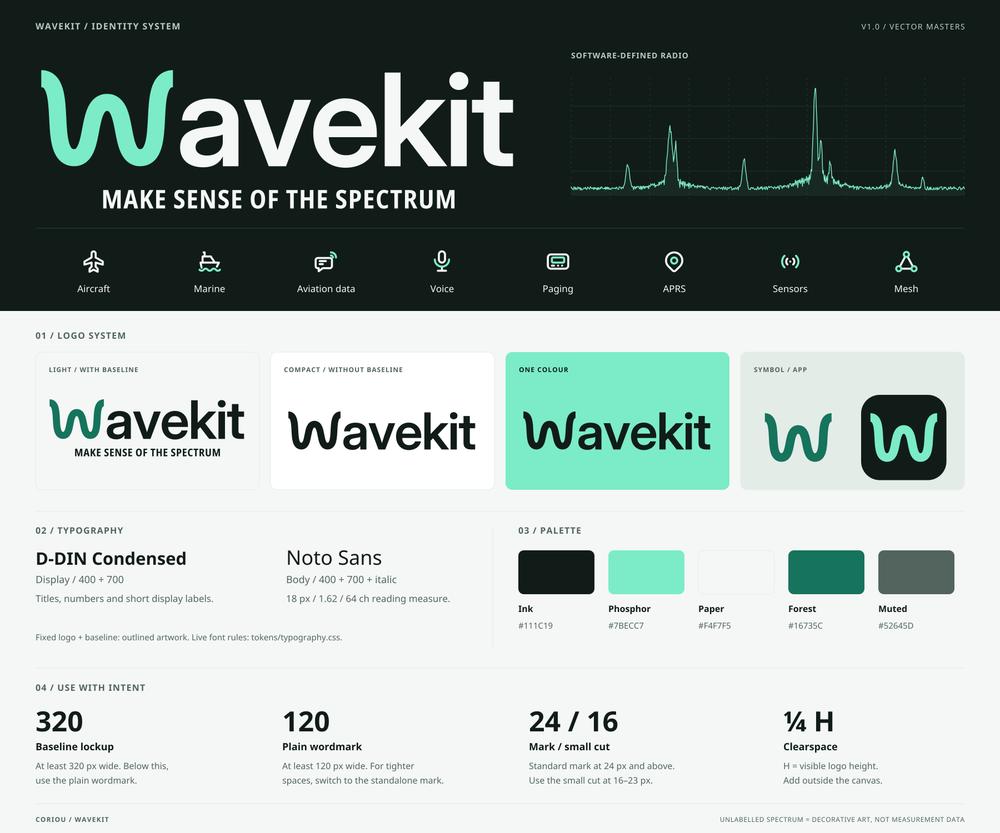

# @wavekit/brand

The WaveKit brand kit (v1.0) as a private workspace package: vector masters, production
assets, design tokens, live fonts and React components. It is the maintained source of
truth. Change things here, re-validate, and let consumers copy or import from here.

Official baseline: **MAKE SENSE OF THE SPECTRUM**. In prose the name is **WaveKit**; the
logo artwork reads **wavekit**. Read [`AGENTS.md`](AGENTS.md) before changing anything;
its rules are binding for people and agents alike.



## Which file do I need?

All paths are relative to `packages/brand/`.

| Need                                                        | File                                                                                      |
| ----------------------------------------------------------- | ----------------------------------------------------------------------------------------- |
| Logo with baseline, dark surface (≥ 320 CSS px wide)        | `logos/wavekit-lockup-on-dark.svg`                                                        |
| Logo with baseline, light surface (≥ 320 CSS px wide)       | `logos/wavekit-lockup-on-light.svg`                                                       |
| Header logo without baseline (≥ 120 CSS px)                 | `logos/wavekit-wordmark-on-dark.svg` / `-on-light.svg`                                    |
| One-colour logo                                             | `logos/wavekit-wordmark-ink.svg`, `-black.svg`, `-white.svg`, `-currentColor.svg`         |
| Standalone signal-w (24 px and up)                          | `marks/wavekit-mark-mint.svg` (dark) / `-forest.svg` (light)                              |
| Signal-w at 16–23 px                                        | `marks/wavekit-mark-small-*.svg`                                                          |
| Favicon                                                     | `marks/favicon.svg` + `exports/favicon.ico`                                               |
| Apple touch / PWA icons                                     | `exports/wavekit-app-180.png`, `-192.png`, `-512.png`, `exports/wavekit-maskable-512.png` |
| PWA manifest template                                       | `templates/site.webmanifest` (adjust `/brand/` paths and `start_url`)                     |
| Category icons for UI chrome (inherit `color`, inline only) | `icons/mono/<slug>.svg`                                                                   |
| Two-tone category icons                                     | `icons/on-dark/<slug>.svg` / `icons/on-light/<slug>.svg`                                  |
| Icon sprite (inline once, then `<use href="#wk-<slug>">`)   | `icons/categories.symbols.svg`                                                            |
| Category ↔ signal mapping                                   | `icons/categories.json`                                                                   |
| Colours, themes, spacing                                    | `tokens/brand.css` (CSS), `tokens/tokens.json` (data)                                     |
| Live typography + `@font-face`                              | `tokens/typography.css` → `fonts/`                                                        |
| GitHub social preview / repo banner                         | `exports/social-card-1200x630.png`, `templates/repository-banner-1280x640.svg`            |
| Decorative spectrum art (never data)                        | `artwork/spectrum-on-dark.svg` / `-on-light.svg`                                          |
| React components                                            | `react/` (`WaveKitLogo`, `WaveKitMark`, `WaveKitIcon`)                                    |
| Guideline boards                                            | `previews/01-brand-overview.svg`, `02-icon-system.svg`, `03-applications.svg`             |

Category slugs: `aircraft`, `marine`, `aviation-data`, `voice`, `paging`, `aprs`,
`sensors`, `mesh`. `on-dark` / `on-light` name the intended background; logos and icons
are transparent. Size and clearspace rules are in [`docs/LOGO.md`](docs/LOGO.md).

## Package layout

```text
AGENTS.md            binding brand rules (for agents and people)
brand.config.json    invariants: palette, preferred variants, minimum sizes
logos/ marks/        logo, wordmark, lockup, mark, favicon and app-icon SVG masters
icons/               8 categories × mono / on-light / on-dark, sprite, categories.json
artwork/             decorative spectrum
templates/           repo banner, social cards, editorial cover, webmanifest, email signature
exports/             PNG/ICO rasters, regenerated from the SVGs by source/export.py
tokens/              brand.css, typography.css, tokens.json
fonts/               D-DIN Condensed + Noto Sans WOFF2, OFL licence beside each family
react/               typed React components and the frozen geometry they draw
source/              geometry.json, build.py, export.py, subset_fonts.py, validate.py
previews/            the three guideline boards (SVG)
docs/                brand, logo, iconography, typography, integration, accessibility, sources
licenses/            Tabler MIT notice (required with the icons) and attribution notes
```

## Themes

`tokens/brand.css` defines the palette once and two equal themes on top of it:

| Token                                                      | Light            | Dark               |
| ---------------------------------------------------------- | ---------------- | ------------------ |
| `--wk-bg`                                                  | paper `#F4F7F5`  | ink `#111C19`      |
| `--wk-surface`                                             | `#FFFFFF`        | `#192B24`          |
| `--wk-fg`                                                  | ink              | paper              |
| `--wk-fg-muted`                                            | muted `#52645D`  | `#B9CAC1`          |
| `--wk-accent`                                              | forest `#16735C` | phosphor `#7BECC7` |
| `--wk-accent-ink` (text on accent)                         | `#FFFFFF`        | ink                |
| `--wk-border-control` (inputs, controls)                   | muted            | `#8BA598`          |
| `--wk-border-decorative` (never the only control boundary) | rule `#E4ECE7`   | `#2C443B`          |
| `--wk-focus-ring`                                          | forest           | phosphor           |

- `data-wavekit-theme="dark"` or `"light"` on any element pins that theme for its subtree.
- With no attribute, `:root` follows `prefers-color-scheme`.
- Dark-first surfaces such as the Pi status page should put `data-wavekit-theme="dark"`
  on `<html>`, so they never flip to light.

Every pair above is contrast-checked by the validator in both themes: text 4.5:1 or
more, borders and focus 3:1 or more. The lowest are light accent on paper at 5.35:1
and dark control border on surface at 5.62:1. Phosphor is never text on paper.

Also in the CSS: spacing `--wk-space-{1,2,3,4,6,8,12,16}`, radii `--wk-radius-control`
and `--wk-radius-panel`, `--wk-target-min` (44 px), and the opt-in helpers `.wk-surface`,
`.wk-panel`, `.wk-button`, `.wk-focus`, `.wk-icon`, `.wk-logo` and
`.wk-visually-hidden`. Typography adds `.wk-type`, `.wk-prose`, `.wk-display`,
`.wk-section-title`, `.wk-deck`, `.wk-label`, `.wk-ui`, `.wk-caption` and
`.wk-numeric`. Nothing styles bare elements.

### Not yet defined by brand

The kit defines no **success / warning / error / info** status colours, no chart or
data-series palette, no elevation/shadow scale and no motion scale beyond
`--wk-transition`. They are listed under `notYetDefinedByBrand` in `tokens.json`. A
status UI that needs them should define them locally, label them as local, and pair
colour with text or an icon. Do not add them here without brand review. The
decorative spectrum is not a substitute for a data visualisation.

## Fonts

- Display: D-DIN Condensed 400/700.
- Body/UI: Noto Sans 400/700/italic.
- Both are WOFF2 under SIL OFL 1.1. Sources, licences, subset ranges and coverage gaps
  are in [`fonts/README.md`](fonts/README.md).
- D-DIN has no tabular figures. Put live numbers in Noto Sans with `.wk-numeric`.

Preload only what renders above the fold:

```html
<link
	rel="preload"
	href="/brand/fonts/d-din/D-DINCondensed-Bold.woff2"
	as="font"
	type="font/woff2"
	crossorigin
/>
<link
	rel="preload"
	href="/brand/fonts/noto-sans/NotoSans-Regular.woff2"
	as="font"
	type="font/woff2"
	crossorigin
/>
```

## Using it

### Static pages with no build step (e.g. the Pi status page)

Vendor a copy and keep the relative layout. `typography.css` loads
`../fonts/<family>/…`, so `tokens/` and `fonts/` must stay siblings:

```text
ui/brand/tokens/brand.css
ui/brand/tokens/typography.css
ui/brand/fonts/d-din/{D-DINCondensed.woff2, D-DINCondensed-Bold.woff2, OFL.txt, FONTLOG.txt}
ui/brand/fonts/noto-sans/{NotoSans-Regular.woff2, NotoSans-Bold.woff2, NotoSans-Italic.woff2, OFL.txt}
ui/brand/logos/wavekit-wordmark-on-dark.svg
ui/brand/marks/favicon.svg
ui/brand/exports/favicon.ico
```

```html
<html lang="en" data-wavekit-theme="dark">
	<link rel="stylesheet" href="brand/tokens/brand.css" />
	<link rel="stylesheet" href="brand/tokens/typography.css" />
	<link rel="icon" href="brand/marks/favicon.svg" type="image/svg+xml" />
	<link rel="icon" href="brand/exports/favicon.ico" sizes="any" />
	…
	
</html>
```

- Copy the licence files with the fonts.
- Re-copy after brand changes; a vendored copy does not update itself.
- Use the fixed `on-dark` / `on-light` files through ``; `currentColor` only works
  when the SVG is inlined.

### Bundled web apps

Import through the package `exports`:

```ts
import "@wavekit/brand/tokens/brand.css"
import "@wavekit/brand/tokens/typography.css"
import tokens from "@wavekit/brand/tokens/tokens.json" with { type: "json" }
import wordmarkUrl from "@wavekit/brand/logos/wavekit-wordmark-on-dark.svg"
```

### React (DOM)

`@wavekit/brand/react` exports TypeScript source (no build step), so the consuming
bundler compiles it. React ≥ 18 is an optional peer dependency, and there are no other
runtime dependencies.

```tsx
import { WaveKitIcon, WaveKitLogo, WaveKitMark } from "@wavekit/brand/react"

<WaveKitLogo tone="on-dark" baseline width={400} />
<WaveKitLogo tone="on-light" width={180} />
<WaveKitMark size={20} label="WaveKit" color="#16735C" />
<a href="/aircraft"><WaveKitIcon name="aircraft" /><span>Aircraft</span></a>
```

- Icons are decorative unless given a `label`.
- `tone="mono"` inherits `color`.

The Ink terminal dashboard (`cli/`) cannot render SVG. In the terminal, use the name
"WaveKit", text labels and a restrained ANSI palette ([`docs/INTEGRATION.md`](docs/INTEGRATION.md)).

## Modifying and re-validating

```sh
pnpm --filter @wavekit/brand validate          # python3 -I source/validate.py, stdlib only
pnpm --filter @wavekit/brand validate:render   # + rasterise SVGs, diff exports/ (CairoSVG, Pillow)
```

The validator checks:

- SVG safety and structure (outlined, no fonts, no URLs, no duplicate ids).
- The icon grid and stroke system.
- That `source/build.py` reproduces the 46 core masters byte-for-byte.
- That `react/geometry.ts` and `react/icon-nodes.ts` match `source/geometry.json`.
- That `brand.css`, `tokens.json`, `brand.config.json` and `geometry.json` agree on the
  palette and themes.
- Theme contrast.
- That every shipped font is loaded by the CSS and has its `OFL.txt`.

| Change                       | How                                                                                                                                                                     |
| ---------------------------- | ----------------------------------------------------------------------------------------------------------------------------------------------------------------------- |
| Tune a theme colour          | Edit `tokens/brand.css`, mirror it in `tokens.json`, run validate. A palette change also touches `brand.config.json` and `source/geometry.json` and needs brand review. |
| Logo / mark / icon geometry  | Edit `source/geometry.json`, then `python3 -I source/build.py --out /tmp/wk`. Review, copy over the masters, and update `react/`. Never hand-edit the paths or redraw.  |
| Templates, boards, app icons | Edit the SVG composition directly. Text is outlined.                                                                                                                    |
| Rasters in `exports/`        | `python3 -I source/export.py` (CairoSVG + Pillow). Never edit the PNGs by hand.                                                                                         |
| Noto Sans subset             | `source/subset_fonts.py`, see `fonts/README.md`. Don't subset D-DIN (Reserved Font Name).                                                                               |
| New category icon            | Same Tabler-based 24 × 24 / 2-unit / round-cap system, and request design review (`docs/ICONOGRAPHY.md`).                                                               |

For an intentional release, bump `version` in `brand.config.json` and `package.json`
and add a `docs/CHANGELOG.md` entry.

## What came from the kit, and what was dropped

- **Kept:** all vector masters, templates, icons, sprite, `categories.json`, every PNG/ICO
  export, source geometry and scripts, React components, docs, licences and the three
  boards (as `previews/`).
- **Kept but reworked:** the exports are now reproducible with `source/export.py`, and
  the validator checks them pixel-for-pixel.
- **Dropped:**
  - `qa/` (a one-off delivery report).
  - `asset-manifest.json` and `CHECKSUMS.sha256` (frozen hashes that would fail on
    every intentional edit; the validator checks content instead).
  - `png/` (raster copies of the boards).
  - `index.html` (the kit's preview page).
  - `tokens/preload.example.html` (now the snippet above).
  - `react/README.md` (folded in here).
  - `fonts/README.md`, which assumed no fonts were bundled (rewritten).

## Docs

- [Brand](docs/BRAND.md)
- [Logo](docs/LOGO.md)
- [Iconography](docs/ICONOGRAPHY.md)
- [Typography](docs/TYPOGRAPHY.md)
- [Integration](docs/INTEGRATION.md)
- [Accessibility](docs/ACCESSIBILITY.md)
- [Sources](docs/SOURCES.md)
- [Changelog](docs/CHANGELOG.md)
- Licensing: [`licenses/NOTICES.md`](licenses/NOTICES.md).

WaveKit's own brand assets carry no public redistribution or trademark licence yet; the
owner still has to choose one.
